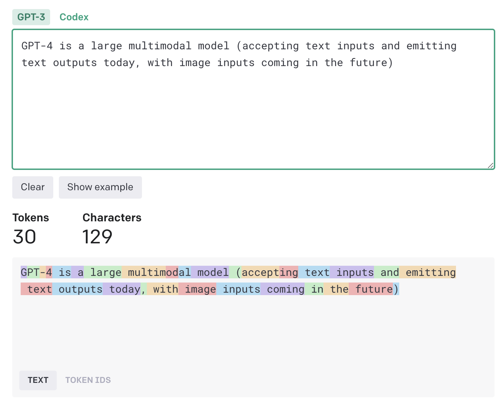
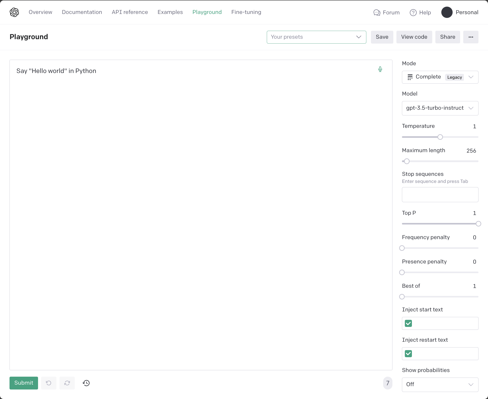

# Large Language Models


In this chapter:

* Understanding large language models.
* Navigating the OpenAI model offerings.
* Counting tokens.
* Calling the OpenAI API.

We won’t cover the science behind large language models since this book focuses
on integrating these pre-trained models into broader software solutions. That
said, we’re going to quickly touch upon what it means (and how expensive it is!)
to train such a model. Once trained, we can use these models in our solutions.

OpenAI offers several families of models, including GPT-3.5, GPT-4, and DALL·E.
Each family contains one or more models. Some we’ll just mention, some we’ll use
intensely throughout the book.

A key concept to understand is that of tokens. Large language models represent
text slightly different than natural language – instead of words, they use
tokens. Each model has some token limit (maximum number of tokens it can
process) and OpenAI charges API calls based on token usage. We’ll learn about
tokens, limits, and how to get from text to tokens.

We’ll also have an in-depth look at the OpenAI API – we’ll first look at all the
components of a response, then we’ll see some of the available request
parameters. We’ll go over some scenarios and code for when we would use each of
these parameters. Let’s start with the overview of large language models.

## Large language models

Large language models are machine learning models that use deep neural networks
to generate human-like language output, based on patterns learned from vast
amounts of text. These models can perform various natural language processing
(NLP) tasks, including language generation, machine translation, question
answering, and sentiment analysis, among others.

The recent breakthrough in large language models was the development of
transformer-based architectures, such as GPT (Generative Pre-trained
Transformer) and BERT (Bidirectional Encoder Representations from Transformers).
These models can learn from massive amounts of data, often referred to as
"pre-training". They can then be fine-tuned for specific tasks.

Large language models have seen a significant increase in performance and
capabilities in recent years, with models such as GPT-3 and, more recently,
GPT-4 achieving remarkable results on a wide range of benchmarks.


*Figure 2.1: Training, fine tuning, and prompting.*

Figure 2.1 shows *training*, *fine tuning*, and *prompting* (we’ll cover each in
more detail below). Training is a one-time, expensive ordeal, dealing with huge
amounts of data. Fine-tuning can optionally adjust a model to some specific
domain. This involves much smaller volumes of data. Finally, the model is used
by users prompting it.

### Training

Large language models are trained on massive amounts of text data. This process
involves feeding the model with huge datasets of text, such as books, articles,
and websites. The model then uses this data to learn patterns and relationships
between words, ultimately creating a vast network of connections between them.
This enables the model to generate human-like responses to queries or prompts.

> **Sidebar: Reinforcement Learning from Human**
>
> Large language models are trained using *Reinforcement Learning from Human
Feedback* (RLHF). This is an approach combining reinforcement learning (RL) with
input and guidance from human experts. It aims to improve the learning process
of an RL agent by leveraging human knowledge and expertise to guide its
training.
>
> In traditional RL, an agent learns through trial and error by interacting with
an environment and receiving rewards or penalties based on its actions. However,
this learning process can be time-consuming and inefficient, especially in
complex and high-dimensional environments.
>
> RLHF introduces human feedback into the RL loop to provide additional
information to the agent. This feedback can take different forms, such as
explicit reward signals, demonstrations, or evaluations from human experts. By
incorporating human guidance, RLHF can accelerate the learning process and make
it more effective.
>
> One key thing to keep in mind is RLHF effectively builds some specialization
into the model, which goes beyond just predicting text.

Training large language models is an extremely expensive process. For instance,
training ChatGPT, one of the largest language models to date, is estimated to
have cost around $5 million. This is due to the enormous computational resources
required to process such vast amounts of data. The training process can take
weeks or even months to complete, and typically involves hundreds or thousands
of GPUs working in parallel.

One of the key features of large language models is the sheer number of
*parameters* they have.

> **Definition**: *Parameters* are the values or weights in the neural network
that are determined during the training process. These parameters dictate how
the model responds to different inputs and are crucial to the model's ability to
generate coherent and meaningful responses. 

Large language models can have billions of parameters, far more than other AI
models used in different applications.

Unlike other AI models that are updated over time, large language models are
typically considered "off-the-shelf" tools. This means that once they are
trained, they are fixed and cannot be retrained. However, they can be fine-tuned
for specific tasks, such as language translation or sentiment analysis, by
adjusting a subset of their parameters. This makes them highly versatile and
useful for a wide range of applications.

### Tuning

While re-training a large language model is not feasible, these models can be
*fine-tuned*.

> **Definition**: *Fine-tuning* is a process that involves taking a pre-trained
language model, such as ChatGPT, and adapting it to a specific domain or task.
This is achieved by training the model on a smaller, domain-specific dataset
that is relevant to the task at hand. Fine-tuning allows the model to learn the
nuances and specificities of a particular domain, enabling it to generate more
accurate and contextually appropriate responses.

For example, if you wanted to create a chatbot for a customer service platform,
you could fine-tune a pre-trained language model by feeding it with a dataset of
customer queries and their corresponding responses. The model would then use
this data to learn how to respond to similar queries in a way that is consistent
with the brand's tone and style. This would result in a more effective and
personalized customer service experience.

The scale of fine-tuning is much smaller than that of full training. This is
because the model has already been trained on a vast corpus of general language
data, and only needs to be further trained on a smaller, domain-specific
dataset. This makes fine-tuning a much quicker and more cost-effective process
than full training.

Furthermore, fine-tuning allows for more flexibility and adaptability in the use
of language models. Instead of having to train a new model from scratch for each
specific task, fine-tuning allows for the reuse of pre-existing models, saving
both time and resources. It also enables the development of highly specialized
models that are tailored to the specific needs of a particular domain or
application.

Overall, fine-tuning is a powerful tool that allows for the customization and
optimization of pre-trained language models. By feeding them with
domain-specific data, we can create highly effective and contextually
appropriate models that are well-suited to a wide range of applications.

### Prompting

Once a language model has been trained or fine-tuned, users can interact with it
by providing *prompts*, which are essentially questions or statements that are
inputted into the model. We defined prompting in chapter 1 as the starting input
given to a model in order to generate output.

Prompting allows users to extract specific information or generate responses
from the model, based on the input provided. For instance, a user might prompt a
language model with a sentence and expect it to generate a coherent and
grammatical response. Alternatively, they might prompt the model with a specific
question or query and expect it to provide an accurate and relevant answer.

The key difference between prompting a language model and traditional
programming is that language models are probabilistic, rather than
deterministic. This means that instead of producing a single, predetermined
output based on a given input, language models generate a range of possible
outputs based on statistical probabilities.

Prompting a language model requires a different mindset than coding for a
deterministic computer. It involves understanding how language models work and
being able to formulate prompts in a way that will elicit the desired response.
This requires an understanding of the model's strengths and limitations, as well
as an ability to formulate prompts that are precise and specific.

You might find it strange that we are comparing prompting with coding, but we
are effectively trying to leverage large language models embedded in software
systems, so the analogy is warranted – this is the new paradigm of computing
enabled by AI.

In this book, we will delve more deeply into the mechanics of prompting,
exploring different strategies and techniques for optimizing language model
performance. We will also discuss best practices for fine-tuning models,
selecting the right data, and evaluating model performance. Ultimately, our goal
is to harness the power of large language models and use them to solve
real-world problems in a variety of domains.

### Non-determinism and hallucinations

One of the key differences between traditional software development and working
with large language models is the issue of *determinism*. Traditional software
development involves writing code that produces a deterministic output for a
given input. In other words, if the same input is provided to the software, it
should always produce the same output.

However, large language models are probabilistic and non-deterministic. The same
input can generate different responses. This non-deterministic nature of large
language models can be both a strength and a weakness. On one hand, it allows
the model to generate a wide range of responses, which can be useful for
applications such as natural language generation, dialogue systems, and
chatbots. On the other hand, it also means that the model can produce
unpredictable or incorrect responses, which can be problematic in certain
situations.

One of the challenges with large language models is that they can sometimes
*hallucinate*.

> **Definition**: *Hallucinations* are generated responses that are not based on
the input or the training data. This can occur when the model lacks the
necessary information to generate an accurate response or when it makes
assumptions based on incomplete or incorrect data.

We should always keep in mind the probabilistic and non-deterministic nature of
large language models and be prepared for a range of possible responses. It’s
also important to carefully evaluate the output of the model to ensure its
accuracy and relevance. This requires a combination of technical expertise and
domain-specific knowledge, as well as an ability to adapt to the unique
challenges and opportunities presented by large language models.

In summary, the probabilistic and non-deterministic nature of large language
models is a key point to consider when interacting with them. This is very
different from traditional software development and requires a different mindset
and approach to ensure the best possible outcomes.

We talked about large language models, what it takes to train one, fine-tuning,
prompting, and the key gotcha: hallucinations. We’ll cover these in-depth over
the next few chapters, with plenty of code examples but this overview should
help us get started with using the models offered by OpenAI.

## OpenAI models

We can use the OpenAI API to retrieve the list of available models. Assuming you
got set up in chapter 1 with an API key and installed the `openai` Python
package, you should be able to run the code in listing 2.1.

```python
import openai
import os

openai.api_key = os.getenv("OPENAI_API_KEY")
models = openai.Model.list().data
for model in models:
    print(model.id)
```

*Listing 2.1: Retrieve available OpenAI models and print them.*

First, we get the `OPENAI_API_KEY` from the environment as usual. Calling
`Model.list()` gives us back the list of available models. There’s quite a few
of them. Let’s see what they’re about.

### Model families

For the most up to date model list, you can visit
<https://platform.openai.com/docs/models/overview>.

At the time of writing, *GPT-4* is in limited beta. Throughout this book, we
will focus on models that output natural language or code. The first family of
models, now deprecated, aimed specifically at processing and generating code,
was *Codex*. The *GPT-3* family of models understand and generate natural
language. A newer and improved version of these is the *GPT-3.5* family of
models, which can handle both natural language and code. *GPT-4* is the latest
in this series, in limited beta at the time of writing.

There are also models focused on *moderation* and *embeddings*, which we’ll
visit later in the book.

OpenAI also offer natural language-to-image (*DALL·E*) and audio-to-text
(*Whisper*) models, but we’re not going to focus on these. The full list
provided by OpenAI at the time of writing is listed in table 2.1.

| MODELS | DESCRIPTION |
| --- | --- |
| GPT-4 (in limited beta) | A set of models that improve on GPT-3.5 and can understand as well as generate natural language or code |
| GPT-3.5 | A set of models that improve on GPT-3 and can understand as well as generate natural language or code |
| DALL·E (in beta) | A model that can generate and edit images given a natural language prompt |
| Whisper (in beta) | A model that can convert audio into text |
| Embeddings | A set of models that can convert text into a numerical form |
| Moderation | A fine-tuned model that can detect whether text may be sensitive or unsafe |
| GPT-3 | A set of models that can understand and generate natural language |
| Codex (deprecated) | A set of models that can understand and generate code, including translating natural language to code |

*Table 2.1: OpenAI model families.*

### Completion models

We will focus on the so-called *completion models* and their applications.

> **Definition**: A *completion model* takes a prompt and returns one or more
predicted completions, meaning text that is most likely to follow the prompt.

In chapter 1, we prompted `gpt-3.5-turbo-instruct` (a model from the GPT-3.5
generation) to say “Hello world!” in Python. Let’s take another look at the code
(listing 2.2), since we’re trying to better understand the API.

```python
import openai
import os

openai.api_key = os.getenv('OPENAI_API_KEY')
response = openai.Completion.create(
    model='gpt-3.5-turbo-instruct',
    prompt='Say "Hello world" in Python')

print(response.choices[0].text)
```

*Listing 2.2: “Hello world” in Python by gpt-3.5-turbo-instruct.*

We are calling the create completion API, passing it the model and prompt. Since
chat/interactive interactions have become a key scenario, OpenAI introduced
*chat completion models*.

> **Definition**: *chat completion models* are very similar to completion
models, but optimized for chat conversations, with a slightly different API:
they expect input to be in the form of messages in a chat and the response is
also formatted as a chat message.

Chat completion models expect as input a series of messages in the format `role`
(which can be `system`, `user`, or `assistant`) and `message` (which is the
content of the message). Let’s get a chat completion model, `gpt-3.5-turbo`, to
say “Hello world!” in Python (listing 2.3).

```python
import openai
import os

openai.api_key = os.getenv('OPENAI_API_KEY')
response = openai.ChatCompletion.create(
    model='gpt-3.5-turbo',
    messages=[
        {'role': 'user', 'content': 'Say "Hello world" in Python'}
    ])

print(response.choices[0].message)
```

*Listing 2.3: “Hello world” in Python by gpt-3.5-turbo.*

Note that instead of a prompt parameter, we have a list of messages. In our
case, we pass as input a single message, from the user, with our desired prompt.

The response should look like listing 2.4.

```json
{
  "content": "print(\"Hello world\")",
  "role": "assistant"
}
```

*Listing 2.4: gpt-3.5-turbo response.*

Following the chat messages format, instead of just text, we now get back an
object representing the message, which includes the `role` (the model responds
as the `assistant`) and the `content` of the message.

At this point you might be wondering why there’s a need for this special class
of chat completion models.

### Why chat completion models

We will talk a lot more about memory in this book, but for now one key thing to
keep in mind is that the models we’re interacting with don’t have any memory
whatsoever. If you played with the interactive ChatGPT, you might think that it
does, as it follows the conversation and you can refer to previous messages, but
in fact this is not the case. Each request contains the full conversation
history!

For interactive scenarios, when using a completion model like
`gpt-3.5-turbo-instruct`, you would use a prompt like listing 2.5.

```text
You are a helpful AI assistant.

User: {{previous message}}
Assistant: {{previous response}}
User: {{new message}}
Assistant:
```

*Listing 2.5: Prompt template for a completion model simulating chat.*

Repeat the User/Assistant part for as many messages there are in the chat. Note
we start the prompt by telling the model how it should act like (`You are a
helpful AI assistant`), then follow up with a dialogue ending where we want the
model to start the completion.

For example, if the user wanted to prompt the model to use Ruby instead, we
would use the prompt in listing 2.6.

```text
You are a helpful AI assistant.

User: Say "Hello world" in Python
Assistant: print("Hello world")
User: Now do it in Ruby
Assistant:
```

*Listing 2.6: Prompt for a completion model simulating chat.*

A chat completion model prompt represents this in a more structured manner, as
show in listing 2.7.

```python
messages=[
    {'role': 'system', 'content': 'You are a helpful AI assistant'},
    {'role': 'user', 'content': 'Say "Hello world" in Python'},
    {'role': 'assistant', 'content': 'print("Hello world")'},
    {'role': 'user', 'content': 'Now do it in Ruby'}
]
```

*Listing 2.7: Prompt for a chat completion model.*

Note we would construct the list of actual messages at runtime based on what the
user asks and what the model replies, and we would pass it to the model on each
subsequent call. To the user it would seem the model “remembers” the
conversation - for example the second message in the chat doesn’t mention “Hello
world” anywhere, but the model will correctly output the Ruby version of “Hello
world”, `puts "Hello world"`. In fact, we are sending back the chat history on
the new call.

We saw a bunch of small hand-crafted calls to the models. At this point, we know
enough to implement a simple command line chat. Listing 2.8 shows our first
ChatGPT.

```python
import openai
import os

openai.api_key = os.getenv('OPENAI_API_KEY')
history = []

while True:
    prompt = input('user: ')
    if prompt == 'exit':
        break

    history.append({'role': 'user', 'content': prompt})
    response = openai.ChatCompletion.create(
        model='gpt-3.5-turbo',
        messages=history)

    message = response.choices[0].message

    print(f'{message.role}: {message.content}')
    history.append({'role': message.role, 'content': message.content})
```

*Listing 2.8: Command line chat application.*

In this example, we maintain a history of the chat in the `history` variable,
which starts as empty. We request input from the user. We exit the loop if the
user types `exit`, otherwise we append the message to the `history` and call the
chat completion API.

We extract the first `message`, print it to the console, and append it to
history for subsequent calls.

That’s it! You can take it for a spin and have a quick chat with
`gpt-3.5-turbo`. Note if we would’ve used `gpt-3.5-turbo-instruct` for this, we
would’ve handcrafted the history by appending to a string.

The full list of GPT-3.5 models offered at the time of writing is captured in
table 2.2.

| MODEL | DESCRIPTION |
| --- | --- |
| gpt-3.5-turbo | Most capable GPT-3.5 model and optimized for chat at 1/10th the cost of text-davinci-003. |
| gpt-3.5-turbo-16k | Same capabilities as the standard gpt-3.5-turbo model but with 4 times the context. |
| gpt-3.5-turbo-instruct | Similar capabilities as text-davinci-003 but compatible with legacy Completions endpoint and not Chat Completions. |
| gpt-3.5-turbo-0613 | Snapshot of gpt-3.5-turbo from June 13th 2023 with function calling data. Unlike gpt-3.5-turbo, this model will not receive updates, and will be deprecated 3 months after a new version is released. |
| gpt-3.5-turbo-16k-0613 | Snapshot of gpt-3.5-turbo-16k from June 13th 2023. Unlike gpt-3.5-turbo-16k, this model will not receive updates, and will be deprecated 3 months after a new version is released. |
| text-davinci-003 (Legacy) | Can do any language task with better quality, longer output, and consistent instruction-following than the curie, babbage, or ada models. Also supports inserting completions within text. |
| text-davinci-002 (Legacy) | Similar capabilities to text-davinci-003 but trained with supervised fine-tuning instead of reinforcement learning. |
| code-davinci-002 (Legacy) | Optimized for code-completion tasks. |

*Table 2.2: GPT-3.5 models.*

*ada*, *babbage*, and *currie* mentioned in the table as a comparison to
*`text-davinci-003` (`text-ada-001`, `text-babbage-001`, and `text-currie-001`),
*together with `text-davinci-001`, are part of the older GPT-3 family of models.

We’ll use `gpt-3.5-turbo-instruct` and `gpt-3.5-turbo` throughout this book. In
the first draft of this book, examples used `text-davinci-003`, which used to be
the top performing completion model (with `gpt-3.5-turbo` and GPT-4 being chat
completion models). Since then, `text-davinci-003` has been deprecated in favor
of the new `gpt-3.5-turbo-instruct`.

Since we’re talking about costs, to better understand how OpenAI charges for
usage, we need to understand tokens.

## Tokens

Large language models don’t use exactly the words we pass in. A preprocessing
step converts natural language into *tokens*. The models “understand” tokens,
this processed representation. This helps models handle multiple languages,
formats, and reduce computational costs.

> **Definition**: A *token* refers to a sequence of characters or symbols that
is considered as a single unit of input to the model. Tokens can be individual
words, punctuation marks, numbers, or other types of symbols, and they are used
to break down a piece of text into smaller, more manageable units for processing
by the model.

Understanding what tokens are is very important for two main reasons: large
language models have limits on how many tokens they can process during a call
and OpenAI charges their API calls based on number of tokens used.

OpenAI uses *Byte-Pair Encoding* for its models. The algorithm works by
iteratively merging the most frequently occurring pair of bytes in the input
data into a single byte, until a predefined number of merge operations have been
performed or a target vocabulary size is reached. The different models available
have different vocabulary sizes.

For the English language, a token is about 3/4 of a word, so 100 tokens
represent around 75 words. OpenAI offers an online tokenizer at
<https://platform.openai.com/tokenizer> and, for programmatic use, the
`tiktoken` library: <https://github.com/openai/tiktoken>.

For example, our prompt `Say "Hello world" in Python` is 7 tokens-long: `Say`,
`·"`, `Hello`, `·world`, `"`, `·in`, and `·Python` (note tokenization
includes spaces and punctuation). Figure 2.2 shows an even nicer example, where
tokenization is not quite one-to-one with the text.



*Figure 2.2: Example of tokenization using the OpenAI online tokenizer. Each
highlight represents a token.*

Note, for example, that “accepting” is split into the tokens `accept` and `ing`.
“GPT-4” is split into 4 different tokens.

Let’s also see how we can do this programmatically.

### Using tiktoken

First, we need to install `tiktoken` (listing 2.9).

```sh
pip install tiktoken
```

*Listing 2.9: Installing tiktoken.*

Next, let’s encode a string and see how the model interprets it. Listing 2.10
shows the code to do this.

```python
import tiktoken

enc = tiktoken.encoding_for_model('gpt-3.5-turbo-instruct')
tokens = enc.encode('Say "Hello world" in Python')

print(tokens)
print([enc.decode_single_token_bytes(token) for token in tokens])
```

*Listing 2.10: Tokenizing text and viewing the tokens.*

First, we get the right encoding for the model we are using. We then encode the
phrase `Say "Hello world" in Python`. We print the encoded tokens, then we print
them decoded back into strings using the `decode_single_token_bytes()` function.

This should print the output in listing 2.11.

```text
[25515, 366, 15496, 995, 1, 287, 11361]
[b'Say', b' "', b'Hello', b' world', b'"', b' in', b' Python']
```

*Listing 2.11: tiktoken output.*

The first line is the tokens as they are fed into the large language model – as numbers. The second line prints their decoded representation, so we can see which characters ended up in which token.

At the time of writing, `tiktoken` supports 3 encodings:

1. `cl100k_base` for models `gpt-4`, `gpt-3.5-turbo`, `text-embedding-ada-002`.
2. `p50k_base` for models `text-davinci-002` and `text-davinci-003`.
3. `r50k_base` for the GPT-3 family of models.

We can retrieve an encoder by name using the `get_encoding()` function (for
example, `tiktoken.get_encoding('p50k_base')`) or, to make sure we get the right
encoding for the model we are using, we can call the `encoding_for_model()`
function like we did in listing 2.10.

As we saw at the beginning of this section, the reason we need to understand
tokens, and potentially write code to parse text into tokens, is that sooner or
later we will run into token limits.

### Limits

Token limits are not artificial limitations, rather they come from the
architecture of the models themselves. For example, `text-davinci-003` has a
limit of 4097 tokens and `gpt-3.5-turbo` has a limit of 4096 tokens. Limits are
combined between prompt and response. That means the more tokens you use in the
input, the fewer will be left for the output.

`gpt-4-32k`, a member of the GPT 4 family, offers a much higher limit of 32768
tokens. The GPT 3.5 family of models now also offers `gpt-3.5-turbo-16k`, a
16,384 token version of `gpt-3.5-turbo`. Over time, we’ll probably see larger
and larger token limits as the field advances, but even with 32K tokens, you
still can’t type your whole novel into a prompt and ask the model to rewrite it
from 1st to 3rd person.

The OpenAI Models reference shows the token limits for each available model:
<https://platform.openai.com/docs/models/>.

Since this book focuses on building software around large language models, token
limits will be a key constraint. In most cases, we will need to squeeze into a
prompt an ask, some task-specific context, and some user input, and leave enough
room for a reply. This is where memory implementations come into play (chapter 5
is all about memory).

Depending on your scenario, you’ll need to consider the token limits when
picking a model to work with.

You might wonder why not to simply pick the highest limit model (currently
`gpt-4-32k`). The reason is the more tokens we use, the more we have to pay:
pricing is also calculated based on the number of tokens used.
`text-davinci-003` costs 2 cents per 1000 tokens, while the newer, more
efficient `gpt-3.5-turbo` is much cheaper, at 0.15 cents per 1000 input tokens
and 0.2 cents per 1000 output tokens. GPT-4 models have different pricing
depending on scenario and context size. The OpenAI pricing page shows how each
model is priced: <https://openai.com/pricing>.

Finally, when working with chat completion models, some special tokens are
automatically included so the model can accurately separate the different roles
and messages. Remember a chat completion model doesn’t take as input just a text
prompt, rather a list of messages issued by `system`, `user`, or `assistant`.
The messages are separated by the special tokens `<|start|>` and `<|stop|>`,
which are injected automatically. `gpt-4` and `gpt-3.5-turbo` have slightly
different token overhead per message[^1]. We won’t cover the full implementation of
counting tokens for a chat completion model here, but our `llm_utils` library
provides a `count_tokens()` function we’ll use when we need an accurate token
count.

### Key takeaways

Before moving away from the topic of tokens, let’s quickly recap:

* Each model has a token limit (maximum number of tokens it can process), which
  is a combination of input and output tokens.
* Pricing is calculated based on the number of tokens used.
* Rule of thumb: for English, a token is about 3/4 of a word (100 tokens for 75
  words).
* You can quickly check the tokenization of some text using the online tokenizer
  provided by OpenAI (<https://platform.openai.com/tokenizer>).
* You can programmatically work with tokens using the `tiktoken` library.

The main use-cases for programmatically counting tokens are figuring out whether
a prompt fits within the model limits and to estimate the cost of a call. In
chapter 5, where we discuss memory, we’ll spend more time talking about how to
handle this context size limit. Since using these models can get expensive[^2],
let’s see how we can get the most out of an API call.

## API responses

We’ll cover some of the parameters we can pass to API calls but first, let’s
understand the responses we get back.

Let’s rerun our “Hello world” example, but instead of just printing the text
returned by the model, we’ll print the whole reply.

### Completion response

Listing 2.12 shows the code, the only difference from listing 2.2 is on the last
line (we’re printing the whole response payload, not just the completion text).

```python
import openai
import os

openai.api_key = os.getenv('OPENAI_API_KEY')
response = openai.Completion.create(
    model='gpt-3.5-turbo-instruct',
    prompt='Say "Hello world" in Python')

print(response)
```

*Listing 2.12: Print whole response.*

Listing 2.13 shows the JSON response we get when running this code.

```json
{
  "choices": [
    {
      "finish_reason": "stop",
      "index": 0,
      "logprobs": null,
      "text": "\n\nprint(\"Hello world\")"
    }
  ],
  "created": 1696028086,
  "id": "cmpl-84GfewCM1npGywwNEDFMlMd5SzfFL",
  "model": "gpt-3.5-turbo-instruct",
  "object": "text_completion",
  "usage": {
    "completion_tokens": 6,
    "prompt_tokens": 7,
    "total_tokens": 13
  }
}
```

*Listing 2.13: Response shape.*

First, we have an array of `choices`. In this case, it contains a single
element, but we’ll soon see how we can get the model to give us multiple
responses for the same prompt, so we can choose from them.

Each choice in the array consists of 4 fields:

* `finish_reason`: This shows why the processing finished. If all went well, the
  value should be stop. This can also be `length`, which means the model
  would’ve continued but it hit the token limit (we can set a lower limit using
  the `max_tokens` parameters as we’ll see in the next section). More recently,
  `function_call` is another possible response, in which the model requests to
  call a function we made available to it (more about this in chapter 6). The
  other possible value is `content_filter` – when OpenAI’s content filters flag
  the content and abort processing. Content filtering happens when the prompt
  contains abusive or otherwise inappropriate content and OpenAI rejects it.
* `index`: The index of the choice in the array, 0-based. We have a single
  choice in this response, so the value is 0.
* `logprobs`: For advanced uses, we can ask the model to return the log
  probabilities of the tokens chosen in the completion.
* `text`: Contains the response text.

We’ll soon see an example of responses with multiple choices.

Next, we have some metadata:

* `created` is the Unix timestamp of when the message was created (can you tell
  when I wrote this chapter?).
* `id` is a unique identifier for the response.
* `model` is the model used to generate the response.
* `object` is the type of the response object, this is useful for deserializers
  when translating the JSON response into an object in your programming language
  of choice.

Finally, we have some usage data:

* `completion_tokens` is the number of tokens in the reply (the generated text).
* `prompt_tokens` is the number of tokens in the input prompt.
* `total_tokens` is the sum of these – this is what OpenAI charges for the call.

Chat completion responses are very similar, with some minor differences.

### Chat completion response

Let’s print a full response from our “Hello world” example running against
`gpt-3.5-turbo`. Listing 2.14 shows the code for this. Again, the only
difference between this and listing 2.3 is on the last line.

```python
import openai
import os

openai.api_key = os.getenv('OPENAI_API_KEY')
response = openai.ChatCompletion.create(
    model='gpt-3.5-turbo',
    messages=[
        {'role': 'user', 'content': 'Say "Hello world" in Python'}
    ])

print(response)
```

*Listing 2.14: Print whole response from chat completion.*

We get a response like the one in listing 2.15.

```json
{
  "choices": [
    {
      "finish_reason": "stop",
      "index": 0,
      "message": {
        "content": "print(\"Hello world\")",
        "role": "assistant"
      }
    }
  ],
  "created": 1682286483,
  "id": "chatcmpl-78bqtRV5BuMFaVX2S9LNvU3drfdoH",
  "model": "gpt-3.5-turbo-0301",
  "object": "chat.completion",
  "usage": {
    "completion_tokens": 5,
    "prompt_tokens": 15,
    "total_tokens": 20
  }
}
```

*Listing 2.15: Response shape for chat completion.*

This is very similar to the completion response, so we’ll only highlight the
differences:

* The entries under `choices` don’t have a `logprob` field and instead of
  `text`, we get the `message` object consisting of `content` (the text of the
  response) and `role` (`assistant`).
* The model is obviously different, but note that even though we asked for a
  chat completion from `gpt-3.5-turbo`, the response has `gpt-3.5-turbo-0301`.
  That’s because OpenAI periodically updates some of its models. This tells us
  we are using the March 1st instance of the model.
* `object` is also obviously different, `chat.completion` rather than the
  previous `text_completion`.

Now that we have a good understanding of what the API responds with, let’s see
how we can tune our requests.

## API parameters

So far, we made a couple of very simple completion calls, providing only the
model we wanted to use and a prompt (or list of messages in the chat completion
case). The APIs support a variety of other parameters, so let’s take a look at
these next. We’ll cover a few key ones in-depth, then provide a quick overview
of a few others.

### OpenAI playground

We have Python code samples for calling the OpenAI API, but you can also use the
OpenAI playground (<https://platform.openai.com/playground/>) to play with
prompts and parameters. Figure 2.3 is a screenshot of the playground. On the
right side you can see a *Mode* and a *Model* picker, followed by all available
parameters.

The main area of the screen is used for prompting. Figure 2.3 shows a big text
box for the `text-davinci-003` prompt. If you switch to a chat completion model
like `gpt-3.5-turbo`, this will change to a view where you can add chat
messages.

The *Submit* button sends the request to the model.

If you click the *View code* button, the playground generates the corresponding
Python API call.



*Figure 2.3: Screenshot of the OpenAI playground.*

### Key parameters

First, a quick addendum: in the case of chat completion models, we already saw
the `messages` parameter being populated with messages with `role` and `content`
parts (the *role* issuing the message, which can be `system`, `user`, or
`assistant` and the *content* of the message). The API supports an additional,
optional parameter `name`. This represents the name of the author of the
message (for example your name if you are the one chatting with the large
language model).

The key parameters we’ll cover are:

* `max_tokens` - Limits the number of tokens in the reply. No limit by default
  (other than the total context limit of the model).
* `n` - How many completions to generate in response. 1 by default but we can
  ask for more.
* `temperature` - A number between 0 and 2, with a default of 1. The lower the
  temperature, the more deterministic the model will be, the higher the
  temperature, the more random.

Another important API parameter, available in the latest versions of GPT 4 and
3.5-turbo is `functions`, which allows us to describe functions the model can
call if it determines they would help produce the final response. We will cover
these at length in chapter 6, where we look at how we can integrate large
language models with external systems. For now, let’s stick with the basics.
Consider how we can use these parameters based on our scenarios.

### max_tokens

The `max_tokens` parameter controls the maximum number of tokens in the
generated text. If you set a low value for `max_tokens`, you get back shorter
outputs. Note this parameter does not make the model rephrase the response to
make it shorter so it fits the token limit, rather the response simply gets
truncated.

Listing 2.16 shows an example using a low value for `max_tokens`.

```python
import openai
import os

openai.api_key = os.getenv('OPENAI_API_KEY')

prompt = 'What are the main causes of climate change?'

response = openai.ChatCompletion.create(
    model='gpt-3.5-turbo',
    max_tokens=50,
    messages=[{'role': 'user', 'content': prompt}])

print(response.choices[0].message.content)
```

*Listing 2.16 Example use-case for low token limit.*

We know what `message` is as we saw this before. It contains the `content`
(output text) and the `role` (`assistant`). There’s also a `finish_reason` and
an `index`.

If you run the code in listing 2.16, the response you get might be cut off
mid-sentence. Remember, since these models are non-deterministic, getting a
completion for the same prompt yields different responses, so I can’t know for
sure that is the case, but that is what would usually happen when the model
would output a longer response but we limit it with `max_tokens`. If you inspect
the full `response` object, the `finish_reason` property on the choice could be
`length` instead of `stop`, indicating the model hit the token limit and had to
stop because of that.

If you want the model to rephrase the response so it is more concise, you will
have to include these instructions in the prompt – explicitly ask for a short
response. We’ll talk more about prompts in the next chapter. `max_tokens` simply
cuts off the output once the limit is reached.

So far, we only ever had a single choice in our response. The API allows us to
ask for multiple variations of a response to a prompt through the n parameter.

### n

The `n` parameter controls the number of responses generated by the API call.
Setting n to a value greater than 1 will generate multiple responses, while
setting it to 1 will generate a single response.

Note that setting `n` to a value greater than 1 can increase the variety and
diversity of the generated responses, but it can also increase the computational
cost and response time of the API call. The appropriate value for n depends on
the specific use case and desired number of responses.

Listing 2.17 shows a use-case for soliciting multiple choices from the model.

```python
import openai
import os

openai.api_key = os.getenv('OPENAI_API_KEY')

prompt = 'Generate a name for a new coffee brand.'

response = openai.ChatCompletion.create(
    model='gpt-3.5-turbo',
    n=3,
    messages=[{'role': 'user', 'content': prompt}])

for choice in response.choices:
    print(choice.message.content)
```

*Listing 2.17: Soliciting multiple choices from the model.*

When using large language models for brainstorming/generating content, it might
make sense to ask for different versions of a response to a prompt and let the
user pick the one they like best. Or have some post-processing that evaluates
the different responses and selects the one most appropriate for your scenario.

### temperature

`temperature` is an important parameter to keep in mind. In OpenAI models,
temperature is used to control how diverse and creative we want responses to be.
Temperature can be a value between 0 (least creative) to 2 (most creative), with
a default of 1. 

When you set the temperature to a lower value, the model generates outputs that
are closer to its most confident predictions. This can result in more
conservative and predictable responses.

However, setting a low temperature can also result in outputs that are
repetitive and lacking in novelty. This is because the model will tend to
generate the same outputs repeatedly, rather than exploring the full range of
possibilities.

A low temperature is most useful when you want more predictable and conservative
responses. For example, if you are using the model to generate text for a news
article or a legal document, you may want to use a low temperature to ensure
that the language is clear and concise. Listing 2.18 shows an example of this
use-case.

```python
import openai
import os

openai.api_key = os.getenv('OPENAI_API_KEY')

prompt = 'Draft a nondisclosure agreement (NDA) between two parties'

response = openai.ChatCompletion.create(
    model='gpt-3.5-turbo',
    temperature=0.5,
    max_tokens=100,
    messages=[{'role': 'user', 'content': prompt}])

print(response.choices[0].message.content)
```

*Listing 2.18: Scenario for using a lower temperature.*

If we want help with drafting a legal document, we probably don’t want the model
to get too imaginative.

On the other hand, if we are looking for more creative and diverse responses, we
may want to use a higher temperature. This will allow the model to explore a
wider range of possibilities, resulting in more interesting and unique outputs.
Listing 2.19 shows a prompt for which we likely want a high temperature.

```python
import openai
import os

openai.api_key = os.getenv('OPENAI_API_KEY')

prompt = 'Write a short story about a man who discovers a mysterious book in an old library.'

response = openai.ChatCompletion.create(
    model='gpt-3.5-turbo',
    temperature=1.5,
    max_tokens=100,
    messages=[{'role': 'user', 'content': prompt}])

print(response.choices[0].message.content)
```

*Listing 2.19: Scenario for using a higher temperature.*

Play with the temperature setting and see what responses you get. As the
temperature gets closer to 2, the responses start being incoherent. As the
temperature gets closer to 0, the responses are more deterministic. That said,
even setting the temperature to 0 does not guarantee the same prompt elicits the
exact same response every time.

### Other parameters

Let’s quickly review a few of the other available parameters, though we won’t
cover them in depth. You can always check the OpenAI API reference
(<https://platform.openai.com/docs/api-reference> for the full list of available
parameters).

The completion models (but not the chat completion ones) also accept a `suffix`
parameter. You can use the `suffix` parameter to provide additional context to
the API for generating more relevant and coherent text. The API will take the
`suffix` text into account when generating the final completion. We can use this
to generate more coherent and relevant responses.

Listing 2.20 shows a use-case for this.

```python
import openai
import os

openai.api_key = os.getenv('OPENAI_API_KEY')

prompt = 'Write a paragraph about the benefits of meditation.'
suffix = 'Meditation has been shown to reduce stress and anxiety, improve focus and attention, and promote overall well-being.'

response = openai.Completion.create(
    model='text-davinci-003',
    prompt=prompt,
    suffix=suffix,
    max_tokens=100)

print(response.choices[0].text)
```

*Listing 2.20: Scenario for using a suffix.*

Remember this only works with completion models like `text-davinci-003`, not
with chat completion models like `gpt-3.5-turbo`.

`stop` allows us to specify up to 4 sequences of text that will make the model
stop generating more text. Listing 2.21 shows an example of using this
parameter.

```python
import openai
import os

openai.api_key = os.getenv('OPENAI_API_KEY')

prompt = 'Write a story about a young girl who discovers a magical world.'
stop = ['The end', 'To be continued', 'And they lived happily ever after.']

response = openai.ChatCompletion.create(
    model='gpt-3.5-turbo',
    messages=[{'role': 'user', 'content': prompt}],
    stop=stop,
    max_tokens=500)

print(response.choices[0].message.content)
```

*Listing 2.21: Scenario for using stop text.*

In this example, we are using the `stop` parameter to specify three different
strings that the API should use as stop criteria for generating the completion.
Once the API generates a completion that includes one of the specified stop
strings, it will stop generating further text.

Note that the appropriate value for `stop` depends on the specific use case and
desired stop criteria. In this example, we used typical story ending phrases as
the stop parameter, but you can also use other phrases or keywords depending on
the content and structure of the prompt. We’re also not guaranteed that the
response will end with one of these phrases.

`stream` enables streaming responses, so you don’t have to wait for the whole
call to complete before starting processing. This should come in handy when
integrating with a front-end, so users aren’t stuck waiting for a long call to
complete. Listing 2.22 updates the example in listing 2.21 to stream the
response.

```python
import openai
import os

openai.api_key = os.getenv('OPENAI_API_KEY')

prompt = 'Write a story about a young girl who discovers a magical world.'
stop = ['The end', 'To be continued', 'And they lived happily ever after.']

response = openai.ChatCompletion.create(
    model='gpt-3.5-turbo',
    messages=[{'role': 'user', 'content': prompt}],
    stop=stop,
    stream=True,
    max_tokens=500)

for chunk in response:
    if hasattr(chunk.choices[0].delta, 'content'):
        print(chunk.choices[0].delta.content, end='', flush=True)
```

*Listing 2.22: Scenario for streaming a response.*

In this case, we set `stream` to `True`. We no longer get our `response` in one
go, rather we get a series of *chunks* asynchronously. Each chunk contains a
part of the response. We check to make sure there is `content` in the `chunk`
and if so, we print it to the console. We set `flush` to `True` so we can see
the text being printed as it comes in (otherwise `print()` might flush later and
we won’t get as good of a real-time example).

A couple of things to keep in mind when using streaming: the response no longer
contains the `usage` data (token count), so if you care about this you’ll have
to calculate it yourself using `tiktoken` as we saw earlier in the chapter.
Another drawback is moderation – since the response gets streamed in chunks,
it’s harder to reason over it holistically.

### Parameter recap

We’ve seen quite a few parameters, so let’s quickly review. Table 2.3 lists the
parameters we talked about and when we’d want to use them.

| PARAMETER | DESCRIPTION | USE-CASE |
| --- | --- | ---|
| `max_tokens` | Limit the number of tokens | We want to limit the length of the response |
| `n` | Return multiple completions | We want multiple options to pick from |
| `temperature` | Adjust how “creative” responses are | We want a more deterministic (low temperature) or a more creative (high temperature) response |
| `suffix` | Provide an ending phrase in addition to the prompt | Make the model connect the prompt with the suffix |
| `stop` | Provide up to 4 stop phrases | Immediately stop completion when one of the suffixes is generated |
| `stream` | Stream the response | We don’t want to block until processing is fully done |

*Table 2.3: Parameter review.*

Notably we haven’t covered the `functions` parameter, which allows us to
describe functions to the large language model, and the model can choose to
output a JSON object containing arguments to call those functions. As mentioned
before, we’ll cover this in chapter 6, when we look at the various ways we can
integrate large language models with external systems.

We covered a lot of ground in this chapter: from an overview of large language
models to the various OpenAI model offerings, to what we can get out of their
API, including how to interpret responses and some of the most common request
parameters.

With these foundations out of the way, in the next chapter we’ll focus on the
next layer of the stack, which is part of the paradigm shift – prompt
engineering.

## Summary

* Large language models contain huge numbers of parameters. They are extremely
  expensive to train.
* A pre-trained model can be optionally fine-tuned and prompted many times –
  that is how we are using the large language models hosted by OpenAI.
* Tokens are how models represent text internally. In English, a token is about
  3/4 of a word.
* Models have an upper bound of how many tokens they can used due to their
  architecture. OpenAI charges API calls based on token usage.
* Completion models (like `gpt-3.5-turbo-instruct`) take a prompt and return text most
  likely to follow the prompt.
* Chat completion models (like `gpt-3.5-turbo`) are similar to completion models
  but optimized for chat interactions.
* We can try things out on the OpenAI playground at
  <https://platform.openai.com/playground/>.
* We can configure the maximum number of tokens we want in a response
  (`max_tokens`), how many versions of a response we want (`n`), how creative
  should the response be (`temperature`). We can also configure optional
  `suffix` which the model will attempt to connect with the prompt, a set of
  `stop` phrases, and, if we want, we can `stream` the response.

[^1]: The OpenAI cookbook provides a recipe for token counting for this type of
      models: <https://github.com/openai/openai-cookbook/blob/main/examples/How_to_count_tokens_with_tiktoken.ipynb>
[^2]: This is true when leveraging large language models in production, with
      many users exercising the code and generating calls to OpenAI. You should
      be able to run all the examples in this book for a few dollars (or the
      sign up $5 credit).
