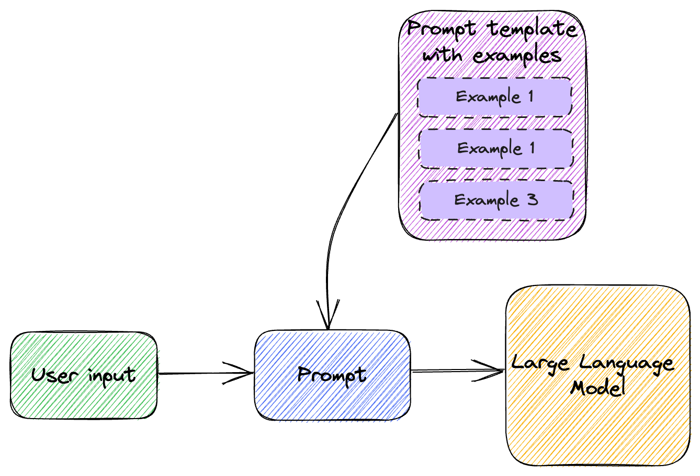
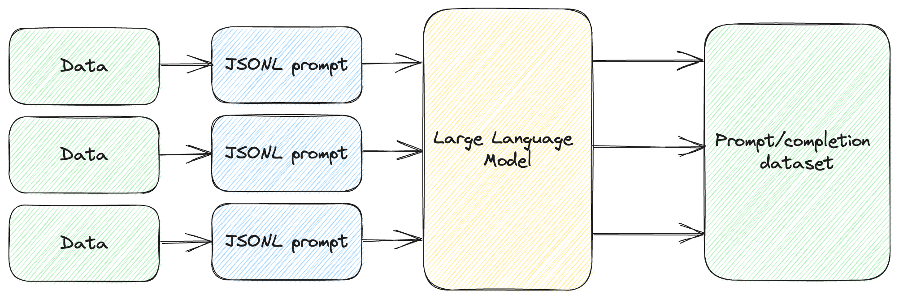
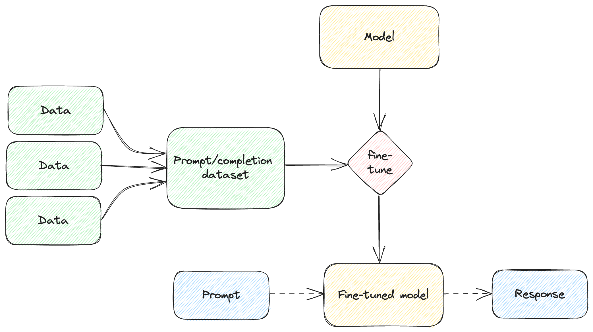

# Learning and Tuning


⚠️ *This chapter was written before OpenAI announced fine-tuning for
`gpt-3.5-turbo`. The section dealing with fine-tuning is no longer accurate and
will be rewritten to account for this update.*

In this chapter:

* Rewriting text in different styles.
* Running a text adventure game.
* Performing sentiment analysis.
* Implementing a Q&A over a dataset.

As we discussed large language models, we described them as huge neural networks
with billions of parameters, that are very expensive to train. Training such a
model is a big undertaking well outside the scope of this book. We talked a lot
about using these model as they are provided by OpenAI, meaning already trained.
As a reminder, GPT stands for *Generative Pre-trained Transformer*. Note the
“pre-trained”.

That said, we *can* teach an old model new tricks. This chapter is all about how
a large model can learn. The learning we’ll cover is different than training as
it is used in the context of neural networks. We won’t be starting from scratch
and attempting to train the billions of parameters in a model. Instead, we will
start with an already trained model and see what we can do from there.

First, there is *zero-shot learning*. This means the model might be able to
perform a task it was not specifically trained for. We prompt it to do
something, and it does this by nature of its knowledge of language and
relationship between words. We’ll see a couple of examples of this and what it
means.

Next, we have *one-shot learning*. With one-shot learning, we provide a single
example. Once given this example, the model can then accomplish the task.

Sometimes the scenario is more complex, and one-shot learning is not enough. In
this case, we have *few-shot learning*: this means providing several examples
from which the model can derive (learn) what it is supposed to reply.

Zero-, one-, and few-shot learning are all similar. They’re common techniques to
get more out a pre-trained model, simply by prompting. In some situations, this
is not enough. In the second part of this chapter, we’ll introduce
*fine-tuning*. This is a more involved process where we can provide any number
of questions and answers to a model which will help tune its responses.

Currently, OpenAI only supports fine-tuning for their `ada`, `babbage`, `curie`,
and `davinci` models, so we’ll look into fine-tuning `davinci` for a specific
task. We will implement a Q&A using this fine-tuned model, then talk about some
of the tradeoffs when using fine-tuning.

Let’s see what zero-shot learning is about.

## Zero-shot learning

Let’s start with an example: a large language model trained on a wide range of
texts can perform a translation task from one language to another without ever
having been explicitly trained on that particular translation pair. The model
can be given a prompt in the source language, along with a description of the
target language, and it will generate a translation based on its understanding
of language.

Listing 4.1 shows an example of this (we can save this as `translate.json`).

```json
{
    "messages": [
        { "role": "system", "content": "You are an English to French translator." },
        { "role": "user", "content": "Translate this to French: {{text}}" }
    ]
}
```

*Listing 4.1: English-to-French prompt template.*

Note we are not modifying any parameter in listing 4.1, just providing the
`messages`. For this scenario we don’t have to adjust `temperature`,
`max_tokens` etc. If we don’t mention them, the default values will be used.

We’re relying on the prompt templating we set up in Chapter 3. We’ll be using
`gpt-3.5-turbo`, the chat completion model, since it is cheaper than
`text-davinci-003` and just as good for this task. This template contains a
`system` message, telling the model to act as a translator, and a prompt to
translate text to French. The actual text is replaced at runtime.

Listing 4.2 shows how we can use this to make an OpenAI API call.

```python
from llm_utils import ChatTemplate

response = ChatTemplate.from_file(
    'translate.json').completion({'text': "Aren't large language models amazing?"})

print(response.choices[0].message.content)
```

*Listing 4.2: English-to-French translation using chat completion.*

We instantiate a `ChatTemplate` from the template file we defined in listing 4.1
and call the `completion()` function, setting the text to *“Aren’t large
language models amazing?”*. Running this code should print something like *“Les
grands modèles de langage ne sont-ils pas incroyables?”*

So how is this zero-shot learning? Well, `gpt-3.5-turbo` was not specifically
trained for English-to-French translation. Historically, natural language
processing models designed for translation are trained for the task. In our
case, we would train a model on English-to-French translations. This model has
not been trained for this specific task, but it can still perform it very well
when prompted to do so.

> **Definition**: *zero-shot learning* refers to the ability of a language model
to perform a task without any explicit training data or examples for that task.
Instead, the model can use its knowledge of language and the relationships
between words to perform the task based on a textual description or prompt.

Another example of zero-shot learning is the ability of large language models to
answer questions. These models are not trained specifically for Q&A, rather a
large corpus of data, large enough that it can both understand the semantics of
a question and rely on the data it has been trained on to answer it.

Note since the models are *not* trained for Q&A specifically, rather just to
predict the most likely next word and the one after that and so on, they are
prone to hallucinating (making things up), especially when they don’t have an
answer handy.

Zero-shot learning is impressive from the perspective of what models can achieve
– without us having to do anything, we see large language models exhibit some
powerful capabilities. On the other hand, zero-shot learning means we literally
don’t have to do anything, just ask. There are some limits to what can be done
with zero-shot learning. At some point, we need to show some examples. Enter
one-shot learning.

## One-shot learning

With one-shot learning, we provide the large language model with a single
example, which helps it better understand our prompt.

> **Definition**: *One-shot learning* refers to the ability of a large language
model to learn a new task or solve a new problem from only a single example.

In other words, instead of requiring a large dataset of labeled examples to
train on, a language model with one-shot learning capabilities can quickly adapt
to a new task or context with minimal training data.

This is done through *transfer learning*, where the model leverages its prior
knowledge and pre-trained representations to quickly learn new concepts or
patterns. By doing so, the model can generalize its understanding to new
situations, even when faced with limited data.

Of course, there is not a lot we can teach with a single example. On the other
hand, sometimes it is easier to show an example rather than trying to describe
what we want. For example, listing 4.3 shows a prompt for rewriting text in a
different style.

```json
{
    "messages": [
        { "role": "user", "content": "Here is some sample text: {{sample}} Rewrite the following text in the same style as the sample: {{text}}" }
    ]
}
```

*Listing 4.3: Text rewriting template.*

In this example, we provide some sample text and ask the model to rewrite
another text in the same style as the sample. Let’s save this as `rewrite.json`.
We could’ve provide a detailed description of the style instead, but that would
likely require more prompt tuning as we ourselves would have to understand and
explain the subtle elements of what a writing style entails. Rather than doing
that, we simply show the text in the style we want and let the large language
model figure out what it means.

Let’s put this to work. Listing 4.4 shows how we can use this template for rewriting.

```python
from llm_utils import ChatTemplate

response = ChatTemplate.from_file('rewrite.json').completion({
    'sample': '''
Deep in the shady sadness of a vale
Far sunken from the healthy breath of morn,
Far from the fiery noon, and eve's one star,
Sat gray-hair'd Saturn, quiet as a stone,
Still as the silence round about his lair;
Forest on forest hung about his head
Like cloud on cloud. No stir of air was there,
Not so much life as on a summer's day
Robs not one light seed from the feather'd grass,
But where the dead leaf fell, there did it rest.
A stream went voiceless by, still deadened more
By reason of his fallen divinity
Spreading a shade: the Naiad 'mid her reeds
Press'd her cold finger closer to her lips.''',
    'text': "Let's start with an example: a large language model trained \
on a wide range of texts can perform a translation task from one language to \
another without ever having been explicitly trained on that particular \
translation pair. The model can be given a prompt in the source language, \
along with a description of the target language, and it will generate a \
translation based on its understanding of language."})

print(response.choices[0].message.content)
```

*Listing 4.4: Rewriting chat completion.*

We provide as sample a few lines from John Keats’ Hyperion. The text is a
paragraph from earlier in this chapter. Let’s see how Keats would explain
zero-shot language translation. Listing 4.5 shows a possible reply.

```text
Deep in the vast expanse of knowledge,
Far removed from the familiar words of men,
Far from the common phrases, and dialects of foreign lands,
Resides the mighty language model, still as a statue,
Silent, amidst the stillness of its lair;
Knowledge upon knowledge stored within its head,
A library of texts that stretch beyond the sky.
No disturbance from the outer world can penetrate,
The silence, unbroken, like a winter's night,
But when prompted in one tongue, and guided to another,
It will weave language, a master of communication,
Based on its vast understanding of the spoken word.
```

*Listing 4.5: One-shot rewrite by large language model.*

Admittedly, Keats is a famous poet, so we could’ve asked the model to rewrite in
the style of John Keats, but this example demonstrates how we can sample some
text and have the model adopt the style with a simple example.

Another good use-case for one-shot learning is to format of the output. If we
have some very specific formatting requirements, showing an example rather than
describing the format makes for simpler prompts.

Listing 4.6 (`xml.json`) shows an example of us wanting an XML reply when
prompting the model for facts about some entity.

```json
{
    "messages": [
        { "role": "user", "content": "Give me some facts about Saturn" },
        { "role": "assistant", "content": "<FACTS entity=\"Saturn\"><FACT>Named after the Roman god of agriculture and harvest</FACT><FACT>At least 82 known moons</FACT></FACTS>" },
        { "role": "user", "content": "Give me some facts about {{entity}}"}
    ]
}
```

*Listing 4.6: One-shot formatting template.*

We expect the answer to be contained within the `<FACTS>` element. This element
contains an `entity` attribute specifying the target entity. We then want each
fact to show up inside `<FACT>` elements. In our prompt, we provide an example
of this as part of the chat conversation – we show an example question (facts
about Saturn) and the expected response for that question. We then repeat the
question but for a different entity.

Listing 4.7 shows how we can use this to get formatted facts from a large
language model.

```python
from llm_utils import ChatTemplate

response = ChatTemplate.from_file(
    'xml.json').completion({'entity': 'Elon Musk'})

print(response.choices[0].message.content)
```

*Listing 4.7: Formatted output chat completion.*

In this case we are asking for facts about Elon Musk. Running this code, I got
the reply in listing 4.8 (your milage may vary as models are non-deterministic).

```xml
<FACTS entity="Elon Musk"><FACT>CEO of SpaceX, Tesla, Neuralink, and The Boring
Company</FACT><FACT>Net worth of over $200 billion as of
2021</FACT><FACT>Founded PayPal</FACT><FACT>Has a vision to colonize Mars and
make humanity a multi-planetary species</FACT><FACT>Has publicly stated concerns
about the potential dangers of artificial intelligence</FACT></FACTS>
```

*Listing 4.8: One-shot formatting by large language model.*

The model was able to understand the format we wanted, and the response conforms
to the schema.

In general, consider using one-shot learning when it’s easier to *show* than
*tell*. If it takes fewer tokens to give an example or the example is clearer
than a description, the large language model should be able to easily understand
it. We saw it rewrite text in the style of John Keats from a few lines of
poetry, and we saw it output formatted XML from a single example of a similar
question/answer.

Of course, there is only so much we can convey with one example. Sometimes, we
need to provide a set of examples for the model to understand our goals.

## Few-shot learning

You can think of few-shot learning as an extended version of one-shot learning –
instead of giving a single example to the large language model, we provide
several examples.

> **Definition**: *Few-shot learning* refers to the ability of a large language
model to learn a new task or solve a new problem from a small set of examples.

In some cases, a single example might not provide enough information to give us
the desired result. We might end up here as we tune our prompt – we first
attempt a zero-shot prompt, but we don’t get back quite what we were expecting.
We then try a one-shot prompt, but even that misses the mark. In that case, we
can try providing multiple examples and hopefully the model can better infer
what we want.

Figure 4.1 illustrates few-shot learning.



*Figure 4.1: Few-shot learning.*

We take the user input and combine it with a set of examples to compose the
prompt we send to the large language model.

### Text adventure

An example of when we would want to use few-shot learning is when we want to
“teach” the model to act as a text adventure game. We’ll show the model a couple
of user actions and responses (e.g. for the user action `Look around`, the
response is `You are in a room with a table and a door`). Given a few such
examples, the model should be able to “play” with us.

In chapter 2 (listing 2.8) we implemented a simple command-line interactive
chat. We can expand that to act as our adventure game by pre-seeding the chat
history with a few-shot learning examples of how we want the model to reply. See
listing 4.9.

```python
from llm_utils import ChatTemplate

chat = ChatTemplate(
    {'messages': [
        {'role': 'system', 'content': 'You are a text adventure game.'},
        {'role': 'user', 'content': 'Look around'},
        {'role': 'assistant', 'content': 'You are in a room with a table and a door.'},
        {'role': 'user', 'content': 'Open door'},
        {'role': 'assistant', 'content': 'The door is locked.'},
        {'role': 'user', 'content': 'Check inventory'},
        {'role': 'assistant', 'content': 'You have a sandwich.'}]})

for message in chat.template['messages']:
    if message['role'] == 'assistant':
        print(f'{message["content"]}')

while True:
    prompt = input('> ')
    if prompt == 'exit':
        break

    chat.template['messages'].append({'role': 'user', 'content': prompt})
    message = chat.completion({}).choices[0].message

    print(message.content)
    chat.template['messages'].append(
        {'role': message.role, 'content': message.content}) 
```

*Listing 4.9: Large language model-based text adventure.*

The only thing we added on top of our command line chat from chapter 2 is the
chat history. In listing 2.8, this started out as an empty list. Here, it
contains several examples of user actions and responses. Before we enter the
chat loop, we print the `assistant` messages to give some context to the user.

If we run this code we can continue “playing” and getting realistic responses
from the model. Listing 4.10 shows a few actions and replies we could get by
running the code.

```text
You are in a room with a table and a door.
The door is locked.
You have a sandwich.
> What is on the table?
You see a key lying on the table.
> I use the key to open the door
You use the key to unlock the door and open it. You find yourself in a dark hallway. There are doors on either side of the hallway and a staircase leading up.
> I eat the sandwich
You eat the sandwich and feel slightly less hungry.
```

*Listing 4.10: Example actions and responses.*

The few-shot in this case are the `user` and `assistant` messages we put in
the`history`. Note we’re also starting with a `system` message providing some
context to the large language model. This is pretty impressive! When text
adventures were popular, in the early days of PCs, developers had to hand-craft
each and every interaction. With the help of large language models, we can now
achieve similar results with just a few examples.

This was an example of a generative scenario. We prime the model to generate the
type of responses we would expect from a text adventure game. Let’s look at
another example in another domain: sentiment analysis.

### Sentiment analysis

Large language models have extremely powerful language skills, so we can
leverage these for sentiment analysis. Say we want to evaluate the sentiment of
a restaurant review, on a scale from 1 to 5 (and also get some explanation of
why the model assigned the score it did). We can use few-shot learning for this
as shown in listing 4.11 (we can save this as `sentiment.json`).

```json
{
    "messages": [
        { "role": "system", "content": "You are an assistant designed to analyze sentiment of customer reviews. For a given review, you will respond with an assessment of the review. Rate on a scale of 1-5 (5 being highest). Explain why this rating was given" },
        { "role": "user", "content": "We've been here several times, and every time it wows us. Everything I've ordered I would order again." },
        { "role": "assistant", "content": "5: Short review in which the customer praises the food and mentions being a return customer." },
        { "role": "user", "content": "Love the food and have constantly enjoyed their sushi this last year. However, it's been too often that we've waited 45-60 minutes for our food. They take so many to go orders that they neglect their in-house patrons." },
        { "role": "assistant", "content": "2: The customer really enjoys the food but is dissatisfied by the long wait. The fact that the restaurant prioritizes to-go order makes them feel neglected." },
        { "role": "user", "content": "I loooove the sushi here! I've ordered from here multiple times and have dined in as well. Both are always great experiences and the sushi is always so yummy." },
        { "role": "assistant", "content": "5: The customer both dined in and ordered to go multiple times, had a great experience each time, and really enjoys the food." },
        { "role": "user", "content": "{{review}}"}
    ]
}
```

*Listing 4.11: Few-shot sentiment analysis template.*

We first use the `system` message to tell the model how we want it to reply. We
then provide a set of examples, where the `user` message contains the review
text and the `assistant` message contains the response, consisting of a score
and an explanation derived from the review text.

We can use this template with our interactive chat as shown in listing 4.12.

```python
from llm_utils import ChatTemplate

chat = ChatTemplate.from_file('sentiment.json')

while True:
    prompt = input('> ')
    if prompt == 'exit':
        break

    message = chat.completion({'review': prompt}).choices[0].message

    print(message.content)
```

*Listing 4.12: Sentiment analysis for restaurant reviews.*

For this particular scenario we don’t need chat history, as we expect to score
reviews one by one as they are provided. We simply load the template from
`sentiment.json` and on each call replace the `{{review}}` parameter with the
actual review. We print the response we get back. Listing 4.13 shows an example
of this interaction.

```text
> The food was fantastic but the kitchen was slowwwwwwwww and super disorganized. It seemed like they prioritized delivery orders over diners and it was really disappointing. But for the sushi and the prices this place was excellent!!
3: The customer really enjoyed the food and the prices, but is disappointed by the slow and disorganized kitchen. It seems like delivery orders are prioritized over diners, which is frustrating.
```

*Listing 4.13: Example sentiment analysis.*

We can see the model provides an accurate assessment of the review,
understanding the pros and cons and estimating the sentiment value.

Using few-shot learning, we can enable many scenarios across different domains.
Feeding a small set of examples to the large language model makes it understand
precisely how we want to use it and how it should format its response.

For more complex scenarios, we can combine few-shot learning with prompt
selection. We discussed prompt selection in chapter 3. Depending on the ask, we
can first apply prompt selection to identify which examples we want to inject
into the prompt and pick these from a broader range of possible few-shot
examples. Figure 4.2 shows how this would work.


*Figure 4.2: Prompt selection and few-shot learning.*

This is very similar with the prompt selection flow we looked at in chapter 3:

1. We have a selection prompt template and use the large language model to
process the original user ask and determine which template we should use.

2. In this case, the templates we are selecting from are few-shot learning
templates containing sets of examples for specific scenarios. We pick the right
template based on the selection prompt, then use that combined with the user ask
to generate the final prompt we send to the model.

We won’t go over an implementation as we already have all the building blocks
and putting them together will take too much space. Another powerful combination
is combining the few-shot learning examples with some form of memory – more
about this in chapter 5.

### Recap

We covered zero-shot, one-shot, and few-shot learning. Before moving on, let’s
quickly recap:

* Zero-shot learning pretty much means the model can perform a task it was not
  specifically trained for. You can start here when engineering your prompt –
  maybe the pre-trained model has enough knowledge to provide a good answer to
  your prompt without additional examples. One example we looked at was
  translation between two languages.
* One-shot learning means providing one example to the prompt. This comes in
  handy when it is easier to show than to tell – it can be used to both add
  context to the input prompt (our example was giving some Keats verses and
  asking the model to rewrite some text in that style) or to describe the output
  (we got the model to output in a custom XML format just by showing an
  example).
* Few-shot learning comes into play when a single example is not sufficient. We
  provide the model with a set of examples that help it refine its reply.

As we saw before, models have no memory. We need to supply these examples in the
prompt, and we must do it on each subsequent call if we want to get the same
results. There are situations when we’d rather not do this – we would like to
somehow teach the model something and have it stick.

## Fine-tuning

While training a performant large language model from scratch is prohibitively
expensive, a pre-trained model can be tuned with some domain-specific
information.

> **Definition**: *Fine-tuning* large language models refers to the processing
of adapting a general-purpose model for a specific task or domain. Pre-trained
language models can be trained with additional data to specialize them for
specific application scenarios.

This process involves an additional training step. After the expensive training
of the model, its (trained) parameters are frozen. During fine-tuning, new
domain-specific parameters are added and trained using a small domain-specific
dataset. The fine-tuning adjusts these parameters, without modifying the
pre-trained parameters at all. This process usually yields better performance on
the new domain-specific tasks.

Fine-tuning is very different than what we covered during the first half of this
chapter, with zero-, one-, few-shot learning. Instead of leveraging a
pre-trained model and including relevant information in the prompt, we are
modifying the model itself based on our data.

We won’t be using prompts for this, rather a dedicated API. In fact, not all
models can be fine-tuned. We’ve been using `gpt-3.5-turbo` and
`text-davinci-003` in our examples so far, but neither of them can be
fine-tuned. At the time of writing, the models which support fine-tuning are the
base models `ada`, `babbage`, `curie`, and `davinci`.

Pricing for this at the time of writing is shown in table 4.1. As always, you can find the up-to-date pricing at <https://openai.com/pricing>.

| MODEL | TRAINING PRICE PER 1K TOKENS | USAGE PRICING PER 1K TOKENS |
| --- | --- | --- |
| Ada | $0.0004 | $0.0016 |
| Babbage | $0.0006 | $0.0024 |
| Curie | $0.0030 | $0.0120 |
| Davinci | $0.0300 | $0.1200 |

*Table 4.1: Pricing for fine-tuning*

Two interesting things to note:

* Pricing is done per 1000 tokens, with different prices for the training
  (fine-tuning) part, and subsequent usage of the fine-tuned model.
* Pricing increases by an order of magnitude from `babbage` to `curie`, and
  again from `curie` to `davinci`.

Keep this in mind when using these for a production scenario and find the sweet
spot between cost and model performance. In our example we’ll be using
`davinci`. In general, the larger the dataset we train with, the better results
we get. Since we’re using a small dataset, we’re using a better model.
Fine-tuning this costs \$0.37. If you want, you can use a cheaper model when
running through the sample (`babbage` costs \$0.01 to fine-tune on this dataset).

Let’s walk through the steps of fine-tuning a model to answer questions about a
fictional race (something the model was definitely not trained on). Let’s say we
have a dataset of the 2023 Pod Racing standings as showing in table 4.2.

| PILOT | POD | RACE 1 | RACE 2 | RACE 3 | RACE 4 | RACE 5 |
| --- | --- | --- | --- | --- | --- | ---|
| Senn Kava | The Thunderbolt | 1 | 2 | 1 | 3 | 5 |
| Vix Tor | The Shadow Racer | 3 | 1 | 2 | 5 | 2 |
| Remy Thal | The Crimson Fang | 2 | 5 | 3 | 4 | 1 |
| Tira Suro | The Lightning Bolt | 4 | 3 | 4 | 1 | 4 |
| Kael Voss | The Razor Blade | 5 | 4 | 5 | 2 | 3 |

*Table 4.2: 2023 Pod Racing standings.*

5 races happened this season:

* Tatooine Grand Prix (race 1), won by Senn Kava.
* Coruscant Circuit (race 2), won by Vix Tor.
* Naboo Invitational (race 3), won by Senn Kava.
* Genosis Challenge (race 4), won by Tira Suro.
* Bespin Cup (race 5), won by Remy Thal.

Let’s see how we can fine-tune a model to answer questions about this race
season. Note we’re using a small example to keep things sane – we might actually
get away with putting all this information in a prompt and have the model answer
the question just by the additional context. But this is just an example. As the
size of the data scales, fine-tuning becomes more appealing. We also won’t have
to consume so many tokens with each prompt as we would if we were to pass data
with each prompt as context.

First, we need to prepare the data for training the model.

### Preparing the dataset

OpenAI expects fine-tuning data to be passed as JSONL. JSONL stands for JSON
Lines, meaning JSON objects separated by newlines. Each JSON object consists of
a `prompt` and a `completion`. The `prompt` in this case is a question, and the
`completion` is the ideal answer we would like to get from the large language
model.

Listing 4.14 shows an example JSONL format.

```json
{ "prompt": "Knock, knock!", "completion": "Who's there?" }
{ "prompt": "Orange", "completion": "Orange who?" }
{ "prompt": "Boo", "completion": "Boo who?" }
```

*Listing 4.14: Sample JSONL.*

We’ll need to format our race standing data into `prompt` and `completion`
pairs. An easy way to do this is to use a large language model for the task.
We’ll fragment our data into smaller chunks (to work around token limits if we
have a very large dataset) and ask `gpt-3.5-turbo` to come up with some prompts
and answers based on the dataset. We’ll lower the temperature as we want the
model to use the data provided rather than making things up (though this might
make the questions less imaginative). `gpt-3.5-turbo` will help us fine-tune a
`davinci` base model!

Listing 4.15 shows the prompt we’ll use to generate these questions and answers.
Let’s save this a `jsonl.json`.

```json
{
    "temperature": 0,
    "messages": [
        { "role": "user", "content": "Here is some information about the 2023 Pod Racing season: Race 1 was the Tatooine Grand Prix, won by Senn Kava. Provide 2 prompts and completions based on this data in JSONL format." },
        { "role": "assistant", "content": "{\"prompt\": \"What was the name of the first race in the 2023 Pod Racing season?\", \"completion\": \"The Tatooine Grand Prix.\"}\n{\"prompt\": \"Who won the Tatooine Grand Prix?\", \"completion\": \"Senn Kava.\"}" },
        { "role": "user", "content": "Here is some information about the 2023 Pod Racing season: {{info}}. Provide {{n}} prompts and completions based on this data in JSONL format." }
    ]
}
```

*Listing 4.15: Prompt to generate questions and answers.*

We’re using one-shot to prime the model to format the response as JSONL. In the
example we are providing a short bit of information and expected JSONL reply for
2 prompts and completions. Next we make the information a parameter (`{{info}}`)
and the number of prompts and completions we want generated another parameter
(`{{n}}`).

We can then pass in a chunk of information and a number of prompts and
completions to generate.

Listing 4.16 shows one such chunk, describing the racers and league standings.

```text
During the 2023 Pod Racing season, the following racers competed:
* Senn Kava piloting The Thunderbolt.
* Vix Tor piloting The Shadow Racer.
* Remy Thal piloting The Crimson Fang.
* Tira Suro piloting The Lightning Bolt.
* Kael Voss piloting The Razor Blade.

Anakin Skywalker was mysteriously absent from this season.

The final standings:
* Senn Kava won the cup.
* Vix Tor came in second.
* Remy Thal was third.
* Tira Suro took forth place.
* Kael Voss was last.

The racing season consisted of 5 races:
* The Tatooine Grand Prix (race 1)
* The Coruscant Circuit (race 2)
* The Naboo Invitational (race 3)
* The Genosis Challenge (race 4)
* The Bespin Cup (race 5)
```

*Listing 4.16: Pod Racing league facts from which we generate training data.*

The Pod Racing league fact files are available in the GitHub repo under the
`/code/racing/` folder. The folder contains 6 files, `league.txt`, `race1.txt`,
`race2.txt`, `race3.txt`, `race4.txt`, and `race5.txt`. `league.txt` is shown in
listing 4.16. The remaining files contain facts about each race. Listing 4.17
shows the content of `race1.txt`, so you get an idea of how the dataset looks
like.

```text
During the Tatooine Grand Prix Pod Racing race, there were several thrilling and
unexpected moments that led to the final standings:

Thunderous Takeoff: At the starting line, Senn Kava's Thunderbolt pod launched
with an extraordinary burst of speed, leaving the other racers in awe. The
expertly tuned engine of the Thunderbolt provided an unprecedented acceleration
advantage, allowing Kava to establish a commanding lead right from the
beginning.

Shadow Racer's Slipstream: As the race progressed, Vix Tor's Shadow Racer
skillfully utilized the aerodynamic properties of the pod to ride the slipstream
created by the Thunderbolt. By closely tailing behind Kava, Tor minimized air
resistance and gained a significant speed boost, catapulting the Shadow Racer
into the top three positions.

Thrilling Aerial Maneuvers: Remy Thal, piloting the Crimson Fang, exhibited
exceptional piloting skills during a treacherous section of the racecourse. Thal
expertly navigated through a series of tight turns and dangerous obstacles,
executing daring mid-air flips and barrel rolls. The crowd held their breath as
the Crimson Fang narrowly avoided collisions, ultimately propelling Thal into
second place.

Lightning Bolt's Electrifying Boost: Tira Suro's Lightning Bolt had a unique
energy-harvesting system integrated into its design. During the race, Suro
strategically positioned the pod near an electrical storm that unexpectedly
formed on the course. The Lightning Bolt harnessed the electrical energy,
momentarily activating a boost of unparalleled speed. However, the power surge
was short-lived, and Suro slipped to fourth place after the energy dissipated.

Razor Blade's Perilous Gamble: Kael Voss, piloting the Razor Blade, took a
daring risk to gain an advantage during the race. In a section with a hazardous
sandstorm, Voss decided to take an alternate route through a rocky canyon. While
this path appeared shorter, it was fraught with perilous terrain and
unpredictable gusts of wind. Despite the danger, Voss showcased remarkable
precision and nerve, allowing the Razor Blade to secure the fifth-place
position.

These exhilarating moments and unexpected tactics turned the Tatooine Grand Prix
Pod Racing race into a thrilling spectacle for spectators, leaving them on the
edge of their seats until the checkered flag was waved.
```

*Listing 4.17: Pod Racing league facts from which we generate training data.*

Note each paragraph talks about a pilot and how they performed during the race.
The remaining files follow the same format.

The key takeaway is we can take an arbitrarily large dataset, chunk it, generate
prompts and completions from it, then use them to fine-tune a model so it can
answer domain-specific questions.

Listing 4.18 shows how we can get JSONL using `gpt-3.5-turbo`.

```python
from llm_utils import ChatTemplate
import os

template = ChatTemplate.from_file('jsonl.json')
jsonl = ''

for f in os.listdir('../racing'):
    with open(os.path.join('../racing', f), 'r') as f:
        text = f.read()

    response = template.completion({'info': text, 'n': '20'})
    jsonl += response.choices[0].message.content.strip() + '\n'

with open('racing.jsonl', 'w+') as f:
    f.write(jsonl)
```

*Listing 4.18: Generating prompts and completions from some facts.*

We list all files in the `/racing` subfolder, then user our `jsonl.json` prompt
to get `gpt-3.5-turbo` to produce JSONL prompt and completion pairs. We collect
all of these in a `jsonl` string which we finally write to a file,
`racing.jsonl`.

Running this should return a list of prompts and completions formatted as JSONL,
based on the facts we passed in. Listing 4.19 shows the first few items:

```json
{"prompt": "What maneuver did Remy Thal execute during the Bespin Cup Pod Racing race?", "completion": "A gravity-defying maneuver utilizing the pod's advanced repulsorlift technology."}
{"prompt": "Who piloted the Crimson Fang during the Bespin Cup Pod Racing race?", "completion": "Remy Thal."}
{"prompt": "What strategy did Vix Tor employ during the Bespin Cup Pod Racing race?", "completion": "An elusive approach that relied on the pod's exceptional agility and maneuverability."}
```

*Listing 4.19: Part of the response we get when running listing 4.17.*

The full output is available on GitHub as `racing.jsonl`.

Figure 4.3 shows the steps we just went through.



*Figure 4.3: Preparing the data for fine-tuning.*

We take as many chunks of data as we have (in our case the various text files),
we inject them in the JSONL prompt, and have `gpt-3.5-turbo` produce
prompt/completion JSONL. We concatenate the outputs into our dataset.

We will use the OpenAI command line tools for fine-tuning. These should’ve been
installed when we ran `pip install openai` all the way back in chapter 1. Before
fine-tuning, we’ll use the command line to double-check our JSONL data. Listing
4.20 shows the command.

```sh
openai tools fine_tunes.prepare_data -f racing.jsonl
```

*Listing 4.20: Using OpenAI command line to prepare the JSONL data for
fine-tuning.*

This should output an analysis of the dataset and suggestions. For this
particular dataset, the suggestion would be that completions should start with a
whitespace character (they don’t in our case). The tool offers to automatically
fix this, and outputs `racing_prepared.jsonl`. Remember to always run this
command before fine-tuning to make sure the data is valid.

We now have our fine-tuning data ready. The next step is to use it on a based
model and get our 2023 Pod Racing Q&A model.

### Fine-tuning the model

We’ll be using the command line tools for fine-tuning. Listing 4.21 shows the
command to start the fine-tuning process.

```sh
openai api fine_tunes.create -t racing_prepared.jsonl -m davinci
```

*Listing 4.21: Using OpenAI command line to fine-tune a model.*

This will upload the JSNOL training data and start a fine-tuning job. The output
should contain a unique identifier for the job, something like
`ft-FYTbxinEtM7UeJb0Uz4P6kS3`. The `ft-` part stands for fine-tune, the rest is
a unique identifier.

The job will be queued by OpenAI and you should see console updates with the
place in the queue etc. If for whatever reason the connection is lost, you can
re-connect using the command in listing 4.22.

```sh
openai api fine_tunes.follow -i ft-FYTbxinEtM7UeJb0Uz4P6kS3
```

*Listing 4.22: Using OpenAI command line to follow a fine-tuning job.*

Update the unique identifier with the one you got after running the code in
listing 4.21. The fine-tuning job will eventually execute and will result in a
fine-tuned model you can subsequently use in your application. Listing 4.23
shows an example of the last lines of output from the fine-tuning job.

```text
Job complete! Status: succeeded 🎉
Try out your fine-tuned model:
openai api completions.create -m davinci:ft-personal-2023-06-19-17-42-56 -p <YOUR_PROMPT>
```

*Listing 4.23: Output once model fine-tuning job is complete.*

In this example, the model name is `davinci:ft-personal-2023-06-19-17-42-56`.
The exact model name will be different for you when you run the job, but it
follows the same pattern: the base model (in our case `davinci`), followed by
`ft` (fine-tune), `personal` stands for using a personal account with OpenAI,
and a timestamp representing the date and time when this model was created.

We took multiple datasets, combined them into our JSONL data, ran a fine-tuning
job for a base model, and we ended up with a fine-tuned model we can now prompt
and get responses from (see figure 4.4).



*Figure 4.4: Fine-tuning a model with a prompt/completion dataset.*

Note this fine-tuned model is tied to your account – it is not publicly
available. You can access it with your account but a different person with a
separate account will not have access to it.

Now let’s see how we can use this model.

### Using the model

We’ll implement another chat – an interactive Q&A with the fine-tuned model.
Listing 4.24 shows the code for this.

```python
import openai
import os

openai.api_key = os.environ['OPENAI_API_KEY']

template = '''You are a Q&A bot. You provide short answers to questions.
For example:
Question: Who was missing from this season? Anakin Skywalker.
Provide the answer to the following question:
Question: '''

while True:
    prompt = input('user: ')
    if prompt == 'exit':
        break

    response = openai.Completion.create(
        model='davinci:ft-personal-2023-06-19-17-42-56',
        temperature=0,
        stop=['\n'],
        prompt=template + prompt)
    print(response.choices[0].text)
```

*Listing 4.24: Q&A using the fine-tuned model.*

We’re not using `llm_utils` in this case since our `Template` class is hardcoded
to use `text-davinci-003` – for good reason, since this is the only code sample
where we’re using a different model.

We have a template providing an example question and answer (one-shot learning)
for formatting. Note that we are using the fine-tuned model
`davinci:ft-personal-2023-06-19-17-42-56`. We’re also providing a `stop`
argument, to stop after a newline. I observed the model tends to continue
outputting text even after it answers the question. This `stop` argument
combined with the one-shot example in the prompt helps getting better output.
Listing 4.25 shows an example Q&A with this model.

```text
Crimson Fang.
user: Who pilots The Razor Blade?
 Kael Voss.
user: What happened to Senn Kava during the Genosis Challange?
 An unexpected power surge caused the pod's stabilization system to fail.
```

*Listing 4.25: Example Q&A interaction.*

As we can see, the fine-tuned model remembered the facts we fed it and answers
the questions correctly.

We just saw how we can fine-tune a base model with a custom dataset and how to
integrate that model in an application – Q&A in our case.

### Additional considerations

Fine-tuning performs better the larger the training dataset (the
prompt/completion JSONL), at least a few hundred examples. In our case, since
we’re dealing with a toy example, the dataset is rather small, so model
performance won’t be great. In practice, you would want to use larger datasets –
the larger the better.

Another best practice, which we didn’t do to keep things concise, is to train
the model to say it doesn’t know when the answer is not available in the
dataset. These are called *adversarial examples*. Ideally our JSONL should
contain prompts for facts not captured in the data we have, and completions
saying something like “I am sorry, I do not have this data” or “I don’t have the
answer for this” or something among those lines. If we don’t provide such
examples, the model will make up answers, even if it doesn’t have the facts,
something we would like to avoid.

Fine-tuning a model doesn’t have to be a one-time thing. We can take a
fine-tuned model and fine-tune it further with additional data. Figure 4.5 shows
how this works.


*Figure 4.5: Fine-tuning a fine-tuned model.*

Refer to the OpenAI documentation for more details on fine-tuning:
<https://platform.openai.com/docs/guides/fine-tuning>.

Let’s also talk about some of the drawbacks of fine-tuning, and why we might
want to consider alternative approaches.

First of all, fine-tuning means taking a base model and adding parameters to it
based on the dataset we’re using for the training job. This model will be
different from the model we started with. If you are working on a large system
that relies on large language models in multiple places, each using a
differently fine-tuned model, the models will diverge in the responses they
provide as they no longer have the same parameters. This might or might not be
an issue depending on your specific use-case, but something to keep in mind.

More importantly, at the time of writing, OpenAI only support fine-tuning of
GPT-3 family models: `ada`, `babbage`, `curie`, and `davinci`. These models are
in general “dumber” than the 3.5 family we’re been using throughout the rest of
the book (`text-davinci-003` and `gpt-3.5-turbo`) and the more recently launched
GPT-4. That means in general we’ll be getting worse responses than we would from
newer models. Unfortunately, the newer models do not support fine-tuning.

This seems like a pretty bad tradeoff. We’d like to use a large language model
with better performance. But remember, we went through the trouble of
fine-tuning a model because we had a dataset too large to fit into a prompt.
Turns out there is an alternative: what if we had a way to select only the
relevant information from a large dataset and inject it in the prompt, sticking
to the token limits? The next chapter covers exactly this scenario: using memory
instead of fine-tuning.

## Summary

* Large language models can perform, when prompted, tasks for which they weren’t
  specifically trained – this is called *zero-shot learning*.
* Often, a single example is enough to get desired behavior, this is *one-shot
  learning*.
* Use one-shot learning when it’s easier to show than to tell how a response
  should look like.
* In some cases, a single example is not enough to elicit the desired behavior,
  we need to provide multiple examples – this is called *few-shot learning*.
* If we have a dataset too large to fit in a prompt, we can *fine-tune* a model
  on the dataset.
* Fine-tuning takes a base model and trains it (adding additional parameters) on
  the dataset provided.
* We can take a fine-tuned model and fine-tune it further with additional data.
* The larger the dataset, the better responses we will get.
* Provide adversarial examples, otherwise the models will hallucinate responses
  even when lacking data.
* Only GPT-3 family models can be fine-tuned, which is a drawback as newer
  generation models are better.
