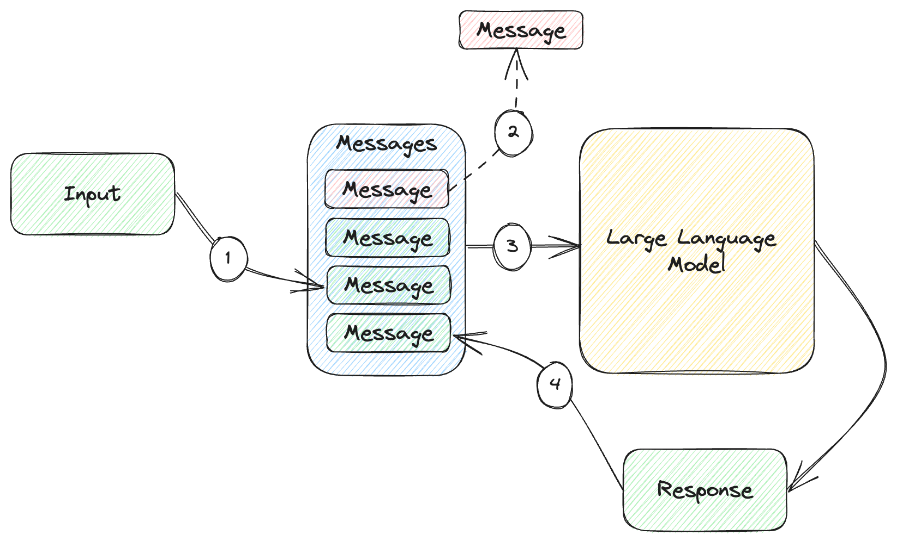

# Memory and Embeddings


In this chapter:

* Implementing simple memories.
* Leveraging embeddings for better recall.
* Using a vector database.
* Exploring alternative memory architectures.


**Man,  it would be awesome if you could do all of these in pod racer....**

We saw some important limitations of large language models: the fact that they
don’t maintain any memory between API calls and token limits which make it
impossible to add large amounts of data in a prompt.

The solution to these limitations is having external memory, and injecting a subset of it into your prompt (the amount required to meet your prompt limitations). The subsetting problems introduces a new problem, how to store, find and subset the memory.

**Is the industry standardized on the word memory, for me it's closer to state...**
**Maybe you go into this later, but this is very similar to the classic virtual memory/cache problem:
.**

We'll introdcue the problem space with a couple of simple memory implementations. First, we’ll
maintain a chat memory **within the prompt** as a list of messages. **However, we'll soon run out space, and we'll need an eviciction strategy.** As we start running into token
limits, we’ll start popping old messages from the list.

We'll over come that

We’ll then implement a slightly smarter key-value memory. Our memory will
consist of book descriptions keyed by book title. When our prompt mentions a
book title we know about, we inject the book data into the prompt. We’ll also
cover limitations of this approach.

Next, we’ll look at a better approach: *embeddings*. We’ll see what an embedding
is and how we can produce one. We’ll implement a memory based on embeddings,
which makes data retrieval much better. We’ll revisit the Pod Racing dataset and
Q&A scenario. Instead of the fine-tuning we used in chapter 4, we’ll embed the
dataset and implement Q&A using embeddings. Turns out this yields better results
than fine-tuning.

To scale to large datasets, we’ll likely need a *vector database*. We’ll take a
look at Chroma, an open-source vector database. We’ll redo the Pod Racing Q&A
using Chroma and learn how we can store and query embeddings. We’ll briefly talk
about other vector databases which you should consider when building your
solution.

We’ll wrap up with a quick overview of a novel approach to memory, which expands
on embeddings with additional parameters like recency and importance. This is an
interesting area of exploration. But first things first: a very simple memory
implementation.

## A simple memory

We’ll start our discussion on memory by reiterating the need for such a
mechanism and the limitations of a naïve approach. We saw in chapter 2 that
large language models do not maintain any memory themselves. At the model layer,
there is no concept of *session* or *chat*. Let’s say we implement a simple chat
client that doesn’t have any memory whatsoever, like we did in chapter 3
(listing 3.24). We’ll reproduce it here as listing 5.1.

```python
from llm_utils import ChatTemplate

chat = ChatTemplate(
    {'messages': [{'role': 'system', 'content': 'You are an AI chat program.'},
                  {'role': 'user', 'content': '{{prompt}}'}]})

while True:
    prompt = input('user: ')
    if prompt == 'exit':
        break

    message = chat.completion({'prompt': prompt}).choices[0].message

    print(f'{message.role}: {message.content}')
```

*Listing 5.1: Command line chat without history.*

Note we are looping, sending prompts to the large language model, and printing
the replies, but we don’t maintain any history of the chat.

If we run this and our first prompt is *Say "Hello world" in Python* and our
second one is *Now do it in Ruby*, we will get a response similar to listing
5.2.

````text
user: Say "Hello world" in Python
assistant: Sure, here is how to say "Hello world" in Python:

```
print("Hello world")
```
user: Now do it in Ruby
assistant: Sure I can do that! Here's a simple Ruby program that can be run in the console:

```
class ChatProgram
  def initialize
    puts "Hello! I'm a chat program. What's your name?"
    @name = gets.chomp
  end

...
````

*Listing 5.2: Chatting with a large language model without history.*

I trimmed a lot of the output in listing 5.2 as the response went on for quite a
while but this should be enough to get the point across. This example simply
illustrates the fact that models by themselves don’t remember anything between
prompts, which makes for some very incoherent “chat”. The model did not remember
our first prompt was `Say "Hello world" in Python`, so it interpreted `Now do it
in Ruby` as a standalone ask, and it tried to guess what we mean by “it”. In
this case it implemented a chat program.

The solution we saw before, reproduced in listing 5.3, is to maintain a history
of the prompts and responses, and send it back to the model with each prompt.

```python
from llm_utils import ChatTemplate

chat = ChatTemplate(
    {'messages': [{'role': 'system', 'content': 'You are an AI chat program.'}]})

while True:
    prompt = input('user: ')
    if prompt == 'exit':
        break

    chat.template['messages'].append({'role': 'user', 'content': prompt})
    message = chat.completion({}).choices[0].message

    print(f'{message.role}: {message.content}')
    chat.template['messages'].append(
        {'role': message.role, 'content': message.content})
```

*Listing 5.3: Chat with history.*

Unlike listing 5.1, here we append the user message to
`chat.template['messages']` before sending the request to the large language
model. We also append the response we get from the model after printing it. With
each iteration of the loop, we now maintain a history of the conversation which
we play back with each request.

With this approach, our previous example of saying “Hello world” in different
languages looks a lot better (listing 5.4).

````text
user: Say "Hello world" in Python
assistant: Hello world! Here's the code to print it in Python:
```
print("Hello world")
```
user: Now do it in Ruby
assistant: Sure! Here's how to print "Hello world" in Ruby:
```
puts "Hello world"
```
````

*Listing 5.4: Chatting with a large language model with history.*

Figure 5.1 shows how this works.


*Figure 5.1: Maintaining a history of all messages in a chat.*

1. We append the latest user input to the list of messages.
2. We send the whole list of messages to the large language model.
3. We append the response we get from the model to the list of messages.

So far so good – our chat history acts as a very simple memory for the model.
The reason we have to dedicate a whole chapter to the topic is we can easily run
into token limits. As the chat conversation continues, our history grows
unbounded. At some point, it grows large enough that the model is no longer able
to process it.

You can give this a try if you want to see how it looks like. Here is what
happens once the prompt becomes too large for the model:

> openai.error.InvalidRequestError: This model's maximum context length is 4097
tokens. However, your messages resulted in 4327 tokens. Please reduce the length
of the messages.

The API throws an exception. This means our chat program as-is won’t work very
well for any significantly long chat conversation.

Keep in mind this goes beyond chat applications. In chapter 4 we saw how we can
use few-shot learning to “teach” the model new things. For any complex enough
scenario, we will have enough data at hand that we won’t be able (and it would
be highly inefficient) to send all of it to the model with each prompt. Think of
a scenario like our Pod Racing stats from chapter 4. For a large enough dataset,
we had to resort to fine-tuning, but also discussed some of the tradeoffs with
this approach. We said there is an alternative to make large datasets available
to a large language model through memory. Throughout the rest of this chapter,
we’ll look at different ways to implement memory.

In chapter 2 we touched on `tiktoken`, an OpenAI Python library we can use to
count the number of tokens in a request. Counting tokens becomes relevant as
we’re looking at scenarios like the chat memory above, where we are likely to
run into limits. Counting tokens with `tiktoken` is straight-forward for
completion model but gets a bit more complex for chat completion models, where
we have multiple roles and messages. The implementation itself is less
interesting. Our `llm_utils` library as `count_tokens()`, which works for
counting the tokens in the `messages` parameter of the current version of
`gpt-3.5-turbo` (future iterations of this model might choose a different
encoding). We’ll be using this function in the next code samples without
discussing the implementation here (it is covered in Appendix A if you are
curious).

Note the large language model token limit is a combination of prompt and
response, so we need our prompt to leave enough tokens for the model response
too. One idea for the chat scenario is to set some token limit we want our
prompt to fit into, with enough tokens left for a response, and *forget* old
chat items. Figure 5.2 sketches how this would work.



*Figure 5.2: Chat history with limit.*

1. Same as figure 5.1, we append the user input to the list of messages.
2. We now check whether we are within the token limit. If we are not, we remove
   the oldest message. Repeat until we are within the limit.
3. Send all of the remaining messages to the large language model.
4. Append the response to the list of messages.

Listing 5.5 shows the implementation.

```python
from llm_utils import ChatTemplate, count_tokens

chat = ChatTemplate(
    {'messages': [{'role': 'system', 'content': 'You are an AI chat program.'}]})

TOKEN_LIMIT = 1000

while True:
    prompt = input('user: ')
    if prompt == 'exit':
        break

    chat.template['messages'].append({'role': 'user', 'content': prompt})
    while count_tokens(chat.template['messages']) > TOKEN_LIMIT:
        chat.template['messages'].pop(0)

    message = chat.completion({}).choices[0].message

    print(f'{message.role}: {message.content}')
    chat.template['messages'].append(
        {'role': message.role, 'content': message.content})
```

*Listing 5.5: Chat with history and token limit.*

We set a token limit of `1000` and while our history of the chat (maintained in
`chat.template['messages']`) has more tokens that the limit, we pop the oldest
item.

This is a pretty simple “memory” which will never run into token limits. We can
have a conversation where we reference previous prompts and it will work up to a
point. As the chat history starts hitting token limits, we start removing items
from it, so if further down the chat we try to reference something from the very
beginning, the model will no longer be able to recall that. This might be good
enough for some scenarios, but we can do much better.


**For chat history, doing summarization before popping might be cool to talk about as an aside**

## Key-value memory

A key-value memory is another pretty simple type of memory, which works well in
certain scenarios. For example, let’s say we have a database of books and
information about each book. We can represent these as book title-book
description key-value pairs. Listing 5.6 shows a small example, though our
dataset can be arbitrarily large.

```text
Travelling at Night
---
The annotated dream-journals of Christopher Illopoly, sometimes called 'the only
readable occultist': literate, entertaining, bewildering.
'The Wood lies outside the walls of the Mansus. As any student of Histories
knows, the Mansus has no walls.'Illopoly describes how he came to make repeated
visits to a dream-Wood via what he calls silver dreams. 'Trying to think your
way to the Wood,' he explains, 'is like thinking your way to being in love. But
I did find a Secret that helped.'

The Skeleton Songs
---
Poems of greedy delight composed by the possibly pseudonymous Arabella Dusk, the
rumoured heiress-turned-madam-turned-poetess. In Arabella's introduction, she
explains that the book was to be illustrated, but that the Suppression Bureau
would not permit it. She hints that the illustrations still exist somewhere. The
book is dedicated to 'Sir Parsival of the Red Cup'. The Twenty-Six Delightful
Fruits; the Seven Chastisements; the Nine Gardens; the Four Regrets.

The Locksmith's Dream
---
The first volume of Teresa Galmier's examination of parallels in the mystic
dreams of artisans.The parallels in mystic dreams experienced by carpenters,
masons and other artisans, and what they purport to reveal about the
architecture of the world. Sometimes mordant, sometimes funny. No-one has ever
explained why Galmier devoted herself to this quixotic exploration of artisan's
dreams. 'Time and again we hear of the Wood, which rises from the world's
foundation. All trees reach for light. What does the Wood reach for? Is there a
difference between light and Light? I think the key to dreams of the Wood might
be one of these - the one that isn't exactly real.'
```

*Listing 5.6: Book titles and descriptions.*[^1]

We can save this file as `books.txt`. We can now load this database in a
dictionary and enhance our chat program so it can answer questions about books.
Figure 5.3 shows how this would work.


*Figure 5.3: Retrieving book description from memory based on question.*

As we chat with our user, we check whether a book title is mentioned in their
prompt. If it is, we retrieve the book description from memory and inject it in
the prompt before sending it over to the large language model. This adds
additional context to the prompt. We used the term “context” in previous
chapters but let’s define it here.

> **Definition**: *prompt context* refers to the input provided to the model to
guide its response. It includes the user ask and additional information relevant
for satisfying the ask. The information could be a history of previous
interactions, additional data, additional instructions, example responses etc.

Listing 5.7 shows the implementation.

```python
from llm_utils import ChatTemplate

with open('books.txt', 'r') as f:
    content = f.read().split('\n\n')

books = {}
for book in content:
    title, description = book.split('\n---\n')
    books[title] = description.strip()

chat = ChatTemplate(
    {'messages': [{'role': 'system', 'content': 'You are an AI chat program.'}]})

while True:
    prompt = input('user: ')
    if prompt == 'exit':
        break

    for book in books:
        if book in prompt:
            chat.template['messages'].append({'role': 'user', 'content':
                                              'Here is a description of ' + book + ': ' + books[book] + '.'})

    chat.template['messages'].append({'role': 'user', 'content': prompt})
    message = chat.completion({}).choices[0].message

    print(f'{message.role}: {message.content}')
    chat.template['messages'].append(
        {'role': message.role, 'content': message.content})
```

*Listing 5.7: Adding book context to chat.*

We read `book.txt` and process it into the `books` dictionary as
title-description key-value pairs. In our chat loop we now preprocess the
prompt, identify the information that will most likely give useful additional
context to the large language model and update the prompt with this information.

Namely we search for book titles in the user’s `prompt`. If we find one, we
inject another message into the chat history before the user prompt. This
message provides the description of a book as retrieved from our key-value
memory (the `books` dictionary).

Listing 5.8 shows a possible dialogue using this implementation.

```text
user: Who is the author of The Skeleton Songs?
assistant: The author of The Skeleton Songs is Arabella Dusk, a possibly
pseudonymous poetess.
```

*Listing 5.8: Dialogue with key-value memory.*

Listing 5.7 shows a small implementation optimized for readability. A few things
to note here:

1. If the user mentions the same book in two different prompts, we inject the
   same description twice in the chat. We can extend the code to keep track of
   which descriptions we already provided and avoid duplication. Better yet, we
   can trim the chat history of book descriptions that are not relevant to the
   current user prompt.
2. We can mix the simple memory with token limits we looked at in the previous
   section with this implementation. We are again at a point where a long chat
   will exhaust the token limit, but there’s nothing preventing us from trimming
   the history to avoid this.
3. We can provide smarter search than exact string matching. For example, we can
   do fuzzy matching to account for typos. **This is an excellent use of a prompt to do the matching**

We didn’t do any of the above to keep the code sample easier to read, but all of
these are valid enhancements which we’d likely do if we were building a robust
system.

This is the first time where we can easily see how useful additional memory is.
While our example shows only a few books, in practice we can have as many as we
want. We have the constraint of *one* book description having to fit within the
token limit, but not the total size of *all* book descriptions.

### Memory

We’ve seen a couple of memories, so let’s extrapolate and look at the generic
structure. Figure 5.4 shows a pipeline including memory.

**Pondering, would you include eviction in this picture, doesn't seem consistent with the chat - I guess it is actually**


*Figure 5.4: Large language model pipeline with memory.*

We have a large dataset (larger than we can fit in a prompt) – our memory. We
take some input. Based on the input, we identify which pieces of our large
dataset apply to the input, and we pull them into the prompt we send to the
large language model.

In general, since large language models don’t remember data that they haven’t
been trained on, we can greatly increase their utility by providing external
memory. This is very much analogous with how a computer system works – the large
language model is like a CPU, and the memory implementations we’re covering in
this chapter are like RAM.


**Side bar, RAM vs VM not sure people grok that**


Key-value memory works for some scenarios, but a big limitation with this
approach is figuring out which keys are relevant to the user ask. In our book
example, we simply searched for a book title in the prompt. This runs into
limitations very fast – what if the user only remembers the name of a character
and asks in which book the character shows up? Since our key-value memory is
keyed by book title, we won’t know which book description to retrieve. Language
models are great at language processing, and it turns out there already is a
solution perfect for this use-case: embeddings.

## Embeddings


**OH I really like introducing this early, and usign it through all the examples ..

The problem we need to solve is what's the best facts (oh I like the word facts)  to fill into our memory,

E.g. GetFacts(UserInput)

1. Keep all, blow out memroy
1. Keep based on most recent
1. Keep based on most relelvent, fuzzy match
1. Keep based on on LLM but again blow out on memory
1. Keep based on state of the art, called embeddings

.**

Before we implement a memory based on embeddings, let’s understand what an
embedding is. The next section will be a bit more theoretical, but it’s
important to grasp the concept.

### What are embeddings

Underneath all machine learning, there’s large arrays of numbers. That’s how
neural networks represent inputs and weights. Large language models deal with
text, so there needs to be some mapping of language to numbers. We would also
expect some notion of similarity – the numerical representation of synonyms
should be numbers close in value. Large language models encode semantic meaning
through this *closeness* of values.


**Need to mention this is a 2 parts of value
1/ It's a compression function
2/ It enables us to do similarity
**

**OpenAi using 16K dimensions, but to make our undersatnding sane**f

To develop an intuitive understanding of this, let’s start by imagining a single
dimension – meaning we associate a single number to a word. We would expect the
distance between the word *cat* and the word *dog* to be smaller than the
distance between the word *cat* and the word *helicopter*. If we plot these on a
line, the points representing *cat* and *dog* would be closer together, and the
word *helicopter* would be further away. That’s because cats and dogs are pets
and are likely to come up in similar contexts together than next to aircrafts.

Of course, a single dimension is not enough to express how closely related words
are. *Kitten* should be as close to *cat* as *puppy* would be to *dog*. And
since *kitten* is to *puppy* what *cat* is to *dog*, the distance between
*kitten* and *puppy* should be similar to the distance between *cat* and *dog*.
All still relatively far away from *helicopter*. Let’s add a second dimension
and plot these points, as in figure 5.5.

**I don't remember the example, but there's an example of BERT where you do math... Something like (King + Queen) - Royalty ~ Man  + Woman, I reall really liking it ... maybe doesn't matter**


*Figure 5.5: Word relationships represented in a 2-dimensional space.*

While harder to visualize, large language models represent words as vectors
(lists) of numbers. This would be our pets and helicopter example above but
extended to a much larger number of dimensions.


> **Definition**: *Word embeddings* are numerical representations of words that
capture their meanings and relationships based on how they appear in a text
corpus. These embeddings are generated by training a machine learning model on a
large amount of text data. The model learns to assign each word a unique vector
of numbers, which serves as its embedding.

The values used to represent a word like *cat* are determined during model
training. It’s very likely that cats and dogs show up together more often than
cats and helicopters, so the model will capture this relationship by keeping the
words closer together.

We call these representations “embeddings” because the model takes a word and
embeds it into a vector space. Embedding is not limited to single words only –
sequences of text can also be embedded, capturing their meaning in the same
vector space.

OpenAI offers a set of models that output embeddings. The latest,
`text-embedding-ada-002`, performs best and is cheapest ($0.0004 per 1000
tokens[^2]), so that’s the one we’ll be using in this chapter.

The embedding API is simpler than the completion APIs. It has 3 parameters:

* `model` – The model we want to use for the embedding, in our case this will be
  `text-embedding-ada-002`.
* `input` – A string or array of tokens – the text for which we want the
  embedding.
* `user` – An end user ID. This is an optional parameter we can pass in to help
  OpenAI detect abuse. More on this in chapter 8, when we discuss safety and
  security. In short, imagine we offer a Q&A application, but a user starts
  asking inappropriate questions. These would get passed through our code to the
  OpenAI API. If OpenAI detects abuse, it can be tied to a user ID and help us
  identify the abuser.

Listing 5.9 implements a `get_embedding()` function.

```python
import openai


def get_embedding(text):
    return openai.Embedding.create(
        input=[text.replace('\n', ' ')],
        model='text-embedding-ada-002')['data'][0]['embedding']
```

*Listing 5.9: Function to create an embedding.*

We use the `openai` library to call the `Embedding.create()` function. We
replace newlines with spaces in the input text and omit the optional `user`
parameter. We won’t cover the full response shape we get from the model. The
`embedding` property of the first item in the returned data array contains our
embedding. This function is available in the `llm_utils` library.

**Why do you need to remove  newlines?**

Listing 5.10 calls this function to get the embedding for the word *cat*.

```python
from llm_utils import get_embedding

print(get_embedding('cat'))
```

*Listing 5.10: Embedding of the word “cat”.*

If you run this code, you will get a long list of numbers.

We talked about relationships being captured in embeddings and how words that
are more closely related are closer together in the vector space. But we haven’t
talked about how we measure distance.

There are several formulas to do this. OpenAI recommends using cosine
similarity[^3] to measure the distance between two embeddings (i.e., two lists
of numbers).

> **Sidebar: Cosine similarity and cosine distance**
>
> For vectors `A` and `B`, the *cosine similarity* is:
>

Dunno how much ink to spill, but I'd start this again with a 2 dimensional example, and then show how it extends to n dimensions.


$\cos(\theta)=\frac{AB}{\left\|A\right\|\left\|B\right\|}=\frac{\sum_{i=1}^{n}A_iB_i}{\sqrt{\sum_{i=1}^{n}A_i^2}\sqrt{\sum_{i=1}^{n}B_i^2}}$
>
> If you haven’t done math in a while the formula might look scary but it isn’t:
the top of the fraction is the *dot product* of vectors `A` and `B`, which
simply means multiplying the first element of `A` with the first element of `B`,
the second element of `A` with the second element of `B` and so on, and finally
adding up all these products.
>
> At the bottom of the fraction, we multiply the length of the two vectors. To
compute the length of vector `A`, we square each of the elements, sum the
result, then get the square root of that. We multiply the length of `A` with
the length of `B`.
>
> Cosine similarity is the cosine of the angle between the vectors. The closer
the vectors, the closer this value will be to 1. The less they have in common,
the closer they are to 0.
>
> *Cosine distance* is `1 – cosine similarity`. Since we want a measure of
distance, we subtract the similarity from 1. The closer the vectors, the closer
the distance gets to 0 and vice-versa, the further apart the vectors, the closer
the distance gets to 1.

Listing 5.11 shows the implementation of cosine distance.

```python
def cosine_distance(a, b):
    return 1 - sum([a_i * b_i for a_i, b_i in zip(a, b)]) / (
        sum([a_i ** 2 for a_i in a]) ** 0.5 * sum([b_i ** 2 for b_i in b]) ** 0.5)
```

*Listing 5.11: Cosine distance.*

As described in the sidebar, the first sum is iterating over pairs of elements
from `a` and `b` and multiplying them together. This is divided by the sum of
the squares of all the elements in `a` raised to the 1/2 power (square root)
times the sum of the squares of all the elements in `b` raised to the 1/2 power.
All of this subtracted from 1. This function is also available in the
`llm_utils` library.

Cosine distance is not the only way of determining how close two embeddings are.
Euclidean distance[^4] is another common option. Though for vectors normalized
to be in the [0, 1] range, like the OpenAI embeddings, cosine distance and
Euclidean distance are the same.

With the math out of the way, let’s see why this is so important.

### Memory based on embeddings

**This can probably use a picture, precompute and store embeddings, find nearest**

Remember, the key challenge with our key-value memory was identifying which data
we should add to the prompt. In our book Q&A example, we searched for book
titles in the user input and pulled in the information based on what we found.
But we saw this breaks down fast if, for example, the user is asking about a
character but doesn’t know which book the character shows up in.

This is where embeddings become very useful. Instead of relying on a book title
or some other indexing schema, we compute the embedding of each chunk of data we
have. When the user provides some input, we compute the embedding of the input.
We then use the cosine distance to see which of our pieces of data is close to
what the user is asking and pull that data into the prompt.

Let’s redo our Pod Racing example from chapter 4. Instead of fine-tuning a model
to implement Q&A, we’ll use a memory based on embeddings.

First, we’ll get the embedding vectors for each of our text files, and store
these in a JSON file as pairs of `file path: embedding`. Listing 5.12 shows how
to do this.

```python
from llm_utils import get_embedding
import json
import os

data_file_to_embeddings = {}

for f in os.listdir('../racing'):
    path = os.path.join('../racing', f)
    with open(path, 'r') as f:
        text = f.read()

    embeddings[path] = get_embedding(text)

with open('embeddings.json', 'w+') as f:
    json.dump(data_file_to_embeddings, f)
```

*Listing 5.12: Embedding the Pod Racing dataset.*

We read each text file in our Pod Racing dataset (`league.txt`, `race1.txt`,
`race2.txt`, `race3.txt`, `race4.txt` and `race5.txt`). We call
`get_embedding()` to produce the embedding of the text, then store this in a
dictionary keyed by the file path. Finally, we save the dictionary as
`embeddings.json`.

Now let’s see how our Q&A solution works. Listing 5.13 implements the Q&A chat
with embeddings. To keep things simple, we use a chat without memory. That means
we won’t be able to ask the large language model follow up questions.

```python
from llm_utils import ChatTemplate, get_embedding, cosine_distance
import json

embeddings = json.load(open('embeddings.json', 'r'))


def nearest_embedding(embedding):
    nearest, nearest_distance = None, 1

    for path, embedding2 in embeddings.items():
        distance = cosine_distance(embedding, embedding2)
        if distance < nearest_distance:
            nearest, nearest_distance = path, distance

    return nearest


chat = ChatTemplate(
    {'messages': [{'role': 'system', 'content': 'You are a Q&A AI.'},
                  {'role': 'system', 'content': 'Here are some facts that can help you answer the following question: {{data}}'},
                  {'role': 'user', 'content': '{{prompt}}'}]})


while True:
    prompt = input('user: ')
    if prompt == 'exit':
        break

    facts = get_relevant_facts(prompt)
    message = chat.completion(
        {'data': facts, 'prompt': prompt}).choices[0].message

    print(f'{message.role}: {message.content}')
```

*Listing 5.13: Pod Racing Q&A using embeddings.*


**QQ: Why do you use explanations instead of having longer function names and descriptive variables and inline comments**

First, we load the embeddings we got with listing 5.12 from `embeddings.json`.
We then implement a `nearest_embedding()` function which, given an embedding,
iterates over the embeddings in our dataset and returns the nearest key. In this
case, the key is the path to the file.

Our chat template has two parameters: `data` and `prompt`. `data` is information
we retrieve from memory. `prompt` is the user question.

Putting it all together, we take an input question from the user as `prompt`, we
call `get_embedding()` to get the embedding of the question, and find the
nearest embedding in our memory. That is the data that’s most closely related to
the question. `nearest_embedding()` gives us the path to the file, so we open
the file and read it into `data`.

Putting it all together, we take an input question from the user as `prompt`,  we find the most relevents facts by  call `get_embedding()` and find the
nearest embedding in 'external' memory **Oh I like that idea of external memory vs facts**.
...


wecall `get_embedding()` to get the embedding of the question, and find the
nearest embedding in our memory. That is the data that’s most closely related to
the question. `nearest_embedding()` gives us the path to the file, so we open
the file and read it into `data`.

Finally, we prompt the large language model, providing the relevant data and
user question. We print the response.

Listing 5.14 shows an example interaction.

```text
user: What happened to Senn Kava during the Genosis Challenge?
assistant: During the Genosis Challenge Pod Racing race, Senn Kava encountered
an unexpected technical glitch during a crucial stage of the race. A malfunction
in the pod's stabilization system caused Kava to lose control momentarily,
resulting in a brief deviation from the racing line. Despite this setback,
Kava's skillful recovery and determination enabled them to regain momentum and
finish in third place.
user: In which race did a pilot find an uncharted shortcut?
assistant: Kael Voss, the pilot of the Razor Blade, found an uncharted shortcut
during the Coruscant Circuit Pod Racing race. He veered off the traditional
track, navigating through a perilous maze of lower city alleys and weaving
through oncoming traffic in an attempt to gain an advantage over the other
racers.
```

*Listing 5.14: Example Q&A interaction.*

Note we get correct answers to the questions, based on the facts in our text
files, even though we decide which facts to add to the prompt at runtime based
on the question.

For example, for the second question in listing 5.14 (*in which race did a pilot
find an uncharted shortcut?*), the content of `race2.txt` was passed in as
`data` to the prompt. That’s the only file that contains the information the
model needed to produce the response.

This is the key takeaway for why we want to use embeddings: the second question
didn’t mention either a pilot or a race, so it would’ve gotten complicated if we
wanted to devise some other mechanism to retrieve the right data. But using
embeddings, it turned out that indeed `race2.txt` was the *nearest* to the user
question.

Our Q&A solution performs better than the one in chapter 4, which relied on a
fine-tuned model. That’s because here we can use a newer generation model like
`gpt-3.5-turbo` to answer questions, while the only models that can be
fine-tuned are older base models. As long as we have a way to retrieve the data
the model needs to answer questions, we get much better milage from prompting
newer smarter models.

### Applications


**Love this section, can you do that for other chapters - don't know**

We looked at Q&A, but this is not the only application for memory/embeddings.
Going back to our first example in this chapter, a chat bot, we said that
storing the conversation in a list and popping off old items might make the
model lose context. We could instead store each line of the conversation as an
embedding and be smart about which items we retrieve that are relevant to the
current topic.

Another application is prompt selection: remember in chapter 3 we used a
selection prompt – telling the large language models which prompts it has
available and selecting between these (in our example we had a lawyer prompt and
a writer prompt). We could instead use distance between the embedding of the ask
and embeddings of available prompts to select the best prompt. The embedding of
a lawyer should be closer to an NDA document than that of a writer.

A few more scenarios:

* Personalized recommendations: We can store user preferences and history and
  use it to generate custom-tailored recommendations.
* Interactive storytelling: Use external memory to store the story context,
  character information etc. and generate a coherent story across multiple
  interactions.
* Healthcare: Store medical knowledge and patient data as external memory and
  retrieve the relevant data to help with diagnosis and treatment.
* Legal research: Store legal precedents, case law, documents etc. as external
  memory and retrieve the relevant data to help with case analysis and legal
  advice.
* Education: Store course content, student preferences and learning history to
  provide customized e-learning powered by AI.

There are many applications that would be impossible to pull off without a solid
memory story. Another very important scenario we’ll cover in depth in the next
chapter is interacting with external systems, where again memory plays a crucial
role in storing the available interactions.

### Scaling

To keep things simple, we’ve been dealing with toy examples. Let’s talk a bit
about scaling. Our approach was to create an embedding for each of our text
files, then pick the nearest one to the user question. We can refactor this to
scale in several ways.

First, it’s up to us how large we want a unit of data to be. It can be a whole
file, or a paragraph. Depending on our specific scenario and dataset, we can
choose different ways to split things up.

**Not sure if you go into this, but how to chunk so fit into memory**

We are also not limited to just injecting one piece of data into the prompt. If
we’re dealing with a much larger dataset, we can look for the top n nearest
embeddings and pass all of them in.

Finally, finding the nearest embedding in a huge dataset can become a
bottleneck. Let’s address this next.

## Vector databases

Our toy dataset is tiny enough that we have no problem iterating over all 6
embeddings and comparing them with the question embedding, but if we have a
million embeddings, things can get much slower.

Finding the nearest embeddings in a huge dataset can be done very efficiently
using a *vector database*.

> **Definition**: A *vector database* is a specialized type of database designed
to store and efficiently retrieve vector data. Unlike traditional databases that
primarily handle structured data (e.g., tables with rows and columns), vector
databases are optimized for managing and querying high-dimensional vector
representations.

Let’s throw a vector database in the mix to see how we can use that for storage
and retrieval.

### Using Chroma

For this example, we’ll use Chroma[^5], an open-source vector database. First,
let’s install it using the Python package manager (see listing 5.15).

```sh
pip install chromadb
```

*Listing 5.15: Installing Chroma using the Python package manager.*

We will create a new database, embed our Pod Racing facts there, then
reimplement our Q&A chat to leverage Chroma. Listing 5.16 shows the embedding
part.

```python
import chromadb
from chromadb.config import Settings
from chromadb.utils import embedding_functions
import os

client = chromadb.Client(Settings(
    chroma_db_impl='duckdb+parquet',
    persist_directory='racingdb'))

collection = client.create_collection(
    'pod-racing',
    embedding_function=embedding_functions.OpenAIEmbeddingFunction(
        api_key=os.environ['OPENAI_API_KEY'],
        model_name="text-embedding-ada-002"
    ))

for f in os.listdir('../racing'):
    path = os.path.join('../racing', f)
    with open(path, 'r') as f:
        text = f.read()

    text = text.replace('\n', ' ')

    collection.add(documents=[text], ids=[path])

client.persist()
```

*Listing 5.16: Storing the Pod Racing facts in Chroma.*

We first create a new database client using `chromadb.Client()`. The API
supports various settings, can run in client/server mode etc., but we’ll keep
things simple and run an in-memory instance. We’ll want to save to disk, so
we’re specifying the format in which we want the data to be persisted (in this
case as Parquet files using DuckDB[^6]) and the path to the folder where we want
the data saved. That’s the `racingdb` folder.

Next, we create a collection of documents named `pod-racing`. Chroma comes with
a bunch of different embedding functions, the default being a built-in
mini-model. We’ll use the OpenAI embedding (from `text-embedding-ada-002`) to
keep parity with our previous example.

I noticed using the built-in embedding produces worse results, for example it
doesn’t retrieve the right documents for some queries (due to different
embeddings and distances). This is expected – the better the model, the better
the embedding, and a mini-model running locally can’t compete with a large
language model running in the cloud.


**I don't recall did you talk about costs to embedding? Perhaps that answers why you don't do embeddings in real time.**

Chroma provides several embedding functions, including
`OpenAIEmbeddingFunction()`, to which we need to pass an API key.

We iterate over our dataset and add each document to the collection using
`collection.add()`. We need to provide the `documents` and unique `ids`. The
documents get automatically converted to vectors using the embedding function we
configured.

Finally, we save the database to disk by calling `client.persist()`. This should
create a `racingdb` folder inside the current folder, containing the persisted
data.

Let’s now reimplement our chat using the Chroma API. Listing 5.17 shows the
updated implementation.

```python
import chromadb
from chromadb.utils import embedding_functions
from chromadb.config import Settings
from llm_utils import ChatTemplate
import os

client = chromadb.Client(Settings(
    chroma_db_impl='duckdb+parquet',
    persist_directory='racingdb'))

collection = client.get_collection(
    'pod-racing',
    embedding_function=embedding_functions.OpenAIEmbeddingFunction(
        api_key=os.environ['OPENAI_API_KEY'],
        model_name="text-embedding-ada-002"
    ))

chat = ChatTemplate(
    {'messages': [{'role': 'system', 'content': 'You are a Q&A AI.'},
                  {'role': 'system', 'content': 'Here are some facts that can help you answer the following question: {{data}}'},
                  {'role': 'user', 'content': '{{prompt}}'}]})

while True:
    prompt = input('user: ')
    if prompt == 'exit':
        break

    data = collection.query(query_texts=[prompt], n_results=1)[
        'documents'][0][0]

    message = chat.completion(
        {'data': data, 'prompt': prompt}).choices[0].message

    print(f'{message.role}: {message.content}')
```

*Listing 5.17: Pod racing Q&A using Chroma.*

Like listing 5.13, we’re using a chat template in which we inject relevant
`data` and the user `prompt`.

The difference is we don’t use our `embedding.json` and handcrafted
`nearest_embedding()` function. Instead, we use `chromadb`. We create a client,
configured like the client in listing 5.16, to use the `racingdb` subfolder and
DuckDB plus Parquet for storage. This should load the data we persisted.

We then call `get_collection()`, again passing the OpenAI embedding function
configured with our API key.

**If you'd already had a function
    facts = get_relevant_facts(prompt)
Then you can just show you switched implementation of get_relevant facts
.**

The chat template is the same as before, and the interactive loop, except that
instead of `nearest_embedding()` we now call `collection.query()` to retrieve
the relevant data. The query text is the user prompt, since that’s the text we
want to compute an embedding for and find the nearest stored embeddings. The
`n_results` parameter tells Chroma how many nearest documents to retrieve – we
only ask for one.

We won’t cover the API in depth, suffice to say it returns a dictionary which
includes, among other things, the original text we embedded. We’ll save this as
data.

### Vector databases

As we just saw, vector databases abstract away the embedding and retrieval of
information. This allows us to scale when implementing complex solutions over
large datasets. We used Chroma in our example. There are several other options
to consider:

* Weaviate (open-source): <https://weaviate.io/>. Also offered as fully managed
  SaaS on GCP or hybrid-SaaS (managed data plane) on Azure, AWS, and GCP.
* Qdrant (open-source): <https://qdrant.tech>. Also offered as fully managed
  SaaS (<https://cloud.qdrant.io/>).
* Milvus (open-source): <https://milvus.io/>. Also offered as fully managed SaaS
  (<https://zilliz.com/>).
* Pinecone: <https://pinecone.io/>. Also offered on AWS and GCP.
* ...and likely more.

Some other, more established and well-known databases also have vector search capabilities:

* Redis: <https://redis.com/solutions/use-cases/vector-database/>.
* Postgres, with the pgvector engine: <https://github.com/pgvector/pgvector>.
* Azure CosmosDB (for MongoDB): <https://learn.microsoft.com/en-us/azure/cosmos-db/mongodb/vcore/vector-search>.

Vector databases are very popular nowadays, with multiple startups competing in
the space and vector storage and retrieval capabilities being added to other
database engines. The reason for their popularity is exactly because they are a
key component in AI-powered solutions. That said, memory for large language
models is not a fully solved problem – there is plenty of room to innovate and I
expect many improvements over the upcoming period. For example, let’s look at
the memory implementation used in a paper simulating several intelligent agents
interacting with each other in a simulated world.


*Should this be the place you talk about applications section ??**

## A novel approach


*Awesome, example this needs a better title ....

Simulating human memory

.**

An interesting approach **to implemnting memory in prompt space** is described in the paper *Generative Agents:
Interactive Simulacra of Human Behavior*[^7]. The paper describes a simulation,
using a large language model, of several agents (called *generative agents*)
that interact in a sandbox environment. The agents simulate human behavior –
they work, interact, form opinions and so on. I do recommend reading the paper


But they have a problem, given they're stateless, how can they simulate memory?


(link in the footnote); it is a fascinating read.

Related to this chapter, the paper describes the agent architecture, including
memory. For this scenario, the memory is implemented as a stream of memory
objects. These are *observations* captured by an agent and stored as a creation
timestamp, last access timestamp, and the observation as a natural language
description produced by the large language model.

What are memory objects?

Retrieving data from the memory stream is done by identifying the most relevant
observations based on the agent’s current situation. The three main components
used in scoring how important a memory is are *recency*, *importance*, and
*relevance*.

*Recency* assigns higher scores to more recently accessed memories. As time
passes (in the paper’s case this is simulation time), the recency decreases so
the memory is less likely to get selected.

*Importance* is used to distinguish important memories from mundane ones. An
example cited in the paper are eating breakfast (low importance) vs. a breakup
with a significant other (high importance). Importance is scored from 1 to 10.
Scoring is done by the large language model, using a prompt like the example in
listing 5.18.

```text
On the scale of 1 to 10, where 1 is purely mundane (e.g., brushing teeth, making
bed) and 10 is extremely poignant (e.g., a break up, college acceptance), rate
the likely poignancy of the following piece of memory. Memory: buying groceries
at The Willows Market and Pharmacy Rating: <fill in>
```

*Listing 5.18: Prompt for rating a memory.*

*Relevance* is determined using embeddings, as we saw in the previous sections.
This is computed as the cosine distance between the memory observation and the
query (what the agent is currently trying to accomplish).

All three scores (recency, importance, and relevance) are normalized to be in
the range [0, 1], and the score is computed as their sum.

We won’t provide a full implementation of this. The example only aims to
stimulate the imagination. For this particular application (agents simulating
human behavior), turns out simply retrieving memories based on embedding
distance is not the best solution. A better solution includes assigning an
importance score to each memory (using a large language model!) and taking into
account when a memory was last accessed. Embeddings are still a key component,
as they easily tell us how closely related two pieces of text are from a
semantic perspective, but other data points can improve the usefulness of
memories we retrieve. What other data points would improve retrieval in your
application?

**Totally worth a picture**

The key takeaway is memory and retrieval is not a solved problem by far. As
large language models get integrated into more solutions, novel ways of storing
and retrieving memory will be discovered.

If it's a takeaway, maybe have talked about it before? An observeration?

So far we learned about prompt engineering, learning, and memory. Another
critical piece for building a useful AI solution is giving the large language
model capabilities to interact with external systems.


**Somewhere in the intro to this chapter - with our analogy, we 're now talking about the RAM to VM system


Would be super cool if book intro had a picture and each chapter had a highlight with what this chapoter was about with that drawn in
.**

Continuing with the CPU
analogy, if our memory acts as the RAM, we also need some I/O capabilities for a
complete solution. The next chapter is all about this.

## Summary

* The lack of memory of large language models is an important limitation we need
  to work around.
* A simple list where we pop off old memories as we reach token limits works in
  some cases but has major drawbacks as we start forgetting things.
* Another option is key-value storage for memory, which is limited by the
  difficulty of identifying the best keys to retrieve if not exactly matched in
  the user input.
* Embeddings assign lists of numbers to words or paragraphs of text. **NIT, embeddings are still key/value with fuzzy key matching**
* The more (semantically) related two words or two pieces of text are, the
  closer their embeddings.
* We can use an embedding-based memory to retrieve the memories most relevant to
  some given input.
* Vector databases enable efficient storage and retrieval of embeddings for
  scaling out AI solutions.
* A novel approach to memory considers, beyond embeddings, the recency and
  importance of a given memory. There is plenty of room to innovate in the
  memory storage and retrieval space.


**This chapter probably needs something about chunking ... like how to split a text file into prompt sized facts**

[^1]: These fictional books show up in the game Cultist Simulator:
      <https://store.steampowered.com/app/718670/Cultist_Simulator/>.
[^2]: <https://platform.openai.com/docs/guides/embeddings/embedding-models>
[^3]: <https://en.wikipedia.org/wiki/Cosine_similarity>
[^4]: <https://en.wikipedia.org/wiki/Euclidean_distance>
[^5]: <https://www.trychroma.com/>, on GitHub at
      <https://github.com/chroma-core/chroma>
[^6]: <https://duckdb.org/>
[^7]: <https://arxiv.org/abs/2304.03442>
