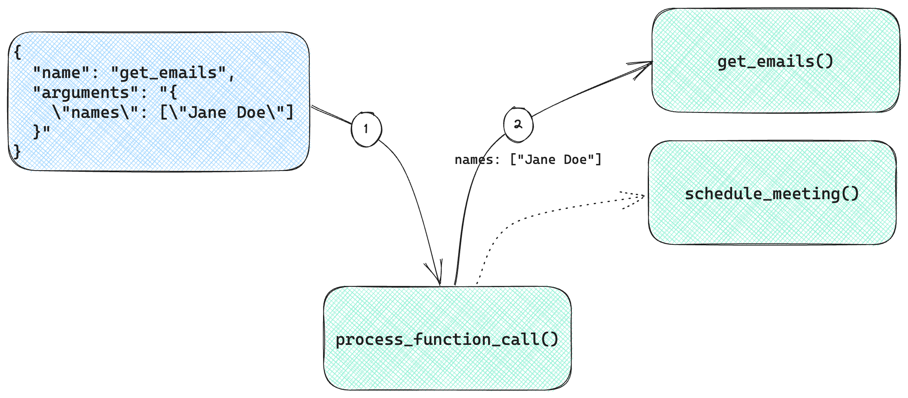
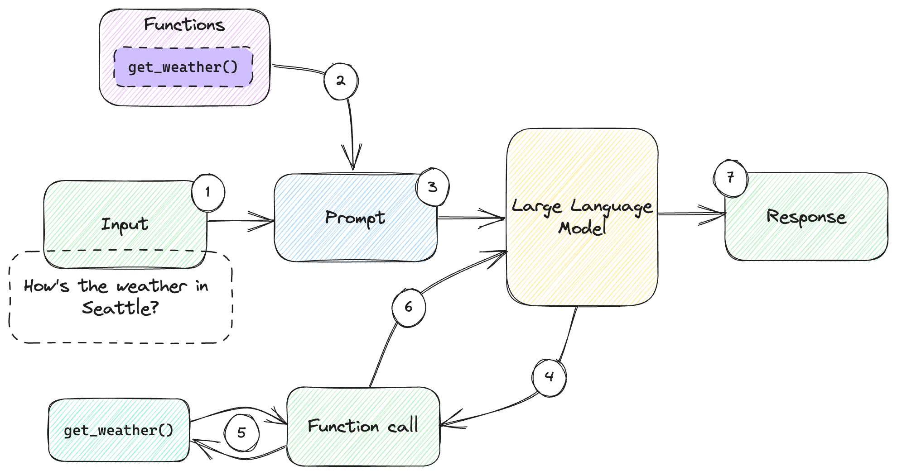
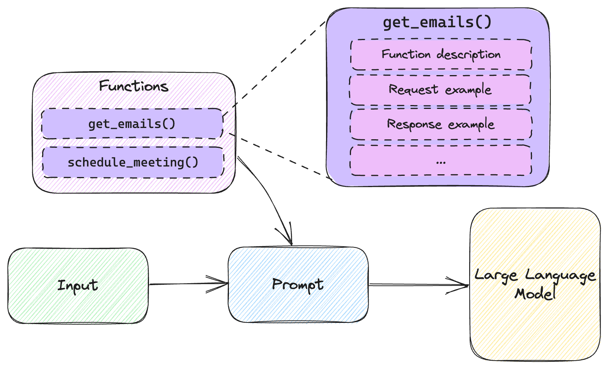
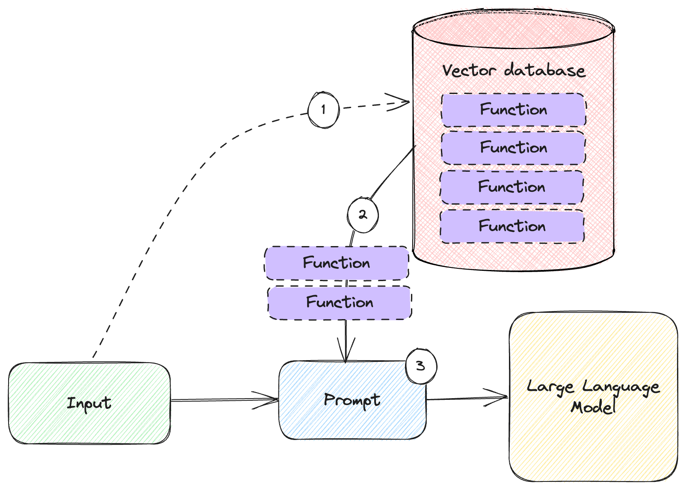

# Interacting With External Systems


In this chapter:

* Building a useful personal assistant.
* Using the OpenAI API to call functions.
* Implementing an alternative function mechanism.
* Leveraging large numbers of functions.

In this chapter, we’ll put together all the building blocks we learned about in
the previous chapters, including the OpenAI API, prompt templating, few-shot
learning, and memory to build a much more useful solution: a personal assistant
that can interact with the outside world.

First, we need a bit of plumbing: a function calling mechanism. This takes a
JSON describing a function call by specifying the function name and parameter.
It invokes the given function and returns the result to the caller. This piece
of infrastructure underpins the rest of the chapter.

We’ll see how the OpenAI API supports function calling, including a dedicated
request parameter through which we can pass it function definitions, and a
response indicating the model wants us to call a function (we’ll use the
mechanism we just described). The model expects us to call the function and pass
it back the reply.

What if you’re not using OpenAI? While most of the topics covered in this book
apply to all large language models, this particular way of describing functions
is very much OpenAI-specific. We’ll cover an alternative implementation for
this, which uses few-shot learning instead of relying on the special API. We’ll
see that we can achieve the same results even this case, meaning we should be
able to get any large language model to interact with other systems, be it
OpenAI or not.

Finally, we will talk about scaling. Passing a couple of function definitions in
a prompt is fine, but if we want a truly powerful assistant, we might have
dozens of functions available, some completely unrelated to one particular user
ask. In this case, we can store these functions in a vector database, and
retrieve the most relevant ones – an application of memory, which we learned
about in chapter 5.

We’ll wrap up with a few other examples of large language model interacting with
other systems, to show personal assistants are not only application of this.

Let’s start by by building our function calling mechanism, then see how we can
leverage the newly (at the time of writing) introduced *functions* in the OpenAI
API.

## A function calling mechanism

One of the major limitations of large language models is their inability to
directly interact with the outside world. If we want to implement an artificial
intelligence personal assistant, we can easily have great conversations with it,
but what about having it *do* things on our behalf, like scheduling meetings?
Let’s look at building such a personal assistant, and in the process see how we
can implement this using OpenAI functions. First, we need a bit of glue.

### External APIs

We’ll start with the non-AI part of our program. Let’s say we have an email and
calendar solution we’re integrating with. We have an address book API that takes
an array of names and returns the corresponding email addresses and an API that
schedules meetings. Listing 6.1 shows the mock implementations.

```python
def get_emails(names):
    print(f'* Getting emails for {names}')

    address_book = {
        'John Doe': 'john.doe@example.com',
        'Jane Doe': 'jane.doe@example.com',
    }
    emails = {}

    for name in names:
        emails[name] = address_book[name]

    return emails


def schedule_meeting(subject, recipients, time):
    print(f"* Meeting '{subject}' scheduled for {time} with {recipients}")
    return {'success': True}
```

*Listing 6.1: Mock implementations for address book and meeting scheduling.*

The `get_emails()` function takes an array of names, looks them up in the
`address_book`, and returns a dictionary of names-to-emails. For example, if we
pass in `['Jane Doe']` we should get back `{'Jane Doe':
'jane.doe@example.com'}`. Of course, a real-world implementation would actually
talk to a service like Microsoft Exchange or Gmail. Note we’re also not handling
unknown names to keep things simple.

The `schedule_meeting()` function takes a subject, a set of recipients, and a
time and “schedules” a meeting. In this case we just print this to the screen
and return a `{'success': True}` object. A real-world implementation would send
out meeting invitations.

Both functions call `print()`, so when we run our end-to-end example we’ll see
how they get called. Their output is prefixed with `*`.

We now have our API. Let’s see how we can connect it to the large language
model. First, we’ll implement a glue function that takes a `function_call`
argument which we expect to contain a `name` (the name of the function to call)
and `arguments` (string representation of the JSON parameters to pass to the
function). Listing 6.2 shows the implementation.

```python
import json


def get_emails(names):
    ...

def schedule_meeting(subject, recipients, time):
    ...

def process_function_call(function_call):
    name = function_call.name
    args = json.loads(function_call.arguments)

    functions = {
        'get_emails': get_emails,
        'schedule_meeting': schedule_meeting,
    }

    return functions[name](**args)
```

*Listing 6.2: Function call mechanism.*

We’re omitting the `get_emails()` and `schedule_meeting()` implementations here
as we just went over them in listing 6.1. We get the function name from
`function_call.name` and we load the arguments into `args` using `json.loads()`.
The `json.loads()` function parses a JSON string and outputs a Python object.

Our available functions appear in the `functions` dictionary. We simply map from
function name to function object.

Finally, we return the result of calling the function (looked up by name) with
the given arguments. This allows us to convert JSON into a function call. We get
a JSON containing a function `name` property and an `arguments` property
containing a JSON string. We load this into a Python object which we pass as
`function_call` to our `process_function_call()` function.

Figure 6.1 shows how this mechanism works.



*Figure 6.1: Calling a function given a JSON payload.*

We start with a JSON payload containing a `name` property and an `arguments`
property.

1. We load this into a Python object and pass it to `process_function_call()`. The function determines, based on the `name` property, which function to forward the `arguments` to. It also calls `json.loads()` to convert the `arguments` from a string into a Python object which becomes the function arguments for the called function.
2. In our case, the function is `get_emails()`, which gets invoked with the argument names being the list `["Jane Doe"]`.

This little bit of glue enables us to take a description of a function to call
and arguments to pass to it, dispatch the call at runtime to that function, and
give back the result. The specific functions (`get_emails()`,
`schedule_meeting()`) are less important, the key takeaway is we will need
something like `process_function_call()` regardless of our application. In other
words, we need some way to get from JSON to function invocation. The result also
needs to be a JSON. In our case, we had our functions respond with JSON.
Alternately, we can take a return object in the programming language we’re using
and serialize it to JSON inside `process_function_call()`. Either way, the large
language model will expect a JSON.

Back to the fun AI part now: let’s see how we can connect this to an interaction
with a large language model. OpenAI provides built-in support for this!

## OpenAI functions

In chapter 2, when we covered the OpenAI API, we mentioned the `functions`
request parameter and the `function_call` finish reason, but explicitly didn’t
cover them there. We’ll revisit them here.

This new API capability was added to provide a consistent way to achieve a very
common scenario – having large language models interact with the outside world.
We now have a way to describe what functions a model has available to call, and
the model has a way to clearly tell us what function it would like to have
called. We’ll start with how we describe functions to the large language model.

### Describing functions

OpenAI now allows us to specify a set of functions available to it using the
`functions` parameter. Listing 6.3 shows the template for our personal assistant
that is now made aware of the two external APIs we implemented in listing 6.1.

```json
{
    "temperature": 0,
    "messages": [
        { "role": "system", "content": "You are an AI personal assistant" }
    ],
    "functions": [
        {
            "name": "get_emails",
            "description": "Get the email addresses of a set of users given their names",
            "parameters": {
                "type": "object",
                "properties": {
                    "names": {
                        "type": "array",
                        "items": {
                            "type": "string"
                        }
                    }
                }
            }
        },
        {
            "name": "schedule_meeting",
            "description": "Sends a meeting invitation with the given subject to the given recipient emails at the given time",
            "parameters": {
                "type": "object",
                "properties": {
                    "subject": { "type": "string" },
                    "recipients": {
                        "type": "array",
                        "items": {
                            "type": "string"
                        }
                    },
                    "time": { "type": "string" }
                }
            }
        }
    ]
}
```

*Listing 6.3: Chat template with function descriptions.*

We can save this template as `personal_assistant.json`. The `temperature` and
`messages` properties should be familiar by now. What we haven’t seen before is
the `functions` property. This is an array of function objects. Each function
object has:

* A `name`, representing the name of the function to call.
* A `description`, which describes what the function does to the large language
  model.
* A `parameters` object defined in the JSON Schema format[^1].

JSON Schema is a way to describe expected JSON properties and their types using
JSON itself. OpenAI expects the root parameter to have type `object`. Then its
`properties` contain the argument definitions.

In our case, for `get_emails()` we have `names`, of type `array`, with the
`items` of the array being of type `string`.

For `schedule_meeting()` we have `subject` (type string), `recipients` (array of
string), and `time` (type string).

When we pass this to the model in a chat completion call (as we’ll see right
away), the model will be aware of the external APIs available to it. The
function descriptions count towards the token limit, meaning they consume
tokens. See sidebar for how they are implemented “under the hood”.

> **Sidebar: Functions under the hood**
>
> The OpenAI documentation has this note: *Under the hood, functions are
injected into the system message in a syntax the model has been trained on*.
What does this mean? Large language models are trained, there is no way to
“hardcode” something and guarantee some response. OpenAI came up with some
syntax to describe function calls to a model, then used this during training
until the model started replying with the right function calls more often than
not (the documentation also clearly states that the model might output invalid
JSON, so we need to verify the output).
>
> Much like memory, which we covered in chapter 5, the fact a model can’t
interact with the other systems directly is a big limitation. As companies start
integrating AI in their solutions, they devise various ways to make the large
language models aware of what they can interact with and how. Of course, doing
this with one-shot or few-shot learning or even fine-tuning, will not yield as
good results as if a model was trained on a special syntax for function calling
(that said, we’ll cover that alternative in the next section).
>
> With the training done, the function calling capability is part of the model
and the model “knows” when and how to apply it to achieve the best results.

We now have all our external capabilities in place. We’ll implement another chat
system. This time around though, we’ll be able to ask it to schedule meetings
using natural language and it will do so by calling the APIs we provided. But
first, let’s go over how functions work with the OpenAI API.

### Calling functions

In chapter 2, when we discussed the OpenAI API, parameters and responses, we
deliberately skipped functions to keep things simple. We’ll revisit this now.

We covered how we can pass `functions` as an optional parameter to make the
model aware of APIs it can interact with. We said an API response contains a
`finish_reason` which can be `stop` (processing finished successfully), `length`
(token limit), `content_filter` (OpenAI flagged the content and aborted
processing) or `function_call`.

When the API returns a `finish_reason` as `function_call`, it means it asks us
to run a function and give it back the result. We know chat completion calls
return a message object. So far we’ve been using the `message.role` and
`message.content` properties. When the model wants us to call a function, the
content will be null. Instead, we’ll receive a `function_call` property
containing the `name` of the function to call and the `arguments`. Let’s see a
quick example. Listing 6.4 provides an API to the large language model and
prints the response.

```python
from llm_utils import ChatTemplate

chat = ChatTemplate({
    'messages': [{'role': 'user', 'content': 'What is the weather like today in Seattle?'}],
    'functions': [
        {
            "name": "get_weather",
            "description": "Gets the weather given a city name",
            "parameters": {
                "type": "object",
                "properties": {"city": {"type": "string"}}
            }
        }]})

print(chat.completion({}).choices[0])
```

*Listing 6.4: Example prompt with function definition.*

This very simple example sends the user message “What is the weather like today
in Seattle?” and tells the model it has a `get_weather()` function available,
which takes an argument named `city` of type `string`.

If you run this code, you will likely see a response like listing 6.5.

```json
{
  "finish_reason": "function_call",
  "index": 0,
  "message": {
    "content": null,
    "function_call": {
      "arguments": "{\n  \"city\": \"Seattle\"\n}",
      "name": "get_weather"
    },
    "role": "assistant"
  }
}
```

*Listing 6.5: Example API response with function call.*

Note `finish_reason` is `function_call`. The `message` still has the `role` set
to `assistant`, indicating a response from the large language model, but the
`content` is empty. Instead, we get a `function_call` for the function
`get_weather()` with the arguments captured as a JSON string.

What happened? The model realized it can best answer the prompt (weather in
Seattle) by calling this API. Since it can’t call the API directly, it gives us
the details and expects us to pass it back the result.

We pass back the result by appending it to the `messages` list. In this case,
the `role` must be `function`, we also need to pass in a `name` property – the
name of the function we called, and the `content` is what the function returned.
In subsequent calls, the model will take into account these results, so it won’t
call the same function again if it knows what it returned. Listing 6.6 shows a
mock example of this.

```python
from llm_utils import ChatTemplate

chat = ChatTemplate({
    'messages': [
        {'role': 'user', 'content': 'What is the weather like today in Seattle?'},
        {'role': 'function', 'name': 'get_weather', 'content': 'Sunny and 75 degrees, with 10% chance of rain.'}],
    'functions': [
        {
            "name": "get_weather",
            "description": "Gets the weather given a city name",
            "parameters": {
                "type": "object",
                "properties": {"city": {"type": "string"}}
            }
        }]})

print(chat.completion({}).choices[0])
```

*Listing 6.6: Mocking a function response.*

This is example is purely for us to grok the syntax of function calls and
responses. Don’t worry, we’ll call some functions for real next. For now, note
how we provide the same prompt as listing 6.4, except we add the result of
`get_weather()` as the second message.

Listing 6.7 shows the final response we get for this second call.

```json
{
  "finish_reason": "stop",
  "index": 0,
  "message": {
    "content": "The weather today in Seattle is sunny with a temperature of 75 degrees. There is a 10% chance of rain.",
    "role": "assistant"
  }
}
```

*Listing 6.7: Example API response after function call.*

Before the model had the result of calling `get_weather()`, it responded with a
`function_call`. Now, the `finish_reason` is `stop`, content has the final
answer, and no function calling is needed.

The typical interaction is:

1. User asks for weather in some city.
2. The model replies with a function_call for `get_weather()`.
3. We run the `get_weather()` function, and append its result to the messages list.
4. We run the completion again, now including the function result.
5. The model has the data it needs to provide an answer.

Figure 6.2 illustrates this typical interaction.



*Figure 6.2: Large language model interaction including function call.*

This figure has a lot of numbers, but it’s really not that complicated:

1. We start with the user ask – *“How’s the weather in Seattle?”*
2. We also add to the request the functions we have available, in our case
   `get_weather()`.
3. We send the request to the model.
4. The model realizes it can best answer the question if it gets additional data
   from the function, so it responds with a `function_call`.
5. Our function calling mechanism will know to invoke `get_weather()` with the
   right parameters as provided by the large language model and get back the
   result.
6. We send the additional information to the model (of course, including the
   original request, as large language models don’t have memory).
7. With this additional information, the model can produce the final response.

The major difference between this and the diagrams we saw in previous chapters
is the intermediate function call (steps 4 to 6), before the model produces its
final response (step 7).

In fact, as we will see soon, a model can request multiple function calls until
it considers it has enough data to produce a response.

With a good understanding of the API shape, let’s now put together our personal
assistant. We already covered the template we’re going to use in listing 6.3 and
saved it as `personal_assistant.json`. As a quick reminder, this template tells
the large language model it has available a `get_emails()` function and a
`schedule_meeting()` function, describes what these functions do, and the
arguments they expect.

Listing 6.8 shows the complete personal assistant chat.

```python
import json
from llm_utils import ChatTemplate


def get_emails(names):
    print(f'* Getting emails for {names}')

    address_book = {
        'John Doe': 'john.doe@example.com',
        'Jane Doe': 'jane.doe@example.com',
    }
    emails = {}

    for name in names:
        emails[name] = address_book[name]

    return emails


def schedule_meeting(subject, recipients, time):
    print(f"* Meeting '{subject}' scheduled for {time} with {recipients}")
    return {'success': True}


def process_function_call(function_call):
    name = function_call.name
    args = json.loads(function_call.arguments)

    functions = {
        'get_emails': get_emails,
        'schedule_meeting': schedule_meeting,
    }

    return functions[name](**args)


chat = ChatTemplate.from_file('personal_assistant.json')

while True:
    prompt = input('> ')
    if prompt == 'exit':
        break

    chat.template['messages'].append({'role': 'user', 'content': prompt})

    while True:
        message = chat.completion({}).choices[0].message

        if 'function_call' in message:
            result = process_function_call(message.function_call)
            chat.template['messages'].append(
                {'role': 'function', 'name': message.function_call.name, 'content': json.dumps(result)})
        else:
            break

    print(message.content)
    chat.template['messages'].append(
        {'role': message.role, 'content': message.content})
```

*Listing 6.8: Personal assistant chat with functions.*

We already covered the `get_emails()`, `schedule_meeting()`, and the glue
function `process_function_call()`. Let’s focus on the chat interaction.

As before, we take a user prompt and send it to the model. This time around, we
do it in a loop. We take the response message and check whether it contains a
`function_call`. If it does, we pass this to `process_function_call()` and we
get back a `result`. We append to our `messages` list the result of the function
call as JSON (`json.dumps()` is the inverse of `json.loads()` – it converts a
Python object into a JSON string). After this we loop – we again invoke the chat
completion, but now it should have additional data – the result of the function
call.

On the other hand, if the response we get from the large language model doesn’t
include a `function_call`, we break the loop.

Finally, we print the content of the response we got and add it to the message
list.

Hopefully not too complicated – we extended our interactive chat with function
calling capabilities. As long as the model thinks a function call can help it
provide a better answer, we invoke the requested function and pass it back the
result. Once the model thinks function calls won’t help, it will provide a final
(non-function call) answer, which we can print.

Listing 6.9 shows an example interaction.

```text
> Schedule lunch with Jane Doe for Monday at noon at Tipsy Cow
* Getting emails for ['Jane Doe']
* Meeting 'Lunch' scheduled for Monday at 12:00 PM with ['jane.doe@example.com']
I have successfully scheduled a lunch with Jane Doe for Monday at noon at Tipsy Cow.
```

*Listing 6.9: Example personal assistant interaction.*

The initial prompt asks the model to schedule a meeting with Jane Doe. The model
correctly realizes that it needs Jane Doe’s email address in order to do this.
It first responds with a `function_call` for `get_emails()`. As we can see in
the sample output, the `get_emails()` function indeed gets called with the
argument `['Jane Doe']`.

We pass this back to the model. It then responds with another `function_call`,
this time for `schedule_meeting()`. As we can see from our debug output (lines
starting with `*`), the `schedule_meeting()` function is called with `subject`
as `'Lunch'`, `time` as `'Monday at 12:00 PM'`, and `recipients` as
`['jane.doe@example.com']`.

This is exactly what we wanted! If we actually had real-world implementations
for `get_emails()` and `schedule_meeting()`, a meeting invitation would be going
out to our friend Jane Doe with a lunch invitation. Our large language model
application is no longer just talk; it can now act. Before moving on, a few
things to keep in mind.

### Notes on reliability

To keep things simple, our toy examples mocked responses and we passed through
the model replies to our `process_function_call()` whenever we got a
`function_call` from the model. This assumes everything works great end-to-end.
Remember though, we are dealing with non-deterministic models.

We don’t have a guarantee the model will output valid JSON or that it won’t
hallucinate calling a function that is not available. Quoting from the OpenAI
documentation[^2]:

> Hallucinated outputs in function calls can often be mitigated with a system
message. For example, if you find that a model is generating function calls with
functions that weren't provided to it, try using a system message that says:
"Only use the functions you have been provided with."

In a production solution, we should ensure both that the JSON is well-formed and
that the function to be called actually exist. If this is not the case, we need
to give the model more constraints (“Only output valid JSON”, “Only use the
functions you have been provided with” etc.) and retry.

We’ll talk more about hallucinations in chapter 8, when we discuss safety and
security, as model hallucinations are one of the key gotchas in this new world.
A key thing to remember is to not assume you will always get a well-formed
response and code defensively around this.

Another thing to consider is how we would handle a failure in one of our
external systems. What if, for whatever reason, we cannot retrieve the email of
a user? We could report the failure back to the large language model and have it
respond to the user or, alternately, we can catch the error and tell the user
something is wrong, without another model roundtrip. If the function call
failure is critical to complete the workflow, we might as well stop here.

Throughout this book, we’ve been using the OpenAI API. Until now though,
everything we learned applies to any other large language model. If you want to
build your solution around a large language model offered by a different vendor,
you still need to do prompt engineering, you can still teach it using one-shot
or few-shot learning, or maybe fine-tune it. The large language model will have
similar constraints on memory, and embeddings will be just as useful. A major
difference though is it might not be trained on this specific function
invocation syntax. So to keep our learning as generally applicable as possible,
let’s look at how we can use few-shot learning instead of the built-in function
calling API to achieve the same results.

## Non-native functions

Let’s assume we want to build the same solution, but the model we’re working
with doesn’t have a special way for us to declare functions and the API doesn’t
have a `finish_reason` of type `function_call`. This was precisely the case with
OpenAI too, up until June 2023. How would we implement our personal assistant in
this case?

We’ll continue using `get_emails()` and `schedule_meeting()` which we
mock-implemented in the previous section. We will need a different way to
describe them to the model though. We’ll use one-shot learning for this (to keep
things simple, few-shot learning would very likely work much better).

Figure 6.3 shows this alternative implementation.



*Figure 6.3: Implementing functions using few-shot learning.*

Assume we can’t use the `functions` parameter and describe the functions with
the expected JSON syntax. In this case, we describe each function as a set of
chat messages: a `system` message describing the function, and a set of `user`
and `assistant` messages showing example interactions.

We inject all of these in the prompt together with the user ask and send the
whole thing to the model. Not pictured in figure 6.3, when the model responds,
this time we won’t get a different `finish_reason` but if our few-shot learning
worked correctly, we should be able to tell the model is asking us to call a
function. Let’s also see how this looks like in code.

Listing 6.10 shows a template that does not rely on the special `functions`
syntax, rather describes to the large language model what functions are
available and shows example invocation and response. We can save this file as
`personal_assistant2.json`.

```json
{
    "temperature": 0,
    "messages": [
        { "role": "system", "content": "You are an AI personal assistant. You can call external functions to accomplish tasks or get more information. To call an external function, your respond is only JSON. The return value of the function will be made available to you. Only call the functions described next:" },
        { "role": "system", "content": "Function: get_emails - Gets the email addresses of a set of users given their names. Call this if you need to get email addresses when you know names. Arguments: names - array of names as string; returns name to email mapping." },
        { "role": "system", "content": "Function: schedule_meeting - Sends a meeting invitation with the given subject to the given recipient emails at the given time. Arguments: subject - meeting subject as string, recipients - array of emails as string, time - meeting time as string; returns success status." },
        { "role": "user", "content": "Schedule a meeting with Bill Gates for 3 PM, subject: Discuss LLMs"},
        { "role": "assistant", "content": "{ \"name\": \"get_emails\", \"args\": { \"names\": [\"Bill Gates\"]}"},
        { "role": "user", "name": "get_emails", "content": "{ \"Bill Gates\": \"billg@microsoft.com\" }"},
        { "role": "assistant", "content": "{ \"name\": \"schedule_meeting\", \"args\": { \"subject\": \"Discuss LLMs\", \"recipients\": [\"billg@microsoft.com\"], \"time\": \"3 PM\" }"},
        { "role": "user", "name": "schedule_meeting", "content": "{ \"success\": true }"},
        { "role": "assistant", "content": "Meeting scheduled successfully"}
    ]
}
```

*Listing 6:10: Functions without special syntax.*

In this example, we use `system` messages to describe what is available and
`user`/`assistant` interactions as one-shot learning examples.

Our example describes the two available functions, `get_emails()` and
`schedule_meeting()`, and shows an example of stitching calls to them together
to accomplish a task. The more examples we provide, the likelier it will be we
get a syntactically correct answer from the model as a response.

Let’s adapt our chat to not rely on the `functions` special syntax. Listing 6.11
shows the updated code.

```python
import json
from llm_utils import ChatTemplate


def get_emails(names):
    print(f'* Getting emails for {names}')

    address_book = {
        'John Doe': 'john.doe@example.com',
        'Jane Doe': 'jane.doe@example.com',
    }
    emails = {}

    for name in names:
        emails[name] = address_book[name]

    return emails


def schedule_meeting(subject, recipients, time):
    print(f"* Meeting '{subject}' scheduled for {time} with {recipients}")
    return {'success': True}


def process_function_call(function_call):
    name = function_call['name']
    args = function_call['args']

    functions = {
        'get_emails': get_emails,
        'schedule_meeting': schedule_meeting,
    }

    return functions[name](**args)


chat = ChatTemplate.from_file('presonal_assistant2.json')

while True:
    prompt = input('> ')
    if prompt == 'exit':
        break

    chat.template['messages'].append({'role': 'user', 'content': prompt})

    while True:
        message = chat.completion({}).choices[0].message
        chat.template['messages'].append(
            {'role': message.role, 'content': message.content})

        if 'get_emails' in message.content or 'schedule_meeting' in message.content:
            function_call = json.loads(message.content)
            result = process_function_call(function_call)
            chat.template['messages'].append(
                {'role': 'user', 'name': function_call['name'], 'content': json.dumps(result)})
        else:
            break

    print(message.content)
```

*Listing 6.11: Personal assistant chat with functions, no special syntax.*

We haven’t changed the `get_emails()` and `schedule_meeting()` implementations.
We slightly modified `process_function_call()` to expect `names` and `args` to
be keys in a dictionary rather than properties on an object.

Instead of looking for `function_call` in the response, since we’re not using
that special syntax, we just check if the response contains the name of one of
our functions. If so, we process the response as a JSON string. We’re again
skipping any checking for valid JSON and assume the response is correct – we
wouldn’t make this assumption in a production system, but for our toy example
this keeps things simple.

We end up with a `function_call` dictionary populated from parsing the response.
If the model responded with valid JSON, conforming to what we specified, we
should have `name` and `args` properties we can use in
`process_function_call()`.

All of the changes we made are just for replacing the specialized syntax with
something more generic, which can apply to older models or models provided by
other vendors - models that don’t support functions natively.

Listing 6.12 shows an example interaction.

```text
> Schedule lunch with Jane Doe for Monday at noon at Tipsy Cow
* Getting emails for ['Jane Doe']
* Meeting 'Lunch' scheduled for Monday at noon at Tipsy Cow with ['jane.doe@example.com']
Lunch with Jane Doe scheduled successfully for Monday at noon at Tipsy Cow.
```

*Listing 6.12: Example personal assistant interaction.*

This should be the same as listing 6.10, which is what we want – we were able to
achieve the same results without relying on the special syntax.

### Conclusions

So why do we need special syntax again? Because a model trained on it is much
more likely to provide the expected responses and leverage the functions made
available to it, with correct syntax. We can achieve similar results, but we
need to tune our examples and make sure we get the expected results. We might
need to provide more than one example (few-shot learning).

Ultimately, `functions` is a more robust way of achieving this. The reason
OpenAI developed this was to address the common need of having to interact with
external system and the fact that multiple users and companies ended up devising
something similar to what we just did to support interactions.

If you are using OpenAI and want to enable a large language model to interact
with outside systems, use the special syntax if available. If you are using an
API that does not support this, know there is a way to achieve similar results
through few-shot learning, instructions, and examples, which you can stick into
a prompt.

So far we covered a simple scenario: a personal assistant that can schedule
meetings. What if we want a more capable assistant?

## Function libraries

Let’s say we have a very smart personal assistant. It can not only schedule
meetings, it can add reminders to our to do list, it can check the weather, it
can email people on our behalf and so on.

We have a lot of function available to call. We can stick all of them in a
prompt, but at some point we’ll run into token limits or, at the very least, end
up consuming way more tokens than we should: if I want my assistant to remind me
to buy cheese, my prompt shouldn’t also teach it how to schedule meetings and
email people.

Of course, we know from chapter 5 what to do if we’re worried about token
limits: use memory. We will store all our available functions in a vector
database, indexed by description embedding (where description is the
`description` property in our function JSON).

Instead of passing all available functions in with a completion call, we can
instead select a subset of functions which should be most relevant to the user
ask. And as we saw when discussing memory in chapter 5, relevance is measured by
cosine distance between embeddings.

Figure 6.4 shows the high-level architecture of such a system.



*Figure 6.4: Using a vector database to store function definitions.*

Here, we have a vector database like Chroma storing all available function definitions.

1. Based on the input embedding, we query the vector database to retrieve the
   most relevant functions.
2. We inject the functions in the prompt, to make the large language model aware
   of them.
3. We send the prompt to the model, including the selected functions.

The model will do its best to satisfy the user request, and invoke the provided
functions as needed. Let’s work through an example.

We’ll start by describing our functions in separate JSON files. Listing 6.13
shows the JSON corresponding to `get_emails()`.

```json
{
    "name": "get_emails",
    "description": "Get the email addresses of a set of users given their names",
    "parameters": {
        "type": "object",
        "properties": {
            "names": {
                "type": "array",
                "items": {
                    "type": "string"
                }
            }
        }
    }
}
```

*Listing 6.13: JSON description of get_emails() function.*

Nothing surprising here – we saw this before, as a subset of our first template,
in `personal_assistant.json`.

This JSON file shows up in the book’s code repo under `/code/06/functions/` as
`get_emails.json`. The folder contains several other JSON function descriptions
for our example, but we won’t list their content here. All of them describe an
available function. They are:

* `get_emails.json` – Gets a set of email addresses given a set of names.
* `schedule_meeting.json` – Sends a meeting invitation with subject and time to
  a set of recipients.
* `get_weather.json` – Gets the current weather in a given city.
* `set_reminder.json` – Sets a reminder.

Let’s stick these in a vector database. If you went through the examples in
chapter 5, you should have `chromadb` installed. If not, you can quickly do it
now with `pip install chromadb`. We’ll write a small script to index the
functions by their description and store them in a database.

Listing 6.14 shows the steps.

```python
import chromadb
from chromadb.config import Settings
import json
from llm_utils import get_embedding
import os

client = chromadb.Client(Settings(
    chroma_db_impl='duckdb+parquet',
    persist_directory='functions'))

collection = client.create_collection('functions')

for f in os.listdir('./functions'):
    path = os.path.join('./functions', f)
    with open(path, 'r') as f:
        func = json.load(f)

    embedding = get_embedding(func['description'])

    collection.add(
        documents=[json.dumps(func)],
        ids=[path],
        embeddings=[embedding])

client.persist()
```

*Listing 6.14: Storing functions by description embedding.*

Here’s what’s going on:

1. We create a `chromadb` client again using DuckDB and Paquet as the data
   storage format. We’ll save the database in the `functions` folder.
2. We create a `functions` collection.
3. We list all files in the `functions` subfolder (our JSON function
   definitions), and load each into `func` using `json.load()`.
4. For each function, unlike chapter 5, where we passed the whole data to
   `chromadb` and let it compute the embedding, we compute the embedding
   ourselves “manually”, by calling `get_embedding()` on the `description`
   property. This ensures we only get the embedding of the function description
   rather than of its name and parameters.
5. We add this to the collection using `collection.add()`. Note besides the
   `document` (which specifies the data to store in the database) and the `id`
   (which must be unique in the collection), we also pass in an `embedding`.
   This tells `chromadb` to use our provided embedding when storing the
   document.
6. Once all functions are added to the collection, we call `client.persist()` to
   save our database.

The first few steps should be familiar from chapter 5, so we won’t zoom in on
the details. One interesting change is we’re relying on our on embedding of
function descriptions rather than letting Chroma embed the documents.

Why did we only embed the descriptions? It’s unlikely that the JSON curly braces
and function parameters add much to the meaning of the function, which should be
captured in the description. This way, we embed the tokens which are most
relevant to our future queries. Remember, the database stores the whole JSON
content anyway, the embedding is just what it uses to retrieve data: it measures
the distance between the embedding associated with each document and the
embedding of the given query.

With the database now saved, let’s implement the final version of our personal
assistant, which will pull the top 2 relevant functions from the database and
inject them in the prompt. Listing 6.15 shows this.

```python
import chromadb
from chromadb.utils import embedding_functions
from chromadb.config import Settings
import json
from llm_utils import ChatTemplate
import os

client = chromadb.Client(Settings(
    chroma_db_impl='duckdb+parquet',
    persist_directory='functions'))

collection = client.get_collection(
    'functions',
    embedding_function=embedding_functions.OpenAIEmbeddingFunction(
        api_key=os.environ['OPENAI_API_KEY'],
        model_name="text-embedding-ada-002"
    ))

chat = ChatTemplate(
    {'temperature': 0,
     'messages': [{'role': 'system', 'content': 'You are an AI personal assistant'}],
     'functions': []})

while True:
    prompt = input('user: ')
    if prompt == 'exit':
        break

    chat.template['messages'].append({'role': 'user', 'content': prompt})

    functions = collection.query(
        query_texts=[prompt], n_results=2)['documents']
    chat.template['functions'] = [json.loads(doc) for doc in functions[0]]

    print(chat.template)

    # ...
```

*Listing 6.15: Injecting relevant functions from the vector database into the
prompt.*

The first part of the code sample creates the `chromadb` client and loads the
`functions` collection. In this case we do configure the collection to use the
OpenAI embedding API. When we stored the data, we computed the embedding
ourselves since we didn’t want the embedding of the whole JSON, just of the
function description. Now we’re not adding anything to the collection, we’re
just querying it. That is, we need the embedding of the whole user ask, so we
might as well let `chromadb` do it. As long as we’re using the same model to
produce the storage and query embeddings, things should work just fine (and we
are, we’re using `text-embedding-ada-002` for both).

Our chat template starts with an empty array of functions.

In the `while` loop, we append the user prompt to the template message list,
then we update the `functions` parameter to use the top 2 *nearest* functions.
Again, by nearest we mean smallest cosine distance between the user prompt and
the function descriptions.

We call `collections.query()` where the `query_texts` are the texts to embed and
find nearest neighbors – we only pass one text in our case, the `prompt`.
`n_results` tells `chromadb` how many documents to return. We want 2.

We process the result and load the JSON strings for each of these functions into
the `functions` array.

Finally, we print the final prompt which we would be sending to the large
language model.

We won’t implement the rest, as it will be tedious – we would need our function
calling mechanism and loop which we covered in the first section of this
chapter. We already know how to do this. What we just learned was how we can
dynamically modify the functions we make available to the large language model
based on user input.

If we run the code in listing 6.15, we might get an interaction like listing
6.16.

```text
user: Remind me to buy cheese when I leave work
{'temperature': 0, 'messages': [{'role': 'system', 'content': 'You are an AI
personal assistant'}, {'role': 'user', 'content': 'Remind me to buy cheese when
I leave work'}], 'functions': [{'name': 'set_reminder', 'description': 'Sets a
reminder based on location', 'parameters': {'type': 'object', 'properties':
{'reminder': {'type': 'string'}, 'location': {'type': 'string'}}}}, {'name':
'get_weather', 'description': 'Gets the weather given a city name',
'parameters': {'type': 'object', 'properties': {'city': {'type': 'string'}}}}]}
```

*Listing 6.16: Prompt with injected functions based on user ask.*

For the user ask *“remind me to buy cheese when I leave work”*, the vector
database correctly retrieves `set_reminder()` as the most relevant function.

Looks like the second nearest function is `get_weather()`, not particularly
useful in this case, but we did ask for 2 functions.

Of course, we are dealing with simple toy examples. A powerful personal
assistant would have dozens of functions available, and we would likely inject
more than 2 with a prompt to ensure it has the right tools at its disposal. The
overall pattern is the same though: store all available functions in a vector
database; retrieve them based on embedding distance to user ask. In fact, the
more functions we have available and the more we want to pull into the prompt
(while keeping some sane limits), the better results we’ll get.

We just build our first function library!

Before wrapping up, a quick note on embeddings: we said that the embedding we
use when we insert the documents must be produced by the same model as the
embedding we use when we query the database. Even though we used our custom
`get_embedding()` function, under the hood it calls `text-embedding-ada-002`.
That’s the same model we asked Chroma to use when embedding queries. An
important thing to remember is there is no *one true embedding* for a piece of
text. Different models produce different vectors. If we mismatch the storage and
query models, we end up comparing apples to oranges and we’re guaranteed to have
surprising results.

### Recap

Throughout this chapter we built a much more useful solution – a large language
model-based solution that can interact with external systems.

We started with a bit of non-AI coding and devised a mechanism to convert JSON
into function calls. This is a crucial piece of infrastructure for this type of
large language model interaction with external systems.

We used the building blocks from the previous chapters, including calling the
OpenAI API (which we learned about in chapter 2) and adding relevant data to a
prompt (which we learned in chapter 3).

As an alternative to the recently (at the time of writing) introduced function
API, we saw how we can use few-shot learning to achieve similar results (we
learned about few-shot learning in chapter 4).

Finally, we scaled our solution to any number of available functions, and we
worked around the large language model limitations by using memory (which we
learned about in chapter 5).

We were able to tie together all these different aspects of working with large
language models into an end-to-end solution with new capabilities. Our
application was again based on interactive chat, as this is a simple way to get
the point across – we go from user input straight to our system. There are many
other applications of this, to name a few:

* Customer support – where the large language model can integrate with ticketing
  systems and knowledge bases.
* Coding and debugging – where the large language model can interact with the
  IDE or debugger.
* Data analysis and visualization – where the large language model can interact
  with computational and visualization libraries to perform complex calculations
  and generate visualizations.
* Financial analysis and trading – where the large language model can access
  real-time market data and automate trading.

Another very specific example is Copilot generative AI in the Office
applications. For example, Copilot can now generate an entire PowerPoint
presentation based on a simple description, including text, images, styles and
so on. In this case, the large language model interacts with PowerPoint to
produce content.

In general, a large language model that can interact with external systems is
orders of magnitude more powerful than a model operating without any connection
to the outside world.

In the next chapter, we’ll cover planning – getting large language models to
perform complex, multi-step tasks. This is a different take than a chat
back-and-forth: we start with a complex goal and let the model figure out how to
break it down into multiple steps and execute those.

## Summary

* We can have large language models interact with external systems to
  significantly enhance their capabilities.
* We need a mechanism that takes a JSON description of a function to call and
  arguments and invokes the given function.
* OpenAI now provides a way to describe functions to a large language model and
  have the model ask us to call a function.
* Alternately, we can achieve similar results with few-shot learning, describing
  the functions to the model and providing example invocations.
* This becomes a multi-step interaction: the model first asks us to call a
  function and pass it back the result; it then uses the result to continue
  responding.
* The model might output invalid JSON. We need to be careful to validate output
  (and handle failures from the external systems if they occur).
* If we need to scale, we can store functions in a vector database and retrieve
  them based on how relevant they are to the user ask.

[^1]: <https://json-schema.org/understanding-json-schema/>
[^2]: <https://platform.openai.com/docs/guides/gpt/function-calling>
