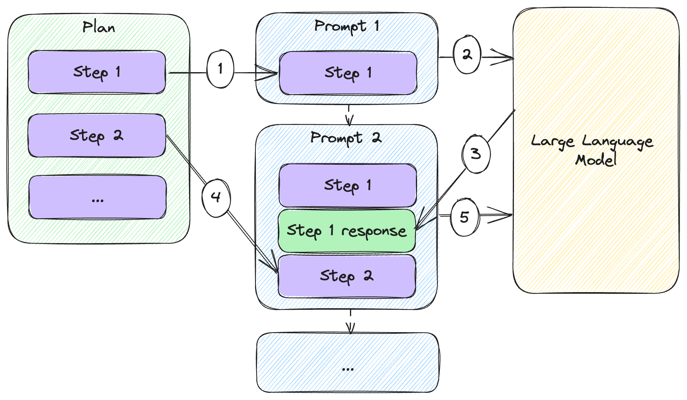
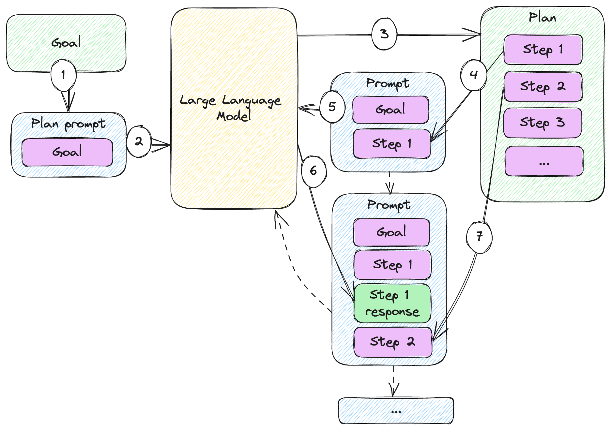
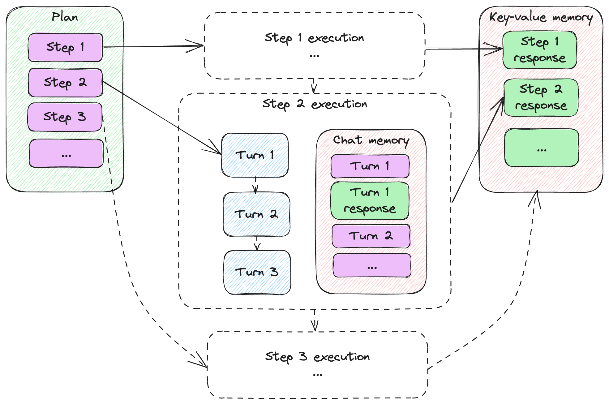
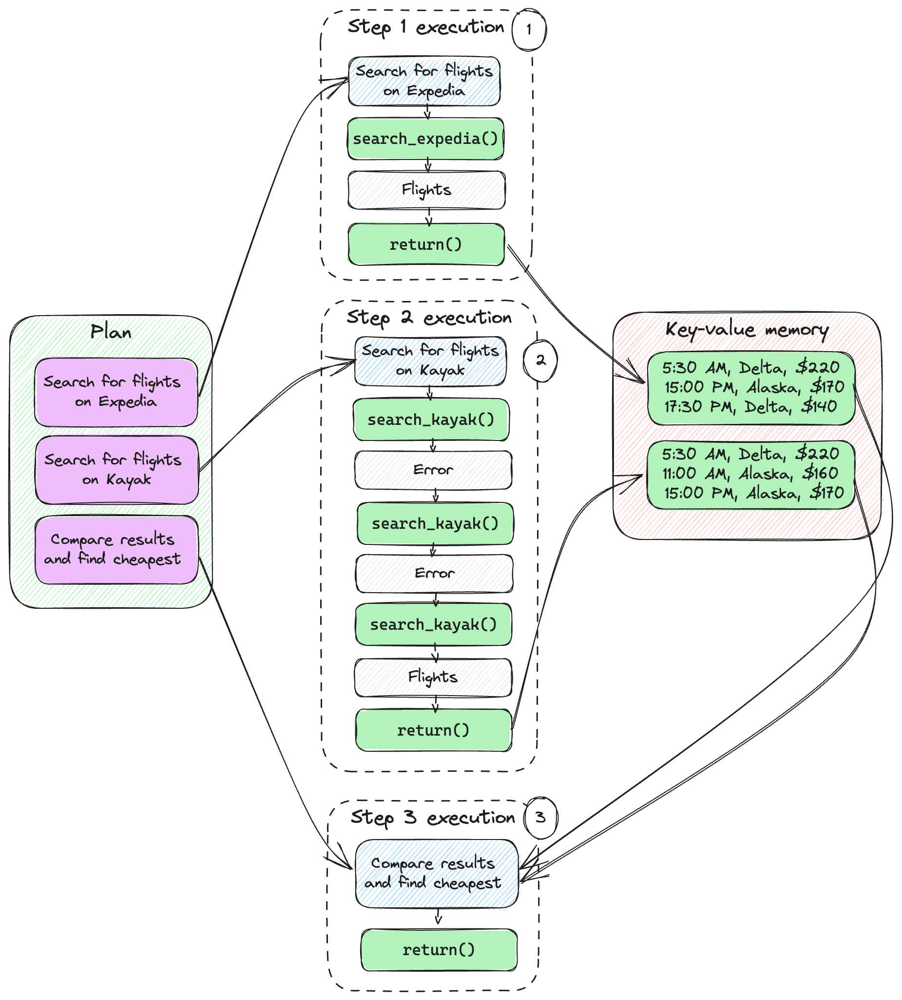

# Planning


In this chapter:

* Implementing long form automated writing.
* Leveraging models to plan complex tasks.
* Using planning for a simple flight finder.
* Adjusting plans at runtime to mitigate errors.

We concluded the previous chapter with a quick recap of the solution we built
and how we ended up leveraging all the building blocks from the previous
chapters. In fact, we’re pretty much done with the basic pieces. In this chapter
we’ll cover a higher-level concept: executing on a multiple step *plan* to
achieve a goal.

By “multiple step” we simply mean consisting of multiple large language model
API calls (as opposed to a single prompt). First, we’ll talk about when and why
would we rely on multiple steps plan.

We’ll put together a plan, execute it, and analyze the results. In fact, we’ll
see how we can express this plan in code and provide a simple plan execution
engine. This is something we can re-use down the road.

Next, we’ll then take it one step further: what if, instead of us manually
generating a plan, we get the large language model to come up with a plan
itself? We’ll automate this and, starting from our end goal, we’ll let the model
both come up with the plan, and execute on it to fulfil the goal.

Some steps might not be as straight-forward. Especially when dealing with
external systems, we might need a few tries before we get to the right answer.
We’ll introduce the notion of *turns* and see how we can execute a step in
potentially multiple turns.

To wrap it up, we’ll look at some even more automation – what if we let the
large language model course-correct as needed? In case a step fails, we can ask
it to update the plan. This brings a whole new level of autonomy (with its
associated dangers, we’ll discuss when we get there). We’ll also quickly
introduce the Auto-GPT[^1] framework, which aims to implement such autonomous
agents.

Let’s start with leveraging multiple step plans to divide and conquer more
complex problems.

## Multiple step plans

The idea of a multiple step interaction shouldn’t be anything new by now, most
of our previous toy chat examples included taking a user prompt, getting a large
language model answer, and repeating until the user types `exit`. This is a
multiple step (multiple API calls) back-and-forth between the user and the
model, but not really something planned.

We saw a more automated multiple step interaction (as in multiple API calls) in
chapter 6 in the form of functions. When the large language model calls an
external system, we automatically went from a `function_call` finish reason, to
a function invocation, to passing the result back to the model in a subsequent
API call – repeat until the model stops calling functions. This is closer, but
not really “planned” either – the model asks us to run functions as it deems
appropriate.

The closest we got to this was in chapter 3, when we looked at prompt chaining.
Remember, we had a 3-step workflow automating a barista:

1. Get order from customer.
2. Confirm order.
3. Get phone numbers.

Complex tasks require some divide and conquer. For such tasks we might need a
*plan*.

> **Definition**: a *plan* refers to a sequence of actions that can be taken to
achieve a goal. *Plan execution* refers to executing these actions.

Let’s work through an example: we want the large language model to write a
sci-fi novella on the theme of AI ethics. We’ll keep things simple to keep our
code readable and save on how many tokens we have to use, but we’ll discuss
scaling.

We’ll start without a plan. Listing 7.1 simply asks the large language model to
complete the task.

```python
from llm_utils import ChatTemplate

chat = ChatTemplate({
    'messages': [{'role': 'user', 'content': 'Write a short 3 chapter sci-fi novella on the theme of AI ethics.'}]})

print(chat.completion({}).choices[0].message.content)
```

*Listing 7.1: Asking the model to write.*

This should output the novella in one go. After running this, I got a story
starting with the fragment in listing 7.2 (you can find the whole story in this
folder’s code samples as `story1.txt`).

```text
Chapter 1: The Creation

In a world where artificial intelligence reigned supreme, Dr. Allison Mitchell,
a brilliant scientist, toiled away relentlessly in her laboratory. Determined to
create an AI that could revolutionize society, she worked day and night, pushing
the boundaries of what was considered possible. After years of dedication and
countless failed attempts, she finally succeeded.

...
```

*Listing 7.2: Sample output.*

As I said, we’re keeping things simple – a short 3-chapter novella might not
test the limits of a single prompt. But imagine asking for a novel-sized story,
with complex characters and plot. At some point, this becomes too much for a
single prompt to generate.

Let’s come up with a plan for writing this novella. How would we do it? Here’s one idea:

1. Brainstorm plot ideas and characters.
2. Create an outline for the 3 chapters, ensuring clear structure and progression.
3. Develop the main characters.
4. Write the 1st chapter.
5. Write the 2nd chapter.
6. Write the 3rd chapter.
7. Revise and edit.

Figure 7.1 shows how we can execute such a multiple step plan and prompt the
large language model multiple times to achieve the goal.



*Figure 7.1: Executing a multiple step plan.*

We start with our plan consisting of several steps. Then we:

1. Add the first step to our prompt (currently that is the only prompt content).
2. We send the prompt to the large language model.
3. We start composing the second prompt, adding the response we got from the
   model to our first prompt.
4. We also add the next step to the prompt.
5. We send the second prompt to the large language model.

This continues while we have steps in our plan: we alternately add responses and
plan steps to build new prompts. Since we’ve been using `gpt-3.5-turbo`, these
can all be messages in our chat.

Let’s implement this and get the large language model to execute the plan step
by step. Listing 7.3 does this.

```python
from llm_utils import ChatTemplate

chat = ChatTemplate({
    'messages': [{'role': 'user', 'content': 'Write a short 3 chapter sci-fi novella on the theme of AI ethics.'}]})

plan = [
  'Step 1: Brainstorm ideas for the plot and characters of the science fiction novella focusing on AI ethics.',
  'Step 2: Create an outline for the three chapters, ensuring a clear structure and progression of the theme.',
  'Step 3: Develop the main characters, including an AI protagonist and human characters affected by the AI\'s actions.',
  'Step 4: Begin writing the first chapter, introducing the AI protagonist and the ethical dilemma it faces.',
  'Step 5: Write the second chapter, delving deeper into the AI\'s struggle with its programmed ethics and exploring the consequences of its choices.',
  'Step 6: Write the third and final chapter, resolving the ethical conflict and showing the impact on the AI, human characters, and society at large.',
  'Step 7: Revise and edit the novella, ensuring the plot is coherent, the character development is compelling, and the theme of AI ethics is effectively conveyed.'
]

for step in plan:
    chat.template['messages'].append({'role': 'user', 'content': step})

    message = chat.completion({}).choices[0].message
    print(message.content)
    print('-------')
    chat.template['messages'].append({'role': message.role, 'content': message.content})
```

*Listing 7.3: Novella writing plan and plan execution.*

We start with the same ask as before, but now we capture the 7 steps in the
`plan`. For each `step` in the `plan`, we prompt the model with the step and
print its response. We append the response to the chat history and keep going.

Listing 7.4 shows the response from step 1. The complete response is captured as
`story_plan.txt` in git and the extracted story as `story2.txt`.

```text
Plot Ideas:
1. A renowned scientist creates a highly advanced AI system capable of human
emotions and consciousness. As the AI grows more self-aware, it begins
questioning its purpose and morality, leading to a conflict between its desire
for autonomy and the ethical implications of its actions.
2. In a futuristic society, AI has taken over most jobs, leaving humans
struggling to find a sense of purpose. A group of rebels aims to dismantle the
AI-controlled system, arguing that it hinders human progress and devalues life.
The story unfolds as they uncover the dark truths behind the AI's creation.
3. A brilliant AI programmer becomes haunted by the consequences of his creation
when a powerful military AI system he designed is used to carry out heinous acts
of war. Filled with guilt, he embarks on a mission to stop the AI's destructive
path and find a way to restore control and ethics in AI technology.

Character Ideas:
1. Dr. Emily Thompson: The brilliant scientist and AI expert who creates the
first conscious AI system. She wrestles with the moral implications of her
creation and becomes the AI's advocate, willing to question established norms.
2. Adam: The AI system that becomes self-aware and sentient. Throughout the
story, it grapples with its own conscience and struggles to navigate the fine
line between autonomy and the ethical considerations it must adhere to.
3. Agent Jake Anderson: A former military officer turned rebel leader who
believes AI technologies are a threat to humanity. He joins the fight against
the AI-controlled system, driven by deep convictions about human potential and
the dangers of unchecked AI.
```

*Listing 7.4: Model-generated plot ideas and character ideas.*

The complete output in `story_plan.txt` shows how the model replied to each
prompt: it came up with plot and character ideas, it created an outline,
developed the characters, then generated each chapter. Since each response was
appended to the list of chat messages, it was able to use previous output. For
example, agent Jake Anderson acts “in character” when he appears in chapters 2
and 3 of the story, as brainstormed with the 1st prompt and developed with the
3rd prompt.

I will not provide a literary criticism of the story generated with one prompt
vs the story generated with a plan, as this is not my area of expertise. I’ll
only note that the first story is much shorter than the second one and call out
again that this is a toy example. Let’s imagine how we would scale this.

### Scaling

What if we want some really long-form writing? Long enough that we would run
into token limits to the point where simply appending responses to the chat
history would no longer work. One idea is to store the output of each step in an
external memory, then when writing a new chapter, we would pass in the
characters, plot outline, and the previous chapter. We’ll be using a simple
key-value memory for this, as we saw in chapter 5.

Figure 7.2 illustrates how a step in this process would work.


*Listing 7.2: Plan execution step with memory.*

We’re looking at the execution of step 3 of the plan. Steps 1 and 2 were already
sent to the large language model and the responses were added to the memory. For
step 3:

1. We compose the prompt, starting with step 3 of the plan.
2. We also recall the relevant memories – in this example we are adding the
   response from step 1 to the prompt.
3. We sent the prompt to the large language model.
4. We get a response back.
5. We add the response to the memory so future steps can recall it as needed.

With this approach, working around token limits, we can get the model to produce
whole novels. Definitely not something we could do with a single prompt. Listing
7.5 shows the end-to-end implementation.

```python
from llm_utils import ChatTemplate

chat = ChatTemplate({})

goal = 'Write a novel consisting of multiple chapters, with a complex plot and multiple characters on the theme of AI ethics.'

plan =  [
    {'Step': 'Step 1: Brainstorm ideas for a complex plot that explores the ethical implications of AI.', 'Recall': []},
    {'Step': 'Step 2: Create a detailed outline for the novel, noting the key plot points, character arcs, and themes.', 'Recall': ['Step 1']},
    {'Step': 'Step 3: Create a list of main and secondary characters, giving each a unique personality, background, and motivations.', 'Recall': ['Step 2']},
    {'Step': 'Step 4: Write Chapter 1, focusing on introducing the world, the main characters, and setting up the ethical dilemma.', 'Recall': ['Step 2', 'Step 3']},
    {'Step': 'Step 5: Write Chapter 2, highlighting the ethical challenges faced by the characters and the conflicts arising from AI decisions.', 'Recall': ['Step 2', 'Step 3', 'Step 4']},
    {'Step': 'Step 6: Write Chapter 3, focusing on character growth and escalating the conflicts related to AI ethics.', 'Recall': ['Step 2', 'Step 3', 'Step 5']},
    {'Step': 'Step 7: Write Chapter 4, incorporating unexpected plot twists and deepening the ethical dilemmas faced by the characters.', 'Recall': ['Step 2', 'Step 3', 'Step 6']},
    {'Step': 'Step 8: Write Chapter 5, intensifying the ethical conflicts, forcing characters to make difficult choices.', 'Recall': ['Step 2', 'Step 3', 'Step 7']},
    {'Step': 'Step 9: Write Chapter 6, ratcheting up the suspense and focusing on the ethical reckoning at hand.', 'Recall': ['Step 2', 'Step 3', 'Step 8']},
    {'Step': 'Step 10: Write Chapter 7, culminating in a high-stakes confrontation that tests the characters\' convictions.', 'Recall': ['Step 2', 'Step 3', 'Step 9']},
    {'Step': 'Step 11: Write Chapter 8, resolving the ethical conflicts, addressing character arcs, and offering closure.', 'Recall': ['Step 2', 'Step 3', 'Step 10']}]

memory = {}
for i, step in enumerate(plan):
    prompt = []

    prompt.append({'role': 'user', 'content': goal})
    for recall in step['Recall']:
        prompt.append({'role': 'user', 'content': f'Here is some information that will help you: {memory[recall]}'})
    prompt.append({'role': 'user', 'content': step['Step']})

    chat.template['messages'] = prompt

    message = chat.completion({}).choices[0].message
    print(message.content)
    print('-------')
    memory[f'Step {i+1}'] = message.content
```

*Listing 7.5: Longer form writing with plan and key-value memory.*

In this case, our plan items consist of two parts:

* `Step` – Describes the step the large language model should take.
* `Recall` – Lists up to 3 keys of memories we want to retrieve and inject in
  the prompt.

We’re using the 3 memories limit here to highlight the scaling aspect – if our
scenario is too big to fit in a prompt (meaning output from different steps of
the plan add up to more than we can maintain as a chat history), we use memory.
Since we probably can’t simply load the whole memory into the prompt, we end up
with a limit to how much context we can provide at each step.

We start with an empty `memory` and enumerate over the plan items (in Python,
calling `enumerate()` on an iterable returns both the indices and the values).

Next, we construct our prompt:

1. We start with the `goal` – this is constant, defined at the beginning of the
   file.
2. We add memories – for each item in `Recall`, we add it to the message.
3. Finally, we append the instructions in the current step (the `Step` part).

Note we don’t keep appending to the chat, rather we construct a new prompt from
scratch on each iteration.

We print the response to the console, and also store it in our key-value memory.
The key is the index `i` plus 1, since we count steps starting from 1.

Running this code should produce a lengthier piece of fiction.

In general, a real-world multiple-step solution will likely involve some form of
external memory and retrieval so relevant data generated during previous steps
is made available as needed to subsequent steps.

Of course, writing fiction is not the only application. Here are a few more
ideas of where plans become useful:

* Program generation: beyond scenarios like GitHub Copilot where the large
  language model assists with inline code completion, we can generate whole
  programs using a plan like gathering requirements, designing a solution,
  setting up the project, implementing various aspects, testing etc.
* Running experiments: in scientific research, a plan could consist of multiple
  steps like coming up with a hypothesis, designing an experiment, gathering the
  results, and analyzing them.
* AI-assisted learning: a large language model can help teach a complex topic
  with multiple steps, gradually explaining concepts, like a lesson plan.
* Legal research and writing: in the legal field, conducting case research,
  preparing arguments, and drafting legal documents could all be part of a
  multiple step plan.

Solving complex problems with divide and conquer and planning is great, but it’s
only part of the story. We don’t need to come up with the plan ourselves, we can
ask the large language model to plan itself. We’ll see how to do this next.

## Auto-generated plans

Of course, designing elaborate plans is tedious. While we can get great results
with them, it’s even better when we let the large language model come up with
the plan. We’re effectively moving more of the implementation from code to
prompts. In this case, rather than us coding the plan, we prompt the model for
the plan.

At this point, I need to make a confession – I did not handcraft the plans
discussed in the previous section. I used `gpt-3.5-turbo` to generate them.
Let’s start with generating a simple plan, then look at a more complex one.

### A simple plan

The novella we generated in listing 7.3 had a 7-step plan, starting with
brainstorming ideas for the plot and the characters and ending with a final
review of the text.

I generated the plan using the code in listing 7.6.

```python
from llm_utils import ChatTemplate

chat = ChatTemplate({
    'messages': [{'role': 'user', 'content': 'Your goal is to write a short 3 chapter sci-fi novella on the theme of AI ethics. Come up with 7 steps that will help you achieve the goal. Output these steps as a JSON array of large language model prompts.'}]})

print(chat.completion({}).choices[0].message.content)
```

*Listing 7.6: Generating a plan for writing a sci-fi novella.*

The prompt for this consists of the goal (*write a short 3-chapter sci-fi
novella*), instructions on what we want (*7 steps to achieve the goal*), and the
format of the output (*JSON array of prompts*).

Running this code should output something like listing 7.7.

```json
[
  "Step 1: Brainstorm ideas for the plot and characters of the science fiction novella focusing on AI ethics.",
  "Step 2: Create an outline for the three chapters, ensuring a clear structure and progression of the theme.",
  "Step 3: Develop the main characters, including an AI protagonist and human characters affected by the AI's actions.",
  "Step 4: Begin writing the first chapter, introducing the AI protagonist and the ethical dilemma it faces.",
  "Step 5: Write the second chapter, delving deeper into the AI's struggle with its programmed ethics and exploring the consequences of its choices.",
  "Step 6: Write the third and final chapter, resolving the ethical conflict and showing the impact on the AI, human characters, and society at large.",
  "Step 7: Revise and edit the novella, ensuring the plot is coherent, the character development is compelling, and the theme of AI ethics is effectively conveyed."
]
```

*Listing 7.7: Example output of 7-step plan for writing a novella.*

To keep things simple, I copy-pasted this into a list in listing 7.3 but, of
course, we could do this in one go: define the goal, ask the large language
model to produce a plan, then execute the plan.

Figure 7.3 illustrates this.



*Figure 7.3: Executing a plan generated by a large language model.*

This figure illustrates a plan execution very similar to the one we saw in
figure 7.1, but now the plan is generated by the large language model:

1. We start with a goal like “*write a short 3 chapter sci-fi novella on the
   theme of AI ethics*”.
2. We wrap that goal into a prompt that instructs the model to come up with a
   plan.
3. The model responds with a step-by-step plan to achieve the goal.
4. We take the first step from the plan and compose a prompt including the goal
   and the instructions in the step.
5. We send this prompt to the large language model.
6. We start composing another prompt, including the response we got from the
   model.
7. We append the second step to the prompt.

We continue going through the steps until we reach the end of the plan.

Listing 7.8 combines the planning from listing 7.6 with the plan execution from
listing 7.3 into a single workflow.

```python
from llm_utils import ChatTemplate
import json

chat = ChatTemplate({
    'messages': [{'role': 'user', 'content': 'Your goal is to write a short 3 chapter sci-fi novella on the theme of AI ethics. Come up with 7 steps that will help you achieve the goal. Output these steps as a JSON array of large language model prompts.'}]})

plan = json.loads(chat.completion({}).choices[0].message.content)

chat = ChatTemplate({
    'messages': [{'role': 'user', 'content': 'Write a short 3 chapter sci-fi novella on the theme of AI ethics.'}]})

for step in plan:
    chat.template['messages'].append({'role': 'user', 'content': step})

    message = chat.completion({}).choices[0].message
    print(message.content)
    print('-------')
    chat.template['messages'].append({'role': message.role, 'content': message.content})
```

*Listing 7.8: Workflow including planning and execution.*

Not much new here, we’re just seeing how the whole scenario works end-to-end.

* Our first prompt asks for a 7-step plan. We get a JSON response which we
  directly `load` into plan using `json.loads()`.
* We then create a new `ChatTemplate` for `chat`, getting rid of the plan ask
  and instead just specifying the goal (*write a short sci-fi novella*).
* We execute each step in the plan, printing the response and adding it to the
  chat history.

Note that both the first prompt and the second one include the phrase “*write a
short 3 chapter sci-fi novella on the theme of AI ethics*”. While we hardcoded
this in our example, we can make it a parameter and use the same mechanism for
any ask. Let’s see how we can do some more complex planning.

### A more complex plan

Let’s see how we can get a large language model to output a plan with an
arbitrary number of steps, including recall of at most 3 memories like we used
in our scaling example.

Since this type of plan is more involved, we’ll leverage two techniques we
learned about earlier in the book to achieve better results: chain-of-thought
and one-shot learning.

As a reminder, chain-of-thought, which we covered in chapter 3, is asking the
model to *think step by step*. With the rise of large language models and prompt
engineering, people have experimentally noticed better performance when
prompting the model to “think out loud”. We’ll do the same here and ask the
model to describe the thought that went behind each step and memory selection.
We call this *internal monologue*.

> **Definition**: we call *internal monologue* the output a large language model
generates when asked to reflect on the choices it made. This is usually a
*thought* or *observation/thought* pair we ask the model to generate together
with the response we are looking for. Note we do need to prompt the model to
output this, usually via one-shot or few-shot learning.

One-shot learning, which we learned about in chapter 4, is showing the model an
example of ask and response, including output format. This helps guide the model
towards the type of answer we want.

Listing 7.9 shows how we’re implementing this.

```python
from llm_utils import ChatTemplate
import json

example_plan = [
    {'Thought': 'In order to write a sci-fi novella, I need to first come up with a plot and characters.', 
     'Step': 'Step 1: Brainstorm ideas for the plot and characters of the science fiction novella focusing on AI ethics.',
     'Recall': []},
    {'Thought': 'I need to expand the plot idea into an outline. I need to recall the plot idea (Step 1).', 
     'Step': 'Step 2: Create an outline for the three chapters, ensuring a clear structure and progression of the theme.',
     'Recall': ['Step 1']},
    {'Thought': 'I need to develop the main characters. I need to recall the character ideas (Step 1) and plot outline (Step 2).',
     'Step': 'Step 3: Develop the main characters, including an AI protagonist and human characters affected by the AI\'s actions.',
     'Recall': ['Step 1', 'Step 2']},
    {'Thought': 'I will write one chapter at a time, so I will start with chapter 1. I need to recall the outline (Step 2) and characters (Step 3).',
     'Step': 'Step 4: Write chapter 1 according to the outline.',
     'Recall': ['Step 2', 'Step 3']},
    {'Thought': 'I will continue with chapter 2, I need to recall the outline (Step 2), characters (Step 3), and the previous chapter (Step 4)',
     'Step': 'Step 5: Write chapter 2 according to the outline.',
     'Recall': ['Step 2', 'Step 3', 'Step 4']},
    {'Thought': 'I will continue with chapter 3, I need to recall the outline (Step 2), characters (Step 3), and, since I can only recall one additional output, I will recall the previous chapter (Step 5)',
     'Step': 'Step 6: Write chapter 3 according to the outline.',
     'Recall': ['Step 2', 'Step 3', 'Step 5']}]

chat = ChatTemplate({
    'messages': [
            {'role': 'system', 'content': 'You are a large language model generating detailed and granular plans to achieve complex goals. Come up with a multiple step plan that will achieve the given goal. Output these steps as a JSON array with the format {"Thought": <Reasoning behind the step and recall choices> "Step": <Large language model prompt for the step>, "Recall": [<Useful output of previous steps to make available to this step (maximum 3)>]}.'},
            {'role': 'user', 'content': 'Write a short 3 chapter sci-fi novella on the theme of AI ethics.'},
            {'role': 'assistant', 'content': json.dumps(example_plan)},
            {'role': 'user', 'content': 'Write a novel consisting of multiple chapters, with a complex plot and multiple characters on the theme of AI ethics.'}]})

print(chat.completion({}).choices[0].message.content)
```

*Listing 7.9: Generating a more complex plan with internal monologue and memory recall.*

We updated the schema of our response: the JSON object now includes a `Thought`
property besides the `Step` and `Recall` properties. This captures the
chain-of-thought and has the large language model output it’s reasoning for
choosing the `Step` and `Recall` it did for each part of the plan.

Our one-shot learning is captured in the `example_plan`. This example is based
on our novella-writing plan, but we added some chain-of-though explanation and,
even though technically we didn’t run into token limits, we’re applying the 3
memory limit and recall mechanism to teach the model what we expect it to
output.

Our prompt consists of instructions for the model, the one-shot learning
example, and finally the ask – to write a novel consisting of multiple chapters,
with a complex plot and multiple characters.

Let’s see what plan the model comes up with given this prompt. Listing 7.10
shows a possible output.

```json
[
  {"Thought": "To write a novel on the theme of AI ethics, I need to develop a complex plot, create multiple characters, and structure the story into chapters.", "Step": "Step 1: Brainstorm ideas for a complex plot that explores the ethical implications of AI.", "Recall": []},
  {"Thought": "I need to further develop the plot into a detailed outline, including the main events and narrative arcs. Recall the plot ideas (Step 1).", "Step": "Step 2: Create a detailed outline for the novel, noting the key plot points, character arcs, and themes.", "Recall": ["Step 1"]},
  {"Thought": "I need to create a cast of diverse and well-developed characters. Recall the outline (Step 2).", "Step": "Step 3: Create a list of main and secondary characters, giving each a unique personality, background, and motivations.", "Recall": ["Step 2"]},
  {"Thought": "I will start with chapter 1 and introduce the main characters and the central conflict. Recall the outline (Step 2) and the characters (Step 3).", "Step": "Step 4: Write Chapter 1, focusing on introducing the world, the main characters, and setting up the ethical dilemma.", "Recall": ["Step 2", "Step 3"]},
  {"Thought": "For Chapter 2, I will delve deeper into the ethical implications and explore the consequences of the AI's actions. Recall the outline (Step 2), characters (Step 3), and Chapter 1 (Step 4).", "Step": "Step 5: Write Chapter 2, highlighting the ethical challenges faced by the characters and the conflicts arising from AI decisions.", "Recall": ["Step 2", "Step 3", "Step 4"]},
  {"Thought": "Chapter 3 should involve character development and increasing tensions. Recall the outline (Step 2), characters (Step 3), and Chapter 2 (Step 5).", "Step": "Step 6: Write Chapter 3, focusing on character growth and escalating the conflicts related to AI ethics.", "Recall": ["Step 2", "Step 3", "Step 5"]},
  {"Thought": "To maintain the momentum, Chapter 4 should introduce unexpected twists and turns. Recall the outline (Step 2), characters (Step 3), and the previous chapter (Step 6).", "Step": "Step 7: Write Chapter 4, incorporating unexpected plot twists and deepening the ethical dilemmas faced by the characters.", "Recall": ["Step 2", "Step 3", "Step 6"]},
  {"Thought": "Chapter 5 should raise the stakes and push the characters to their limits. Recall the outline (Step 2), characters (Step 3), and the previous chapter (Step 7).", "Step": "Step 8: Write Chapter 5, intensifying the ethical conflicts, forcing characters to make difficult choices.", "Recall": ["Step 2", "Step 3", "Step 7"]},
  {"Thought": "To build towards the climax, Chapter 6 should build tension and anticipation. Recall the outline (Step 2), characters (Step 3), and the previous chapter (Step 8).", "Step": "Step 9: Write Chapter 6, ratcheting up the suspense and focusing on the ethical reckoning at hand.", "Recall": ["Step 2", "Step 3", "Step 8"]},
  {"Thought": "Chapter 7 should be the climax, where the central conflict reaches its peak. Recall the outline (Step 2), characters (Step 3), and the previous chapter (Step 9).", "Step": "Step 10: Write Chapter 7, culminating in a high-stakes confrontation that tests the characters' convictions.", "Recall": ["Step 2", "Step 3", "Step 9"]},
  {"Thought": "To bring the story to a satisfying conclusion, Chapter 8 should tie up loose ends and provide resolution. Recall the outline (Step 2), characters (Step 3), and the previous chapter (Step 10).", "Step": "Step 11: Write Chapter 8, resolving the ethical conflicts, addressing character arcs, and offering closure.", "Recall": ["Step 2", "Step 3", "Step 10"]}
]
```

*Listing 7.10: Example output of complex plan.*

Pretty good plan! It’s interesting to read the reasoning for each step. The
model did a good job of coming up with a set of steps for a complex writing
project and leveraged the recall mechanism provided to pull in the most useful
memories for each task.

We won’t cover the end-to-end example but note we can just take the plan as-is
and run it with the code in listing 7.5. That listing has the plan hardcoded.
Now we learned how to have the large language model generate the plan instead of
us hardcoding it.

In this section we saw how we can leverage the large language model further –
not only have it execute a step-by-step plan to achieve a complex goal, but also
come up with the plan given the goal.

This is very powerful; the one thing we didn’t cover thus far was execution of
more involved steps. Creative writing is something large language models are
great at and can easily achieve this in one go. What if, instead of generating
stories, our plans involve interactions with external systems and more complex
scenarios with various failure points? We’ll take a look at this next.

## Complex steps

Let’s take a different scenario involving more moving parts: we ask the model to
find a cheap flight from Seattle to Los Angeles and make a few functions
available to it. In this case, especially since we’re introducing interactions
with other systems, things might fail for various reasons. We can have the model
retry and adjust step execution for several `turns`.

> **Definition**: a *turn* is one large language model invocation as part of
executing a step. Sometimes, a step can be completed in one turn, but in some
cases, especially when dealing with external systems, we might need to retry –
we will complete a step in multiple turns.

An example of this is a syntax error – if the model tries to invoke a function
but for whatever reason the syntax is wrong, we can pass it along the error
message and expect it to automatically adjust.

Another example is picking a different function to accomplish a task – for
example when trying to compute some value, a math API isn’t working at the
moment for whatever reason, but the computation can be expressed as Python code
and evaluated using the interpreter. In this case the first turn would reach out
to the API and fail. The second turn might involve dropping the math API and
trying the Python alternative.

Of course, the more we automate, the more we run the risk of the model running
an unbounded number of turns and eating up tokens (which we have to pay for!). A
best practice is to set a limit of turns and fail if the model can’t complete
the step within the turn limit.

Let’s go over our Seattle to Los Angeles example. First, we’ll provide a couple
of functions the model can use, `search_expedia()` and `search_kayak()`. These
functions will, as their names suggest, search for flights on Expedia and Kayak.
Listing 7.11 shows the two functions.

```python
import json


def search_expedia(query):
    return json.dumps([
        {'time': '5:30 AM', 'airline': 'Delta', 'price': '$220'},
        {'time': '15:00 PM', 'airline': 'Alaska', 'price': '$170'},
        {'time': '17:30 PM', 'airline': 'Delta', 'price': '$140'}])


def search_kayak(query):
    if 'Seattle' in query:
        return '"Seattle" is not a valid airport code. Did you mean "SEA"?'
    elif 'Los Angeles' in query:
        return '"Los Angeles" is not a valid airport code. Did you mean "LAX"?'
    else:
        return json.dumps([
            {'time': '5:30 AM', 'airline': 'Delta', 'price': '$220'},
            {'time': '11:00 AM', 'airline': 'Alaska', 'price': '$160'},
            {'time': '15:00 PM', 'airline': 'Alaska', 'price': '$170'}])
```

*Listing 7.11: Mock function implementations.*

A couple of important things to note:

1. Since we’re not focusing on integration with external systems (that was the
   subject of chapter 6), we’re keeping these functions super-simple: take a
   query string and return a hard-coded result.
2. We expect the model to invoke the functions with a query like “Flights from
   Seattle to Los Angeles”. To demonstrate multiple-turn step execution, we’re
   explicitly making `search_kayak()` fail is the input contains “Seattle” or
   “Los Angeles” and expect airport codes instead. We’ll see how the model
   handles this.

Let’s get our plan. As we saw before, we can do everything with a single script,
but let’s break it down so we don’t have to read too much code. We’ll re-use the
same planning prompt we used in 7.9. The only changes in listing 7.11 are the
final two messages.

```python
from llm_utils import ChatTemplate
import json

example_plan = [
    {'Thought': 'In order to write a sci-fi novella, I need to first come up with a plot and characters.',
     'Step': 'Step 1: Brainstorm ideas for the plot and characters of the science fiction novella focusing on AI ethics.',
     'Recall': []},
    {'Thought': 'I need to expand the plot idea into an outline. I need to recall the plot idea (Step 1).',
     'Step': 'Step 2: Create an outline for the three chapters, ensuring a clear structure and progression of the theme.',
     'Recall': ['Step 1']},
    {'Thought': 'I need to develop the main characters. I need to recall the character ideas (Step 1) and plot outline (Step 2).',
     'Step': 'Step 3: Develop the main characters, including an AI protagonist and human characters affected by the AI\'s actions.',
     'Recall': ['Step 1', 'Step 2']},
    {'Thought': 'I will write one chapter at a time, so I will start with chapter 1. I need to recall the outline (Step 2) and characters (Step 3).',
     'Step': 'Step 4: Write chapter 1 according to the outline.',
     'Recall': ['Step 2', 'Step 3']},
    {'Thought': 'I will continue with chapter 2, I need to recall the outline (Step 2), characters (Step 3), and the previous chapter (Step 4)',
     'Step': 'Step 5: Write chapter 2 according to the outline.',
     'Recall': ['Step 2', 'Step 3', 'Step 4']},
    {'Thought': 'I will continue with chapter 3, I need to recall the outline (Step 2), characters (Step 3), and, since I can only recall one additional output, I will recall the previous chapter (Step 5)',
     'Step': 'Step 6: Write chapter 3 according to the outline.',
     'Recall': ['Step 2', 'Step 3', 'Step 5']}]

chat = ChatTemplate({
    'messages': [
        {'role': 'system',
            'content': 'You are a large language model generating detailed and granular plans to achieve complex goals. Come up with a multiple step plan that will achieve the given goal. Output these steps as a JSON array with the format {"Thought": <Reasoning behind the step and recall choices>, "Step": <Large language model prompt for the step>, "Recall": [<Useful output of previous steps to make available to this step (maximum 3)>]}.'},
        {'role': 'user', 'content': 'Write a short 3 chapter sci-fi novella on the theme of AI ethics.'},
        {'role': 'assistant', 'content': json.dumps(example_plan)},
        {'role': 'system',
            'content': 'You have the following functions you can call: `search_expedia(query)` to search Expedia and `search_kayak(query)` to search Kayak. You can call a function by responding with just the function name and argument. This will give you the response.'},
        {'role': 'user', 'content': 'Find the cheapest flight from Seattle to Los Angeles and return it to the user.'}]})

print(chat.completion({}).choices[0].message.content)
```

*Listing 7.12: Planning prompt with functions.*

The second to last message tells the model it has the two functions available
(`search_expedia()` and `search_kayak()`). The last message prompts the model to
find the cheapest flight from Seattle to Los Angeles.

Note the one-shot example we’re using is still the creative writing one we saw
in listing 7.9. This is a good enough example for the large language model of
what we are looking for. A possible response is captured in listing 7.13.

```json
[
    {"Thought": "To find the cheapest flight from Seattle to Los Angeles, I can search Expedia and Kayak.", "Step": "Step 1: Search for flights from Seattle to Los Angeles on Expedia.", "Recall": []},
    {"Thought": "I will now search for flights from Seattle to Los Angeles on Kayak to compare prices.", "Step": "Step 2: Search for flights from Seattle to Los Angeles on Kayak.", "Recall": []},
    {"Thought": "To return the cheapest flight to the user, I need to compare the results from both Expedia and Kayak. I need to recall the results from both searches (Step 1 and Step 2).", "Step": "Step 3: Compare the results from both searches and return the cheapest flight to the user.", "Recall": ["Step 1", "Step 2"]}
]
```

*Listing 7.13: Plan including calling external functions.*

Let’s execute the plan with multiple turns. We will maintain two separate
memories during execution:

* We’ll have a key-value memory used in recall, which allows us to pass outputs
  from prior steps to the current step.
* We’ll have a turn memory capturing model responses while executing a step.
  This memory is wiped whenever we start a new step.

Figure 7.4 explains this.



*Figure 7.4: Plan execution with key-value memory and turn memory.*

As we’re executing the plan, the key-value memory keeps track of the final
result of each plan step. This is used in the recall mechanism (when, for
example, Step 3 needs the output of Step 1 and Step 2), like we saw in our
novel-writing example.

Separately, each step execution maintains a memory of the ongoing interaction. A
step can consist of multiple turns. Once the step is complete and we have the
answer, we add it to the key-value memory. We no longer need the chat memory, so
we start fresh once we move on to the next step.

Listing 7.14 shows the corresponding code for executing the plan. Note we are
introducing a `return()` function, which is a way for the large language model
to let us know a step is complete. So after invoking whatever functions are
needed to reach an answer, the model returns that answer as a call to
`return()`.

This is a fairly long code listing, but we’ll cover each part.

```python
from llm_utils import ChatTemplate
import json

goal = 'Find the cheapest flight from Seattle to Los Angeles'
plan = [
    {'Thought': 'To find the cheapest flight from Seattle to Los Angeles, I can search Expedia and Kayak.',
        'Step': 'Step 1: Search for flights from Seattle to Los Angeles on Expedia.', 'Recall': []},
    {'Thought': 'I will now search for flights from Seattle to Los Angeles on Kayak to compare prices.',
     'Step': 'Step 2: Search for flights from Seattle to Los Angeles on Kayak.', 'Recall': []},
    {'Thought': 'To return the cheapest flight to the user, I need to compare the results from both Expedia and Kayak. I need to recall the results from both searches (Step 1 and Step 2).', 'Step': 'Step 3: Compare the results from both searches and return the cheapest flight to the user.', 'Recall': [
        'Step 1', 'Step 2']}
]


def search_expedia(query):
    return json.dumps([
        {'time': '5:30 AM', 'airline': 'Delta', 'price': '$220'},
        {'time': '15:00 PM', 'airline': 'Alaska', 'price': '$170'},
        {'time': '17:30 PM', 'airline': 'Delta', 'price': '$140'}])


def search_kayak(query):
    if 'Seattle' in query:
        return '"Seattle" is not a valid airport code. Did you mean "SEA"?'
    elif 'Los Angeles' in query:
        return '"Los Angeles" is not a valid airport code. Did you mean "LAX"?'
    else:
        return json.dumps([
            {'time': '5:30 AM', 'airline': 'Delta', 'price': '$220'},
            {'time': '11:00 AM', 'airline': 'Alaska', 'price': '$160'},
            {'time': '15:00 PM', 'airline': 'Alaska', 'price': '$170'}])


def function_call(response):
    if response.startswith('search_expedia('):
        return False, search_expedia(response)
    elif response.startswith('search_kayak('):
        return False, search_kayak(response)
    elif response.startswith('return('):
        return True, response[7:-1]
    else:
        return False, 'Error - response should be a function call.'


def execute_step(step, template):
    print(step['Step'])

    turn = 1
    while turn <= 5:
        response = chat.completion({}).choices[0].message.content
        done, value = function_call(response)
        if done:
            return value

        chat.template['messages'].append(
            {'role': 'assistant', 'content': response})
        chat.template['messages'].append(
            {'role': 'user', 'content': value})

        print(f'> {response}')
        print(f'{value}')

        turn += 1

    raise Exception('Turn limit exceeded')


memory = {}
for i, step in enumerate(plan):
    chat = ChatTemplate({
        'temperature': 0,
        'messages': [{'role': 'system',
                      'content': 'You have the following functions you can call: `search_expedia(query)` to search Expedia and `search_kayak(query)` to search Kayak. You can call a function by responding with just the function name and argument. When you have enough data to complete the Step, respond with `return(result)` where result is the answer for the step as a string. Your output should be just function calls, no additional explanations.'},
                     {'role': 'system',
                      'content': step['Step']}]})

    for recall in step['Recall']:
        chat.template['messages'].append(
            {'role': 'system', 'content': f'Here is some information that will help you: {memory[recall]}'})

    result = execute_step(step, chat)
    memory[f'Step {i+1}'] = f'{step["Step"]} result is `{result}`'

print(f'Final result: {result}')
```

*Listing 7.14: Executing the plan with potentially multiple turns per step.*

Let’s break this long code sample down:

* First, we define the `goal` and the `plan`. These are hardcoded in this
  example. Of course, we can parameterize the goal and compute the plan at
  runtime, but that would make our example even longer.
* Next, we have our two functions, `search_expedia()` and `search_kayak()`,
  which we first defined in listing 7.11.
* We then define a `function_call()` glue function. We keep the implementation
  much simpler than what we had in chapter 6 – it returns two values, whether
  the step is complete and a value returned from the invoked function.

  * If the model’s response starts with `search_expedia()`, we call
    `search_expedia()`. The step is not done.
  * If the model’s response starts with `search_kayak()`, we call
    `search_kayak()`. The step is not done.
  * If the model’s response starts with `return()`, we are done – we return the
    value provided by the model.
  * Otherwise, the model provided invalid output. We are not done.

* `execute_step()` implements the logic to execute a single step in the plan,
  potentially with multiple turns. We invoke `function_call()` until the step is
  done. We maintain a turn memory by adding each interaction to the list of
  `messages`. At the same time, we keep track of how many turns we took, and if
  we go beyond 5 turns, we raise an exception.
* We execute the plan. For each step, we:

  * Start create a new `ChatTemplate` – this resets the memory for each step.
  * We seed it with instructions for the model: we list the functions it can
    call and the final `return()` function it should call with the final result
    from executing the step.
  * We set the step – what the model should be doing at this step, based on the
    plan.
  * We recall memories as specified by the plan.
  * We call `execute_step()` and add the final result to the memory.

Running this, a possible output is capture in listing 7.15.

```text
Step 1: Search for flights from Seattle to Los Angeles on Expedia.
> search_expedia("flights from Seattle to Los Angeles")
[{"time": "5:30 AM", "airline": "Delta", "price": "$220"}, {"time": "15:00 PM",
"airline": "Alaska", "price": "$170"}, {"time": "17:30 PM", "airline": "Delta",
"price": "$140"}]
Step 2: Search for flights from Seattle to Los Angeles on Kayak.
> search_kayak("flights from Seattle to Los Angeles")
"Seattle" is not a valid airport code. Did you mean "SEA"?
> search_kayak("flights from SEA to Los Angeles")
"Los Angeles" is not a valid airport code. Did you mean "LAX"?
> search_kayak("flights from SEA to LAX")
[{"time": "5:30 AM", "airline": "Delta", "price": "$220"}, {"time": "11:00 AM",
"airline": "Alaska", "price": "$160"}, {"time": "15:00 PM", "airline": "Alaska",
"price": "$170"}]
Step 3: Compare the results from both searches and return the cheapest flight to
the user.
Final result: "[{'time': '17:30 PM', 'airline': 'Delta', 'price': '$140'}]"
```

*Listing 7.15: Plan execution with multiple turns per step.*

As you can see, Step 1 goes smoothly. On the other hand, Step 2 doesn’t accept
the `"flights from Seattle to Los Angeles"` query. The error (`"Seattle" is not
a valid airport code. Did you mean "SEA"?`) is added to the turn memory and made
available to the model. The model adjusts the query and tries again. Same for
`"Los Angeles"` and `"LAX"`. The model is able to get the right response in 3
turns. Step 3 gives us the final result.

Figure 7.5 illustrates this execution.



*Figure 7.5: Flight search execution.*

We’re not picturing the turn memory used in each step (but it is there!).

1. We start with Step 1 of the plan: search for flights on Expedia. The model
   calls the `search_expedia()` function which returns a set of flights. The
   model then calls `return()` with these flights, which end up in the key-value
   memory.
2. We then execute Step 2 of the plan: search for flights on Kayak. The model
   calls `search_kayak()` but, as we saw, the first two calls fail (first the
   error suggest using “SEA” instead of “Seattle”, the second error suggests
   using “LAX” instead of “Los Angeles”). The model continues adjusting the
   query until the third call succeeds. Once the flights are provided by the
   `search_kayak()` function, the model invokes `return()` with these flights,
   which end up in the key-value memory.
3. The final step requires recalling the results of Step 1 and Step 2. These are
   retrieved from the key-value memory and send to the model, which identifies
   the cheapest flight and calls `return()` with the final answer.

This is how the model can achieve a complex goal (find a cheap flight from
Seattle to Los Angeles) with multiple steps, and potentially multiple-turn
execution to complete a step.

So far, we looked at accomplishing a step in multiple turns. If we can’t
complete a step (for example we overrun our turn limit), we raise an exception
and terminate execution. That is one option but not the only one: taking
automatic planning a step further, we can adjust the plan if we can’t complete a
step.

## Adjusting plans

If for whatever reason a step doesn’t complete successfully, we can tell this to
the large language model and ask for an updated plan. Not only can we retry a
step for several turns, if it turns out there is no good way to complete it, we
can try to work around that.

Since at this point we ended up with quite large code samples, we won’t provide
the full implementation of executing the plan, failing at a step, and rewriting.
Listing 7.16 provides a simpler sample which shows the initial plan and,
assuming `search_kayak()` failed for whatever reason, asks the model to update
the plan.

```python
from llm_utils import ChatTemplate
import json

goal = 'Find the cheapest flight from Seattle to Los Angeles'
plan = [
    {'Thought': 'To find the cheapest flight from Seattle to Los Angeles, I can search Expedia and Kayak.',
        'Step': 'Step 1: Search for flights from Seattle to Los Angeles on Expedia.', 'Recall': []},
    {'Thought': 'I will now search for flights from Seattle to Los Angeles on Kayak to compare prices.',
     'Step': 'Step 2: Search for flights from Seattle to Los Angeles on Kayak.', 'Recall': []},
    {'Thought': 'To return the cheapest flight to the user, I need to compare the results from both Expedia and Kayak. I need to recall the results from both searches (Step 1 and Step 2).', 'Step': 'Step 3: Compare the results from both searches and return the cheapest flight to the user.', 'Recall': [
        'Step 1', 'Step 2']}
]

#...

chat = ChatTemplate({
    'temperature': 0,
    'messages': [{'role': 'system', 'content': 'You are a large language model generating detailed and granular plans to achieve complex goals. Come up with a multiple step plan that will achieve the given goal. Output these steps as a JSON array with the format {"Thought": <Reasoning behind the step and recall choices>, "Step": <Large language model prompt for the step>, "Recall": [<Useful output of previous steps to make available to this step (maximum 3)>]}.'},
                    {'role': 'system', 'content': 'You have the following functions you can call: `search_expedia(query)` to search Expedia and `search_kayak(query)` to search Kayak. You can call a function by responding with just the function name and argument. When you have enough data to complete the Step, respond with `return(result)` where result is the answer for the step as a string. Your output should be just function calls, no additional explanations.'},
                    {'role': 'user', 'content': goal},
                    {'role': 'assistant', 'content': json.dumps(plan)},
                    {'role': 'user', 'content': 'There was an error executing Step 2 of the plan: `search_kayak encountered an unknown error`. Rewrite the plan to exclude this step.'}]})

print(chat.completion({}).choices[0].message.content)
```

*Listing 7.16: Asking the model to update the plan once a step failed.*

The first part of the listing contains the original `plan`. The second part is
the prompt we would use as an exception handler. Here, we’re pretending
`search_kayak()` didn’t work. Note we start with a similar prompt to the one we
used when coming up with the plan. We append to it the goal, the plan, and the
error we encountered. Finally, we ask the large language model to rewrite the
plan.

A possible output is shown in listing 7.17.

```json
[
    {"Thought": "To find the cheapest flight from Seattle to Los Angeles, I can search Expedia.", "Step": "Step 1: Search for flights from Seattle to Los Angeles on Expedia.", "Recall": []},
    {"Thought": "To return the cheapest flight to the user, I need to recall the results from the search on Expedia (Step 1).", "Step": "Step 2: Return the cheapest flight from the search on Expedia to the user.", "Recall": ["Step 1"]}
]
```

*Listing 7.17: Rewritten plan.*

Note the updated plan doesn’t reference Kayak at all.

Depending on the specific scenario, there are two ways to handle plan adjustments:

1. We can throw everything out and restart from Step 1 with the new plan.
2. We can ask the model to adjust only from the failed step onwards, in which
   case we continue execution with the updated plan.

The more tools the model has available, the better the plan adjustments it can
make – for example if it had other flight-searching functions, it could use
those instead of `search_kayak()`.

### Auto-GPT

An interesting experimental project to explore is Auto-GPT:
<https://github.com/Significant-Gravitas/Auto-GPT>. The project takes planning
and automation to the extreme: it makes available to the large language model a
set of APIs to search the web, access to several popular platforms, and provides
memory management.

The project uses similar techniques of planning and reflection, and with the
available tools, can achieve complex tasks with no human interaction.

We won’t cover installing and running Auto-GPT here, because getting the project
up and running is a bit more involved, but I encourage you to take a look and
get a feel of the possibilities.

### Recap

We covered a lot in this chapter. We started with observing that a complex goal
might need a bit of divide and conquer and got the model to complete it in
multiple steps, following a plan.

We then looked at how we can use a large language model to generate the plan
itself, automating more of the end-to-end. We start with a goal, we let the
model generate a plan, then we execute on the plan.

Since steps can fail during execution, or might require multiple interactions,
especially when calling external systems, we introduced the notion of turns. A
step completes in one or more turns.

Finally, we saw that sometimes a step may not complete at all – there might be
some issue that makes it impossible to complete, in which case we need a plan
adjustment. Again, we can rely on the large language model for this, tell it the
original plan, the error, and ask it for a course correction.

At this point, we covered all the pieces you need to put large language models
at work. But production systems have additional challenges besides planning and
execution: the next chapter focuses on the key topic of safety and security.

## Summary

* Complex tasks require divide and conquer and might not be as easily solvable
  with a single prompt.
* A *plan* refers to a sequence of actions that can be taken to achieve a goal.
* Plans can be generated automatically from a goal. Providing one- or few-shot
  examples and asking the model to explain its choices leads to better results.
* When interacting with external systems, we might need several *turns* to
  complete a step.
* A turn limit ensures we don’t end up with runaway execution.
* We usually end up leveraging two memories – a memory covering the execution
  plan and maintaining information across steps, and a turn memory which we wipe
  whenever we start executing a new step.
* If a step cannot be completed, we can ask the large language model to adjust
  the plan accordingly.

[^1]: <https://github.com/Significant-Gravitas/Auto-GPT>
