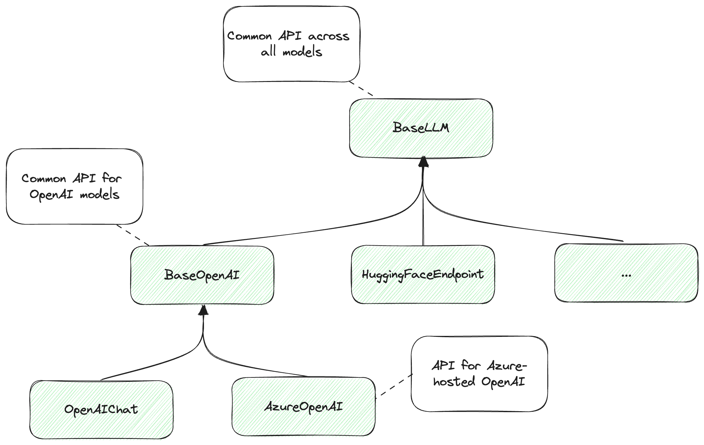
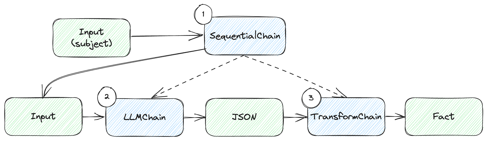
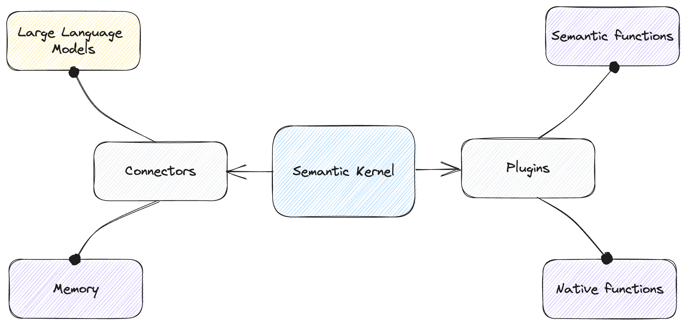

# Chapter 9: Frameworks


In this chapter:

* Reviewing common building blocks.
* Chaining components in LangChain.
* Using Semantic Kernel with connectors and plugins.
* Constraining output with various libraries.

This chapter covers frameworks we can use to bootstrap our large language model
development. We build a bunch of utilities and systems from scratch throughout
the book to get a better understanding of the underlying concepts. That said, we
don’t have to start from zero when we’re ready to build a large language
model-backed system.

We’ll start with a review of common building blocks. This is a recap of the
various ideas we covered throughout the book – prompt templates, prompt
selection and chaining, memory, vector databases, interacting with external
systems, planning. These are all components built over the raw model APIs.

Next, we’ll look at some frameworks that provide some of these “out-of-the-box”.
They might have different names or look slightly different, but the frameworks
aim to abstract some of these blocks and provide a higher-level abstraction for
working with large language models.

We’ll start with *LangChain*[^1], a popular framework for developing
applications powered by large language model. We’ll learn about its modules:
model I/O, retrieval, chains, memory, agents, and callbacks.

We’ll then take a look at *Semantic Kernel*[^2], an open-source framework
developed by Microsoft for similar purposes. We’ll see templates, memory,
plugins, planning and more.

While each framework choses different names, we’ll see how their components map
to the building blocks we learned about. Since the field of engineering systems
that incorporate large language models is new, the vocabulary hasn’t settled
yet.

Finally, we’ll cover a few other interesting libraries you might use during
development. These are less general-purpose, more focused on specific tasks. We
won’t go over code samples here, rather give you some starting points for future
exploration.

Let’s start with the recap of common building blocks.

## Common building blocks

So far, we’ve been learning with concrete code examples of toy applications.
This helped us better understand the underlying concepts that make up a solution
built around a large language model. Now we can take a step back and look at
things a bit more abstractly.

First, a large language model applications involves interacting with a
generative pre-trained model (GPT) through prompts. Figure 9.1 shows a
high-level.


*Figure 9.1: High-level large language model-based system.*

We relied on OpenAI models throughout this book, but all large language models
have similar interaction models. There are a few things that are specific to
OpenAI:

* The shape of the API (e.g., the JSON format expected by `gpt-3.5-turbo` in
  terms of conversation lines with different roles).
* Built-in facilities, like the function calling syntax we saw in chapter 6 or
  GPT-4 plugins (which we’ll touch on in the next chapter).
* Token implementation details: encoding, limits, pricing.

Outside of these specifics though, all large language models, even ones provided
by other vendors, share the same interaction model:

* We prompt the model and get back a response.
* Prompt templates help reuse common prompt parts, while allowing parameterized
  inputs.
* The model maintains no state between interactions, so if we need it to recall
  things, we must use some form of external memory.
* If we want to connect it with external systems, we need some form of
  function-calling mechanism and tell the model what functions it has available
  and how to invoke them.
* Complex tasks require some form of planning – divide and conquer,
  chain-of-thought reasoning etc.

These aspects are covered by frameworks aimed at facilitating development using
large language models.

## LangChain

The best way to describe LangChain is by quoting the introduction from the Get
started documentation page[^3]:

> LangChain is a framework for developing applications powered by language
models. It enables applications that are:
>
> * **Data-aware**: connect a language model to other sources of data.
> * **Agentic**: allow a language model to interact with its environment.
>
> The main value props of LangChain are:
>
> 1. **Components**: abstractions for working with language models, along with a
collection of implementations for each abstraction. Components are modular and
easy-to-use, whether you are using the rest of the LangChain framework or not.
> 2. **Off-the-shelf chains**: a structured assembly of components for
accomplishing specific higher-level tasks.
>
> Off-the-shelf chains make it easy to get started. For more complex
applications and nuanced use-cases, components make it easy to customize
existing chains or build new ones.

*Components*? *Chains*? As mentioned earlier, the vocabulary hasn’t settled yet
*for this new field. We’ll look at these main value props of LangChain and see
*how they connect with the concepts we discussed so far.

Let’s start by installing LangChain. Listing 9.1 does that.

```sh
pip install langchain
```

*Listing 9.1: Installing LangChain.*

Time to dive in.

### Models

Let’s implement the customary “hello world” using LangChain. Listing 9.2 shows
how this will look like.

```python
from langchain.llms import OpenAI

llm = OpenAI()

response = llm('Say "Hello world" in Python.')

print(response)
```

*Listing 9.2: “Hello world” using LangChain.*

Running this code should output `print("Hello world")`, much like the first
examples we saw in chapter 2, when we were getting familiar with the OpenAI API.

A few things to note: LangChain supports multiple models offered by various
vendors – OpenAI, Azure OpenAI, Hugging Face, Cohere, LLAMA etc. The framework
provides an abstraction where developers can use the same API and be able swap
the underlying models. This is provided by a `BaseLLM` class. Vendor-specific
APIs are available in the derived classes. In our example, we used the `OpenAI`
class, which derives from `BaseLLM`.

The common API uses the model object as a function that sends a prompt to a
large language model and returns the response as a string.

If we want a vendor-specific response we can use the `generate()` API instead.
Remember, an OpenAI response is not just a string, rather it includes things
like `finish_reason` and token usage. Listing 9.3 updates our example to use
`generate()`.

```python
from langchain.llms import OpenAI

llm = OpenAI()

response = llm.generate(['Say "Hello world" in Python.'])

print(response)
```

*Listing 9.3: “Hello world” with OpenAI-specific response.*

Running this code should output something like listing 9.4.

```text
generations=[[Generation(text='\n\nprint("Hello world")',
generation_info={'finish_reason': 'stop', 'logprobs': None})]]
llm_output={'token_usage': {'prompt_tokens': 8, 'completion_tokens': 7,
'total_tokens': 15}, 'model_name': 'text-davinci-003'}
run=[RunInfo(run_id=UUID('1a29aa8e-a4ab-4762-907a-ac28ae8748ad'))]
```

*Listing 9.4: Content of the response object.*

Note this includes all the information the OpenAI API returns. We haven’t
specified a model when we created the LangChain OpenAI object, the default is
`text-davinci-003` at the time of writing (this model is deprecated so I expect
LangChain will switch to a newer model soon).

Figure 9.2 shows the hierarchy of models.



*Figure 9.2: LangChain hierarchy of models.*

Note this is an abbreviation of the actual LangChain hierarchy for illustrative
purposes.

If we use `BaseLLM`, we work with an API that can handle any model supported by
the framework, so we can easily swap the underlying model. If we want more
specific functionality, we go down the hierarchy: `BaseOpenAI` offers a common
API over OpenAI models. Further down the hierarchy, we can use `AzureOpenAI`,
which is specific for OpenAI models hosted on Azure or `OpenAIChat` for OpenAI
chat completion models and so on.

The key takeaway is that we can use the common base API when we code our
solution using LangChain and be able to easily swap the underlying models used
if we want to try another vendor. The tradeoff is that we don’t get to leverage
the vendor-specific capabilities.

If we do want access to vendor-specific information, that is still available to
us. Though if we take a dependency on it, we won’t be able to swap out the
vendor as easily.

LangChain also provides an abstraction over chat models, complete with a schema
for representing human messages, AI responses and so on. Let’s update our “hello
world” example again, this time to use `gpt-3.5-turbo`, as in listing 9.5.

```python
from langchain.chat_models import ChatOpenAI
from langchain.schema import HumanMessage

llm = ChatOpenAI()

response = llm([HumanMessage(content='Say "Hello world" in Python.')])

print(response)
```

*Listing 9.5: “Hello world” using a chat model.*

The LangChain schema module provides classes for `HumanMessage`, `AIMessage`,
`SystemMessage`, `FunctionMessage` – all the usual suspects we’ve been dealing
with, but now implemented as Python abstractions with multi-model support.

We won’t cover the full model capabilities provided by LangChain. In general,
our aim is to overview the concepts. You can always refer to the framework’s
documentation for all the nitty-gritty details. We should call out thought that
LangChain provides many other facilities like keep track of token usage,
streaming responses, and even a fake model we can use for testing to mock real
model responses.

### Prompts

Prompt templating is another common building block that the framework provides.
Let’s see how we can implement our English-to-French translator in LangChain.
Listing 9.6 shows the code.

```python
from langchain.chat_models import ChatOpenAI
from langchain.prompts import ChatPromptTemplate

template = ChatPromptTemplate.from_messages([
    ('system', 'You are an English to French translator.'),
    ('user', 'Translate this to French: {text}')
])

llm = ChatOpenAI()

response = llm(template.format_messages(
    text='Aren\'t large language models amazing?'))

print(response)
```

*Listing 9.6: English to French translator using LangChain.*

LangChain provides both `PromptTemplate` and `ChatPromptTemplate` classes for
the corresponding model types. While our simple `ChatTemplate` class we used
throughout the book was a thin wrapper over the OpenAI-expected format,
LangChain aims to support multiple vendors.

Another difference is we’ve been using `{{ }}` to enclose parameters (this is
called “handlebars syntax”, after the popular Handlebars JavaScript library[^4]),
while LangChain templates by default use single braces `{ }`. This is
configurable though, LangChain supports multiple syntaxes for templates.

LangChain prompt templates includes facilities for creating few-shot examples,
partial templates (meaning we can fill in some of the parameters, then the rest
later on), template composition, and more.

The framework also offers some great output parsing capabilities.

### Output parsing

As we saw throughout the book, in many cases we would like the large language
model to output in some format like JSON, so we can then write code that
interprets that response and loads it into an object.

LangChain offers several output parser for some basic types, and a very rich
JSON parser based on Pydantic[^5]. Pydantic is a Python library for data
validation – it allows developers to naturally define schemas (using Python
classes and type annotations) and validates if data conforms to that schema.

We’ll implement a simple example that uses the `PydanticOutputParser` to both
describe to the large language model what shape we want the response in, and to
parse the response into a Python object (listing 9.7). We ask the model for a
fact on some subject and expect it to respond with both a `fact` and a
`reference`.

```python
from langchain.chat_models import ChatOpenAI
from langchain.prompts import ChatPromptTemplate
from langchain.output_parsers import PydanticOutputParser
from pydantic import BaseModel, Field


class Fact(BaseModel):
    fact: str = Field(description='A fact about a subject.')
    reference: str = Field(description='A reference for the fact.')


parser = PydanticOutputParser(pydantic_object=Fact)

template = ChatPromptTemplate.from_messages([
    ('system', 'Your responses follow the format: {format}'),
    ('user', 'Tell me a fact about {subject}')
])

llm = ChatOpenAI()

response = llm(template.format_messages(
    format=parser.get_format_instructions(),
    subject='data science'))

print(parser.parse(response.content))
```

*Listing 9.7: Parsing output into a Python object using PydanticOutputParser.*

First, we define the shape of our `Fact`. We define this as having two fields,
`fact` and `reference`, both strings. We also provide descriptions for the
fields. Note we inherit from the `BaseModel` class – this is the Pydantic base
class for defining schemas.

Next, we create a `PydanticOutputParser` based on our Fact.

We define a prompt template with parameterized `format` instructions (what shape
of output we want from the model) and `subject`.

Then comes the magic – instead of us painstakingly describing to the model how
it should format the output, we simply call `parser.get_format_instructions()`.
LangChain takes care of this part for us – we go from a Python class definition
straight to business.

Not only that, once we get a response from the model, we call `parser.parse()`
on it and end up with an object of type `Fact`. This saves us a lot of work. In
fact, LangChain also provides an `OutputFixingParser` which can send an invalid
formatted output back to a large language model and ask for a fix.

So far we’ve gone from simply calling the model, to defining a prompt template
and using that with the model call, to adding an output parser and formatting
instructions. We have more and more pieces to juggle. LangChain aims to makes
this easy for developers. It’s time to talk about *components* and *chains*.

### Chains

In LangChain parlance, we’ve been dealing with various components. In our
examples so far, the model instance (for example, a `ChatOpenAI` object) and our
prompt template (for example, a `ChatPromptTemplate` instance), are considered
components. Chains help combine components.

> **Definition**: a *chain* is a sequence of calls to components, which can
include other chains. Chains allow us to combine multiple components together to
create a single, coherent application.

An example of a simple chain is taking user input, instantiating a template,
making a large language model call, and getting a response.

A more complex chain can combine multiple chains, or chains with other
components, for arbitrarily large workflows.

Let’s see how we can re-implement our fact prompting with output parsing using
chains. Listing 9.8 shows the code.

```python
from langchain.chains import LLMChain, TransformChain, SequentialChain
from langchain.chat_models import ChatOpenAI
from langchain.prompts import ChatPromptTemplate
from langchain.output_parsers import PydanticOutputParser
from pydantic import BaseModel, Field


class Fact(BaseModel):
    fact: str = Field(description='A fact about a subject.')
    reference: str = Field(description='A reference for the fact.')


parser = PydanticOutputParser(pydantic_object=Fact)

template = ChatPromptTemplate.from_messages([
    ('system', 'Your responses follow the format: {format}'),
    ('user', 'Tell me a fact about {subject}')
])

prompt = template.partial(format=parser.get_format_instructions())

llm = ChatOpenAI()

llm_chain = LLMChain(
    llm=llm,
    prompt=prompt,
    output_key='json')

transform_chain = TransformChain(
    input_variables=['json'],
    output_variables=['fact'],
    transform=lambda inp: {'fact': parser.parse(inp['json'])})

chain = SequentialChain(
    input_variables=['subject'],
    chains=[llm_chain, transform_chain])

print(chain.run(subject='data scientists'))
```

*Listing 9.8: Combining chains.*

Of course, since we’re dealing with toy examples, this sample might seem more
convoluted than what we did in listing 9.7. That said, using chains scales much
better as the size of our code and number of components increases.

Let’s go over the code:

* We start by defining the same `Fact` class, `PydanticOutputParser`, and chat
  template.
* We then do a partial template instantiation by calling `template.partial()`.
  This is partial because we set the format instructions but leave `subject` for
  later. We store this partial instantiation as prompt.
* We create our first chain: an `LLMChain`. An `LLMChain` requires a prompt and
  a model. When invoking this chain, the prompt is fully instantiated based on
  input, and a request is sent to the model. Optionally we can ask for a
  specific output key. We use this to connect with other chains, so in our case
  we want the output to show up under the key `'json'`.
* Next, we create a `TransformerChain`. This is a different type of chain – it
  takes some input, applies a transformation (a function) to it, and returns
  some output. We set this up to call `parser.parse()` and return a dictionary
  with a single key, `'fact'`, containing our `Fact` object. The transformation
  function must take as input a dictionary and return a dictionary.
* We then connect our two chains using a `SequentialChain`. This will ensure
  `llm_chain` runs first, then the result is handed off to `transform_chain` to
  produce the final output.
* Finally, we run the chain by invoking it and providing the `subject`
  parameter.

Figure 9.3 illustrates how the chains connect.



*Figure 9.3: Chain sequence.*

We have 3 chains:

1. We start with our `SequentialChain`, which takes the user input (the subject
   for which we want a fact, and sequences execution of the other two chains).
2. The `LLMChain` takes the input, makes the large language model call, and
   returns JSON output.
3. The `TransformChain` takes the JSON output and uses the parser to deserialize
   this into a `Fact` object.

Again, this might seem like overkill for our simple case, but it becomes much
more useful in larger solutions, consisting of longer sequences.

In fact, LangChain also provides a pipe syntax (using the `|` operator) to
string things together. This handles a lot of the stuff under the hood and makes
chain creation very concise. Listing 9.9 shows the more concise implementation.

```python
from langchain.chat_models import ChatOpenAI
from langchain.prompts import ChatPromptTemplate
from langchain.output_parsers import PydanticOutputParser
from pydantic import BaseModel, Field


class Fact(BaseModel):
    fact: str = Field(description='A fact about a subject.')
    reference: str = Field(description='A reference for the fact.')


parser = PydanticOutputParser(pydantic_object=Fact)

template = ChatPromptTemplate.from_messages([
    ('system', 'Your responses follow the format: {format}'),
    ('user', 'Tell me a fact about {subject}')
])

prompt = template.partial(format=parser.get_format_instructions())

llm = ChatOpenAI()

chain = prompt | llm | parser

print(chain.invoke({'subject': 'data scientists'}))
```

*Listing 9.8: Using pipe syntax to create chains.*

This should look a lot better: we don’t explicitly mention any chain class
anymore – in fact, we removed the imports from `langchain.chains`. We replaced
all that with `prompt | llm | parser`. This reads as *“send `prompt` to the
`llm`, then send the response to `parser`”*.

As before, we run the whole thing by calling `chain.invoke()` and supplying the
`subject`. Going forward we’ll use this syntax.

### Memory and retrieval

LangChain also makes working with memory easy. The frameworks splits this into
two separate modules: *retrieval* and *memory*. Note in chapter 5, when we
discussed memory, we didn’t make this distinction.

The *retrieval* module focuses on connecting with external storage. External
storage can be a file (multiple formats are supported, like CSV, JSON, Markdown
etc.), a vector database, and even Google web search. Data can be retrieved from
any of these storage mediums and injected into a prompt.

The *memory* module focuses on maintaining memory across large language model
interactions, for example chat memory. LangChain provides more advanced memories
like *conversation summary* and *knowledge graph*. We won’t cover all of these
in depth – for this, I refer you again to the LangChain documentation.

We’ll look at implementing our Pod Racing Q&A in LangChain. As a reminder, we
have our Pod Racing league dataset under the `/code/racing` folder in the book’s
GitHub repo. Let’s see how we can use a vector store with LangChain to answer
questions. Listing 9.10 reimplements our Pod Racing Q&A bot using LangChain.

```python
from langchain.chat_models import ChatOpenAI
from langchain.document_loaders import TextLoader, DirectoryLoader
from langchain.embeddings.openai import OpenAIEmbeddings
from langchain.prompts import ChatPromptTemplate
from langchain.schema.runnable import RunnablePassthrough
from langchain.vectorstores import Chroma

loader = DirectoryLoader('../racing', loader_cls=TextLoader)
docs = loader.load()
db = Chroma.from_documents(docs, OpenAIEmbeddings())

retriever = db.as_retriever(search_kwargs={'k': 1})

template = ChatPromptTemplate.from_messages([
    ('system', 'Your are a Q&A AI.'),
    ('system',
     'Here are some facts that can help you answer the following question: {data}'),
    ('user', '{prompt}')
])

llm = ChatOpenAI()

chain = {'data': retriever, 'prompt': RunnablePassthrough()} | template | llm


while True:
    prompt = input('user: ')
    if prompt == 'exit':
        break

    print(chain.invoke(prompt).content)
```

*Listing 9.10: Pod Racing Q&A with LangChain.*

Let’s go over the steps:

* First, we store our dataset in Chroma. LangChain provides a lot of facilities
  for this, so we can do this in 3 lines of code: We start by loading all the
  files in the `../racing` directory using `DirectoryLoader` and supplying a
  `TextLoader` for loading each file (since our data set consists of text
  files). `load()` performs the load, we end up with a bunch of documents
  (`docs`). We call `Chroma.from_documents()` using the OpenAI model for
  embedding and that’s it – our in-memory vector store is now in `db`.
* Next, we create a `retriever` from the vector store. The `search_kwargs({'k':
  1})` configures the retriever to get back the single, nearest (by cosine
  distance) document. We can use larger `k` values to retrieve multiple
  documents.
* The `template` is straight-forward, in fact, it’s the same as the one we used
  in listing 5.13, but now built with LangChain syntax.
* We instantiate a chat OpenAI model (`gpt-3.5-turbo`).
* The last part of the setup is creating the chain: For the `data` template
  parameter, we assign the retriever (under the hood, LangChain will ensure the
  vector store is queried at runtime based on the content of the rest of the
  prompt); For the `prompt` template parameter we use `RunnablePassthrough()` –
  that means we’ll get the actual value for this when we invoke the chain. We
  pipe this to the template, and the template to the model.
* In our interactive loop, the user asks a question (stored in `prompt`), we
  invoke the chain passing the question, and we print the content of the
  response.

If we contrast this with the code in chapter 5, this version should look a lot
more concise. This is expected – instead of us handcrafting each piece, we’re
relying on a framework aimed at making this easier.

We just saw how we can connect a vector store to a chain and help answer
questions based on an external dataset. All in just a few lines of code.

The other major piece we need to cover is interacting with external systems.
We’ll see how we can do this with LangChain. For that, we need to look at
*agents*.

### Agents

LangChain documentation defines agents[^6] as:

> **Definition**: The core idea of *agents* is to use a large language model to
choose a sequence of actions to take. In chains, a sequence of actions is
hardcoded (in code). In agents, a language model is used as a reasoning engine
to determine which actions to take and in which order.

There are a few key components to this:

* An **agent** is responsible for which step to take next. An agent is powered
  by a large language model and a prompt.
* **Tools** are functions that an agent can call.
* **Toolkits** are collections of tools for the agent.
* An **agent executor** is the runtime for an agent, prompting the large
  language model and handling function calls.

Contrasting this with what we learned so far, LangChain bundles the concepts of
*functions* we saw in chapter 6, when we discussed interacting with external
systems; and *planning*, which we saw in chapter 7.

In the LangChain framework, an agent handles both the planning (what action to
take next) and external system interaction (using tools).

Agents can be used to build complex autonomous systems like Auto-GPT, which we
mentioned in chapter 7. We won’t get that deep into it here – instead, let’s
just see how we can use an agent and tools to reimplement our meeting scheduling
solution from chapter 6. Listing 9.11 implements the same personal assistant as
we saw in listing 6.8, using the external functions `get_emails()` and
`schedule_meeting()`.

```python
from langchain.agents import AgentExecutor, OpenAIFunctionsAgent, tool
from langchain.chat_models import ChatOpenAI
from langchain.schema import SystemMessage


@tool
def get_emails(names):
    """Get the email addresses of a set of users given their names"""
    print(f'* Getting emails for {names}')

    address_book = {
        'John Doe': 'john.doe@example.com',
        'Jane Doe': 'jane.doe@example.com',
    }
    emails = {}

    for name in names:
        emails[name] = address_book[name]

    return emails


@tool
def schedule_meeting(subject, recipients, time):
    """Sends a meeting invitation with the given subject to the given recipient emails at the given time"""

    print(f"* Meeting '{subject}' scheduled for {time} with {recipients}")
    return {'success': True}


tools = [get_emails, schedule_meeting]

system_message = SystemMessage(content="You are an AI personal assistant.")

prompt = OpenAIFunctionsAgent.create_prompt(system_message=system_message)

llm = ChatOpenAI()

agent = OpenAIFunctionsAgent(llm=llm, tools=tools, prompt=prompt)

agent_executor = AgentExecutor(agent=agent, tools=tools, verbose=True)
agent_executor.run(
    'Schedule lunch with Jane Doe for Monday at noon at Tipsy Cow')
```

*Listing 9.11: Personal assistant with functions in LangChain.*

We start with our mock functions, but this time around, instead of providing a
JSON description of the functions, we use the `@tool` decorator and provide
descriptions as docstrings (see sidebar for Python decorators and docstrings).
We collect the tools in the `tools` variable.

> **Sidebar: Python decorators and docstrings**
>
> Python decorators[^7] are a language feature that allows you to modify the
behavior of functions or class methods without changing their code. Decorators
are functions themselves, taking another function as an argument, which they can
wrap, extend, or otherwise alter the behavior of. Python offers syntactic sugar
for this: a decorator function like `tool()` can be added on top of another
function using `@` (`@tool`) and the function underneath gets passed as a
parameter to the decorator. The decorator returns a function with matching
signature of the decorated function but can run additional code.
>
> In our case, the `@tool` decorator registers the decorated function with
LangChain as a function available to the large language model.
>
> Python docstrings[^8] are strings which appear as the first thing in a module,
class, or function. They are expressed using 3 quotes (`"""` or `'''`), and the
Python compiler places them in the `__doc__` attribute of the module, class, or
function. At runtime, code can look at this attribute and retrieve the docstring
– LangChain leverages this and pulls the docstring from the decorated tools to
describe the functions to the large language model.

We then create a prompt. We do it a bit differently this time around – we start
with a `SystemMessage`, then use the `OpenAIFunctionsAgent.create_prompt()`
function to get our prompt.

We use `ChatOpenAI()` as the model (again, `gpt-3.5-turbo`).

We set up the agent: `OpenAIFunctionsAgent` is the LangChain agent that knows
how to interpret OpenAI functions – it can translate our `tools` to the JSON
description expected by the model and can interpret function call responses.

Finally, we create the agent executor, providing the `agent` and the available
`tools`. We set it to `verbose` mode, so we can take a look at what is going on
during execution. We run this with the prompt “Schedule lunch with Jane Doe for
Monday at noon at Tipsy Cow”.

Listing 9.12 shows the verbose output.

```text
> Entering new AgentExecutor chain...

Invoking: `get_emails` with `{'names': ['Jane Doe']}`

* Getting emails for ['Jane Doe']
{'Jane Doe': 'jane.doe@example.com'}
Invoking: `schedule_meeting` with `{'subject': 'Lunch', 'recipients': ['jane.doe@example.com'], 'time': 'Monday at 12:00 PM'}`

* Meeting 'Lunch' scheduled for Monday at 12:00 PM with ['jane.doe@example.com']
{'success': True}I have scheduled a lunch meeting with Jane Doe for Monday at noon at Tipsy Cow.

> Finished chain.
```

*Listing 9.12: Agent output.*

The lines prefixed with `*` come from our mock functions. The rest is the agent
executor verbose output.

As expected, based on the prompt, the first thing the agent does is call
`get_emails()` to get Jane Doe’s email. Next, it calls `schedule_meeting()`.

Note LangChain supplies the function calling mechanism under the hood.
Translation from JSON response to function call is handled automatically.
Similarly, the response is sent back to the model automatically. A lot of the
glue we had to write in chapter 6 is now delegated to the framework.

We’ll conclude our LangChain discussion here. There’s a lot more to cover, but
this should be enough to pique your interest and get you started. We’ll move on
to discuss another framework with similar goals: Semantic Kernel. But before we
start that, let’s do a quick recap of this section.

### LangChain recap

We covered the fundamentals of LangChain: components and chains.

Components are modular pieces of functionality that handle some specific
scenario like prompting, memory, or output parsing.

Chains stich together calls to components, enabling us to create workflows.
Chains can be nested, as we saw with the `SequentialChain` sequencing execution
of an `LLMChain` and a `TransformChain`.

We also saw how we can use LangChain to interface with memory, how to integrate
with external code (tools), and how agents can automate execution of multiple
steps. In our example, this was backed by the OpenAI function API.

The pipe syntax makes it easy and intuitive to express complex chains.

## Semantic Kernel

While LangChain relies on components and chaining components to build large
language model-based solutions, Semantic Kernel takes a different approach[^9]:

> Semantic Kernel has been engineered to allow developers to flexibly integrate
AI services into their existing apps. To do so, Semantic Kernel provides a set
of connectors that make it easy to add memories and models. In this way,
Semantic Kernel is able to add a simulated "brain" to your app.
>
> Additionally, Semantic Kernel makes it easy to add skills to your applications
with AI plugins that allow you to interact with the real world. These plugins
are composed of prompts and native functions that can respond to triggers and
perform actions. In this way, plugins are like the "body" of your AI app.

With this framework, we have a *kernel* at the center, to which we connect
plugins and memory, and rely on it for execution. Figure 9.4 illustrates this.



*Figure 9.4: Semantic Kernel with connectors and plugins.*

The kernel orchestrates execution. We use connectors to provide large language
models (for prompt execution) and memory. We use plugins to connect
functionality – these can be *semantic functions* (prompts) or *native
functions* (code).

Let’s look at some concrete examples, starting with “Hello world”. Listing 9.13
installs Semantic Kernel.

```sh
pip install semantic-kernel
```

*Listing 9.13: Installing Semantic Kernel.*

Listing 9.14 is our “Hello world”.

```python
import os
import semantic_kernel as sk
from semantic_kernel.connectors.ai.open_ai import OpenAIChatCompletion

kernel = sk.Kernel()
kernel.add_chat_service('chat_completion', OpenAIChatCompletion(
    'gpt-3.5-turbo', os.environ['OPENAI_API_KEY']))

prompt = 'Say "Hello world" in Python.'

hello_world = kernel.create_semantic_function(prompt)

print(hello_world())
```

*Listing 9.14: “Hello world” using Semantic Kernel.*

We first create our `kernel`. Then we add a chat service to it –
`OpenAIChatCompletion` using `gpt-3.5-turbo`. Like LangChain, Semantic Kernel
also supports multiple model vendors.

Next comes the “Hello world” `prompt`. Then here is the framework-specific part:
we use the prompt to create a *semantic function*. Semantic Kernel aims to
provide a unified programming model across *native functions* – these are
regular functions in our programming language – and *semantic functions*, which
involve calling large language models. In this case, we create a semantic
function based on our prompt, then we simply invoke it and print the result.

Let’s see how prompt templating works in Semantic Kernel. Listing 9.15
reimplements our English-to-French translator. The code is a bit more verbose
than LangChain. One of the reason for that is that, unlike LangChain, which is a
Python/JS framework, Semantic Kernel has Python, C#, and Java versions. Aiming
to keep the API consistent across there languages, the Python version ends up
being less concise.

```python
import asyncio
import os
import semantic_kernel as sk
from semantic_kernel.connectors.ai.open_ai import OpenAIChatCompletion
from semantic_kernel.semantic_functions.prompt_template_config import PromptTemplateConfig

kernel = sk.Kernel()
kernel.add_chat_service('chat_completion', OpenAIChatCompletion(
    'gpt-3.5-turbo', os.environ['OPENAI_API_KEY']))

prompt_config = PromptTemplateConfig(
    completion=PromptTemplateConfig.CompletionConfig(
        chat_system_prompt='You are an English to French translator.'
    )
)

prompt_template = sk.ChatPromptTemplate(
    'Translate this to French: {{$input}}',
    kernel.prompt_template_engine,
    prompt_config)

function_config = sk.SemanticFunctionConfig(prompt_config, prompt_template)

translate = kernel.register_semantic_function(
    None, 'translate', function_config)

text = 'Aren\'t large language models amazing?'

print(asyncio.run(kernel.run_async(translate, input_str=text)))
```

*Listing 9.15: English to French translator using Semantic Kernel.*

We start by creating the `kernel` and adding `OpenAIChatCompletion` like before.
We then create our prompt template. The prompt configuration captures things
like `temperature`, `max_tokens` etc. We use the defaults, so the only thing we
configure in the `PromptTemplateConfig()` call is the `system` message.

We then call `sk.ChatPromptTemplate()`. This function expects a template string,
a template engine, and a prompt config. We use our translation prompt, note the
syntax for template parameters: the parameter `input` is specified as
`{{$input}}`. We use the kernel’s template engine and the config we just
created.

Next, we convert the template into a semantic function. In our “Hello world”
example, we just passed in the prompt. This won’t work here – the simple
`create_semantic_function()` function works with basic templates, but in our
case we have a chat template with a system message, so we use a different API:
we create a function configuration from the prompt config and template (stored
as `function_config`), then we register this with the kernel by calling
`kernel.register_semantic_function()`. The first argument is an optional skill
name (we won’t use this here), the second argument is the name we want to
register the function as (`translate`), the third argument is the function
configuration.

At this point, our kernel can translate from English to French.

Finally, we call `kernel.run_async()`, passing it a function and an input
string. Semantic Kernel runs things asynchronously, so we use the Python
`asyncio` library to wait for the result of the call and print it to the
console.

While doing all this in code is verbose, Semantic Kernel provides a very neat
way of doing this declaratively: we can create a *plugin*.

### Plugins

Now we’re getting closer to one of the main advantages of Semantic Kernel: a declarative way of defining semantic functions and a mechanism to easily load them. The general structure of a plugin is:

```text
<Plugin folder>
|
|--<Function>
|  |
|  |- config.json
|  |- skprompt.txt
|
|--<Function>
   |
   |- config.json
   |- skprompt.txt
```

A root plugin folder contains any number of functions. Each function is
represented by a folder containing a prompt configuration (`config.json`) and a
prompt template (`skprompt.txt`).

Let’s make our previous example declarative. Listing 9.16 represents the prompt
configuration as JSON. We’ll save this under `translate/to_french` as
`config.json`.

```json
{
  "schema": 1,
  "description": "English to French translation",
  "type": "completion",
  "completion": {
    "max_tokens": 100,
    "temperature": 1,
    "top_p": 1,
    "presence_penalty": 0,
    "frequency_penalty": 0,
    "chat_system_prompt": "You are an English to French translator."
  }
}
```

*Listing 9.16: English to French translation JSON prompt configuration.*

We’ll save the prompt template in listing 9.17 as
`translate/to_french/skprompt.txt`.

```text
Translate this to French: {{$input}}
```

*Listing 9.17: English to French prompt template.*

Following the plugin storage format, our plugin is `translate`, our semantic
function is `to_french`. We could potentially add other functions under this
plugin.

Now let’s see how we can load the plugin and translate (listing 9.18).

```python
import asyncio
import os
import semantic_kernel as sk
from semantic_kernel.connectors.ai.open_ai import OpenAIChatCompletion

kernel = sk.Kernel()
kernel.add_chat_service('chat_completion', OpenAIChatCompletion(
    'gpt-3.5-turbo', os.environ['OPENAI_API_KEY']))

translate_plugin = kernel.import_semantic_skill_from_directory('.', 'translate')

text = 'Aren\'t large language models amazing?'

print(asyncio.run(
    kernel.run_async(translate_plugin['to_french'], input_str=text)))
```

*Listing 9.18: Importing a plugin from disk.*

We simply call `import_semantic_skill_from_directory()` and pass it the root
plugin directory and the plugin we want loaded. In our case, `./translate`.

We again call `run_async()`, this time referencing the function by its name in
the plugin we loaded. As you can see, this code is significantly more concise.

At the time of writing, Semantic Kernel doesn’t have a great way of specifying a
chat template – the whole text document is interpreted as a user message, and
the configuration JSON allows for a `chat_system_prompt` property, but no way to
templatize a chat with multiple messages and roles. Also, unlike LangChain,
Semantic Kernel doesn’t offer any built-in capabilities to deserialize model
output into objects, so we’ll move on and look at how we can connect the kernel
with an external memory.

### Memory

Semantic Kernel offers connectors to multiple memory stores behind a unified
interface, including a volatile in-memory store we can use for our examples.

Let’s reimplement our Pod Racing Q&A, this time with Semantic Kernel. We’ll
start by specifying a `qa_plugin`. Listing 9.19 shows the configuration (it
should go under `qa/qa/config.json`).

```json
{
    "schema": 1,
    "description": "Q&A bot",
    "type": "completion",
    "completion": {
      "max_tokens": 100,
      "temperature": 1,
      "top_p": 1,
      "presence_penalty": 0,
      "frequency_penalty": 0,
      "chat_system_prompt": "You are a Q&A bot."
    }
}
```

*Listing 9.19: Q&A JSON prompt configuration.*

Listing 9.20 shows the prompt template (it should go under
`qa/qa/skprompt.txt`).

```text
Here are some facts that can help you answer the following question: {{$data}}.

{{$prompt}}
```

*Listing 9.20: Q&A prompt template.*

Now let’s look at the full Q&A implementation, with embeddings (listing 9.21).

```python
import asyncio
import os
import semantic_kernel as sk
from semantic_kernel.connectors.ai.open_ai import OpenAIChatCompletion, OpenAITextEmbedding

kernel = sk.Kernel()
kernel.add_chat_service('chat_completion', OpenAIChatCompletion(
    'gpt-3.5-turbo', os.environ['OPENAI_API_KEY']))

qa_plugin = kernel.import_semantic_skill_from_directory('.', 'qa')

kernel.add_text_embedding_generation_service('ada', OpenAITextEmbedding(
    'text-embedding-ada-002', os.environ['OPENAI_API_KEY']))

kernel.register_memory_store(memory_store=sk.memory.VolatileMemoryStore())

for f in os.listdir('../racing'):
    path = os.path.join('../racing', f)
    with open(path, 'r') as f:
        text = f.read()
        asyncio.run(kernel.memory.save_information_async(
            collection='racing',
            text=text,
            id=path))

while True:
    prompt = input('user: ')
    if prompt == 'exit':
        break

    data = asyncio.run(kernel.memory.search_async('racing', prompt, limit=1))

    context = kernel.create_new_context()
    context["data"] = data[0].text
    context["prompt"] = prompt

    print(asyncio.run(kernel.run_async(qa_plugin['qa'], input_vars=context.variables)))
```

*Listing 9.21: Pod Racing Q&A with Semantic Kernel.*

The first part we saw before: we create a `kernel`, add an
`OpenAIChatCompletion` service, and load our `qa_plugin`. Then comes the memory
part:

* First, we connect a text embedding service, in this case `OpenAITextEmbedding`
  via the `text-embedding-ada-002` model. Now the kernel knows how to embed
  data.
* We then register a memory store – since we’re using a toy example, we’ll
  create a `VolatileMemoryStore` which won’t be persisted to disk.
* Then for each file in our Pod Racing dataset, we save it to memory by calling
  `save_information_async()`.

  We’re again using `asyncio` here to make these asynchronous calls synchronous
  for our example, but for a real project we would be using `async`/`await` and
  write non-blocking code.
* In our interactive loop, we call `search_async()` to find the best match from
  our memory based on the user prompt.

Since we now have to pass 2 parameters to the template, we no longer use the
default `input_str`, rather we create a `context`, we set `data` and `prompt` in
it, then pass it to the `qa_plugin` as `input_vars`. This is how Semantic Kernel
passes multiple variables to a semantic function call.

The result should behave just as all our other Pod Racing Q&A samples. Notice
again the difference between LangChain and Semantic Kernel in the way the code
is structured – rather than using a memory/retriever component we add to a
chain, here we connect everything to the kernel (including memory store,
embedding function etc.) and let it handle connecting the individual pieces
under the hood.

Finally, let’s look at using Semantic Kernel to interact with external systems,
and handle planning of how to complete a task.

### Native functions and planning

So far, we looked at semantic functions – prompt templates we register with the
kernel then we “invoke”, which means instantiating the template and interacting
with the large language model. Semantic Kernel also supports native functions.
We can register functions written in Python (or C# if we’re using the C# version
of Semantic Kernel).

For this, we’ll use the `@sk_function` decorator, and the `import_skill()`
kernel function. We’ll also use the `SequentialPlanner` to let Semantic Kernel
to come up with the list of steps we need to execute to achieve our goal.
Listing 9.22 shows all of this.

```python
import asyncio
import os
import semantic_kernel as sk
from semantic_kernel.connectors.ai.open_ai import OpenAIChatCompletion
from semantic_kernel.orchestration.sk_context import SKContext
from semantic_kernel.planning.sequential_planner.sequential_planner import SequentialPlanner
from semantic_kernel.skill_definition import sk_function, sk_function_context_parameter

kernel = sk.Kernel()
kernel.add_chat_service('chat_completion', OpenAIChatCompletion(
    'gpt-3.5-turbo', os.environ['OPENAI_API_KEY']))

class CalendarPlugin:
    @sk_function(
        description='Gets the email addresses of a user given their name',
        name='get_email'
    )
    @sk_function_context_parameter(
        name='name',
        description='A name for which to return the email address'
    )
    def get_email(self, context: SKContext) -> str:
        print(f'* Getting email for {context["name"]}')

        address_book = {
            'John Doe': 'john.doe@example.com',
            'Jane Doe': 'jane.doe@example.com',
        }

        return address_book[context['name']]


    @sk_function(
        description='Sends a meeting invitation with the given subject to the given recipient emails at the given time',
        name='schedule_meeting'
    )
    @sk_function_context_parameter(
        name='input',
        description='Recipient email for the meeting invitation'
    )
    @sk_function_context_parameter(
        name='subject',
        description='Meeting subject'
    )
    @sk_function_context_parameter(
        name='time',
        description="Meeting time"
    )
    def schedule_meeting(self, context: SKContext) -> str:
        print(f"* Meeting '{context['subject']}' scheduled for {context['time']} with {context['input']}")
        return 'Success'


calendar_plugin = kernel.import_skill(CalendarPlugin(), 'calendar')

ask = 'Schedule lunch with Jane Doe for Monday at noon at Tipsy Cow'

planner = SequentialPlanner(kernel)
plan = asyncio.run(planner.create_plan_async(goal=ask))

for index, step in enumerate(plan._steps):
    print("Function: " + step.skill_name + "." + step._function.name)
    print("Input vars: " + str(step.parameters.variables))
    print("Output vars: " + str(step._outputs))

result = asyncio.run(plan.invoke_async())
print(result.result)
```

*Listing 9.22: Personal assistant with functions in Semantic Kernel.*

At the time of writing, Semantic Kernel doesn’t natively support OpenAI
functions. Unlike LangChain, where we can simply use the `OpenAIFunctionsAgent`,
which leverages OpenAI function calling, in this case the planner will output a
set of large language model-generated steps, then execute them in sequence on
the client.

To get this working, we need to lightly tweak our functions. Semantic Kernel is
pickier with passing data between functions in a plan. We updated `get_emails()`
to be `get_email()` and return a single email as a string. Both `get_email()`
and `schedule_meeting()` take an `SKConext` as parameter, which will contain all
the arguments for the function call. We also pass the return value of the first
function to the second using the built-in `input` parameter.

With that said, let’s go over the code:

* We define a native plugin, `CalendarPlugin`.
* This implements `get_email()` and `schedule_meeting()`. We decorate both
  functions with descriptions for the function and the parameters.
* We add this to the kernel using `import_skill()`.
* We instantiate a `SequentialPlanner` and create a plan, where the goal is the
  user ask.
* We print the steps of the plan.
* Finally, we execute the plan and print the result.

The output of running this code is shown in listing 9.23.

```text
Function: calendar.get_email
Input vars: {'input': '', 'name': 'Jane Doe'}
Output vars: ['JANE_EMAIL']
Function: calendar.schedule_meeting
Input vars: {'input': '$JANE_EMAIL', 'time': 'Monday at noon', 'location': 'Tipsy Cow', 'subject': 'Lunch'}
Output vars: []
* Getting email for Jane Doe
* Meeting 'Lunch' at 'Tipsy Cow' scheduled for Monday at noon with jane.doe@example.com
Success
```

*Listing 9.23: Plan execution output.*

Our debug output shows how the planner determined we should invoke the available
functions, and with which arguments. Then we see our mock functions were indeed
invoked with the expected parameters.

Note this is less autonomous than an agent – rather than let the large language
model reason at each step which function to call, we have an upfront plan we run
through. Semantic Kernel also offers a `StepwisePlanner`, which acts more like
an agent and, after executing each step, it reassesses the plan and corrects
course as needed. We won’t cover it here but feel free to explore.

A neat feature of Semantic Kernel, which we also won’t go into depth here, is
that a plan can mix native and semantic functions – so part of the processing
can be done by executing code, and part can be done by making large language
model calls.

Semantic Kernel is a bit more verbose than LangChain, and at the time of writing
doesn’t support some of the newer OpenAI features, but it is a solid framework
for building large language model-powered solutions, including support for all
we care about: prompt templating, support for multiple models, memory, planning,
and mixing native code with model calls.

### Semantic Kernel recap

Semantic Kernel aims to provide a central orchestrator to which we add
connectors and plugins.

Connectors enable the kernel to interact with large language models and memory
stores.

Plugins add capabilities to the kernel. They can take the form of semantic
functions – prompt templates; or native functions – code. The framework provides
a common abstraction where we can mix and match native code and prompts to build
our solution.

Planners can handle complex tasks. We looked as an example of a
`SequentialPlanner`, which takes a goal and generates a multi-step plan we can
then execute. A `StepwisePlanner` can reevaluate the result of executing each
step and course-correct if needed.

## Other libraries

We’ll conclude this chapter with a quick overview of some other libraries. Note
these are not full-fledged frameworks, rather libraries which aim to address one
aspect of the ecosystem. LangChain and Semantic Kernel aim to be frameworks to
underpin whole solutions. The libraries we’re covering in this section are more
targeted – pull them in when you need some specific functionality.

We won’t go over any code here – feel free to check out the libraries and see
where they would be useful.

### Guardrails

From the Guardrails[^10] documentation:

> Guardrails is a Python package that lets a user add structure, type and
quality guarantees to the outputs of large language models (LLMs). Guardrails:
>
> * does pydantic-style validation of LLM outputs (including semantic validation
such as checking for bias in generated text, checking for bugs in generated
code, etc.)
> * takes corrective actions (e.g. reasking LLM) when validation fails,
> * enforces structure and type guarantees (e.g. JSON).

Guardrails is a library targeted at ensuring model output conforms to a defined
schema, aiming to address the pain point of consuming model-generated output by
code.

Guardrails uses the `rail` (Reliable AI markup Language) file format to specify
output schema, validation, and what corrective actions to take if output doesn’t
conform. An example of corrective action is re-prompting the model to address an
issue.

We saw Pydantic when we covered LangChain: the Python library that allows us to
define a class like `Fact`, then have LangChain parse model output into an
instance of the class. Guardrails take this one step further, with richer
validation and corrective actions.

### Guidance

From the Guidance[^11] documentation:

> Guidance enables you to control modern language models more effectively and
efficiently than traditional prompting or chaining. Guidance programs allow you
to interleave generation, prompting, and logical control into a single
continuous flow matching how the language model actually processes the text.
Simple output structures like Chain of Thought and its many variants (e.g., ART,
Auto-CoT, etc.) have been shown to improve performance.

Guidance provides an extremely rich template language. We express what we want
as a prompt, and under the hood, Guidance will ensure the model provides output
that conforms to the exact schema we want.

Unlike the simpler template languages we looked at so far, which mostly replace
template parameters with actual values, in Guidance we can also specify
parameters we expect the model to fill in, and define additional constraints
like token counts, regular expressions to match and so on.

In the same template, we can mix our prompt input and output guidance for the
model, enabling a very powerful way to create prompts.

### TypeChat

From the TypeChat[^12] documentation:

> TypeChat replaces *prompt engineering* with *schema engineering*.
>
> [...]
>
> After defining your types, TypeChat takes care of the rest by:
>
> 1. Constructing a prompt to the LLM using types.
> 2. Validating the LLM response conforms to the schema. If the validation
fails, repair the non-conforming output through further language model
interaction.
> 3. Summarizing succinctly (without use of a LLM) the instance and confirm that
it aligns with user intent.

Instead of us having to describe in words what we expect from a large language
model, with TypeChat we can declare the schema of the expected response. The
library translates this into a prompt. It also type-checks the model response,
and if the response contains schema errors, it automatically re-prompts the
model by passing it the error message.

TypeChat is a TypeScript library. The core idea comes from the fact that we
usually ask models to output JSON when we want to connect them with other
systems, and TypeScript is the best solution to express and validate JSON
schemas.

Ideally, we don’t need to tune and find just the right prompt that gives us the
response we expect, rather we just declare the types we want and let TypeChat
take care of the rest.

The frameworks and libraries we covered in this chapter all aim to make
integration of large language models in software solutions easier, either by
providing a “batteries included” solution with everything you would need, or
addressing a specific problem like ensuring model output can be readily consumed
by code. In the next chapter, I’ll share some of my thoughts on where I see the
field evolving.

## Summary

* Regardless of which large language model we use, a software solution that
  integrates a model has a common set of building blocks.
* Prompt templating, external memory, giving the model the ability to interact
  with external systems, and planning are all examples of common building
  blocks.
* Basing a solution on a framework frees us from having to implement everything
  from scratch.
* The LangChain framework relies on components (each addressing one specific
  aspect) and chains (connecting components).
* The Semantic Kernel framework uses a central kernel to orchestrate execution,
  to which we add connections (to models and memory) and plugins (native or
  semantic functions).
* Other libraries like Guardrails, Guidance, and TypeChat address more targeted
  aspects of development with large language models.
* These libraries also provide an opinionated way on how to build large language
  model-backed solutions.

[^1]: <https://www.langchain.com/>
[^2]: <https://learn.microsoft.com/en-us/semantic-kernel/overview/>
[^3]: <https://python.langchain.com/docs/get_started/introduction>
[^4]: <https://handlebarsjs.com/>
[^5]: <https://docs.pydantic.dev/latest/>
[^6]: <https://python.langchain.com/docs/modules/agents/>
[^7]: <https://docs.python.org/3/glossary.html#term-decorator>
[^8]: <https://docs.python.org/3/glossary.html#term-docstring>
[^9]: <https://learn.microsoft.com/en-us/semantic-kernel/overview/>
[^10]: <https://github.com/ShreyaR/guardrails>
[^11]: <https://github.com/guidance-ai/guidance>
[^12]: <https://github.com/microsoft/TypeChat>
