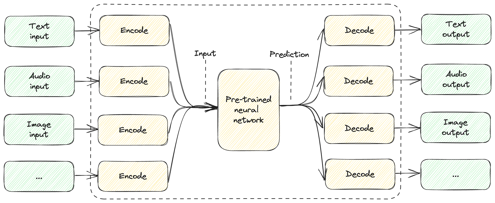

# Chapter 10: Closing Thoughts

In this chapter:

* The high speed of innovation.
* Introducing multimodal models.
* GPT-4 and ChatGPT plugins.
* Predicting possible future developments.

This is the final chapter of the book. By now we covered all the fundamentals,
so here we’ll go over a few “big picture” concepts and think about the future.

The field is advancing at a break-neck speed. You will be surprised to learn
just how much changed over just a few months, while I was writing this book.
OpenAI updated their API, launched new models, and deprecated some existing
models. While I fully expect some of the code samples I shared will stop working
in a year or two, I believe the concepts this book is trying to convey will
remain relevant for a lot longer.

We focused on large language models, with text prompts and text output. In this
chapter we’ll briefly cover *multimodal models*, models that accept input and/or
can generate output in different forms.

I’ll also briefly cover GPT-4. Note that using GPT-4 is more expensive than the
GPT-3.5 models which we used throughout the book, but much more capable.
Depending on your scenario, you might want to pay a premium for better output.

We’ll also take a quick look at ChatGPT plugins – these are “add-ons” developers
can create and publish, and users can install to enhance their ChatGPT
experience. This is not core to what we’ve been learning so far, since it is
limited to ChatGPT, which is the OpenAI-hosted chat solution, but it gives us a
glimpse of where things are going.

We’ll conclude with a few predictions about the future, and what we can expect
to see in the years to come. These predictions will be speculations from my
part, informed by previous trends in the software industry. They might or might
not come to fruition, or they might end up in a different form. My goal is not
to be 100% accurate, rather to get you thinking about where things are going –
feel free to come up with your own predictions.

For starters, here is a (what I would consider funny) list of developments that
forced me to revisit various parts of this book as I was working on the first
draft.

## While writing this book

To get a sense of the speed of innovation, I started writing this book in April
2023. When I picked up the project, GPT-4 was in private preview, with GPT-3.5
being the most powerful globally available model offered by OpenAI. Since then,
GPT-4 opened to the public.

In June, OpenAI announced Functions – fortunately, this happened just before I
started working on chapter 6, *Interacting with External Systems*. Before
Functions, the way to get a large language model to connect with native code was
through few-shot learning in the prompt, covered in the *Non-native* functions
section.

Originally, I was planning to focus exclusively on this implementation. Of
course, built-in support makes it easier to specify available functions and the
model interaction is likely to work better – since the model has been
specifically trained to “understand” function definitions and output correct
function calls.

In August, OpenAI announced fine-tuning support for `gpt-3.5-turbo`. When I was
writing the first draft of chapter 4, *Learning and Tuning*, the only models
that used to support fine-tuning were the older GPT-3 generation models: Ada,
Babbage, Currie, and Davinci. This was particularly annoying, as the quality of
output produced by these models is way below `gpt-3.5-turbo` levels.

Now, with the newer models having fine-tuning support, I had to rewrite the
*Fine-tuning* section.

`text-davinci-003` launched in November of 2022, while `gpt-3.5-turbo` launched
on March 1st 2023. When I started writing this book, `text-davinci-003` was
backing most large language model-based solutions across the industry, and
migrations to the newer `gpt-3.5-turbo` were underway.

When I’m writing this, `text-davinci-003` is deprecated to be removed by January
4, 2024 (to be replaced by `gpt-3.5-turbo-instruct`), and the industry is moving
to adopt GPT-4.

I used DALL·E 2 to generate the art for each chapter in this book. Ironically,
as I am writing this chapter, OpenAI announces DALL·E 3, with much better
capabilities.

All this is to illustrate just how fast the field is moving and how much
innovation is happening.

On one hand, my guess is this book won’t age very well – as OpenAI iterates on
their APIs and models, I expect code samples will start breaking and any list of
models or prices will not stay accurate for long. I knew this going in.

On the other hand, I hope the underlying principles of working with large
language models that I walked through in this book – prompt engineering, memory,
interacting with external systems, planning, and so on – will be relevant for a
while. Understanding these fundamentals should help anyone ramp up in the space.

I expect more and more systems to integrate AI, and while the model capabilities
will improve and the API signatures will change, fundamentally we’ll still be
connecting a model to some code. Bridging the prompt/code divide includes both
enhancing code with model intelligence and using code pieces to work around
limitations of models (memory being a good example of this). The fundamentals
will remain, but the ecosystem will evolve significantly – more on this in the
following sections.

## Multimodal models

The book focuses on large language models. That said, the latest generation of
models is *multimodal*.

> **Definition**: *Multimodal models* are models that can represent, learn from,
and/or output different types of data: text, images, audio, etc.

At the time of writing, GPT-4 accepts only text input, but image inputs are
supposed to come online in the future. This will make GPT-4 multimodal, taking
input in different formats.

Multimodal models take us one step closer to *artificial general intelligence*
(AGI), the holy grail of AI. As we saw when we discussed embeddings, all the way
back in chapter 5, models are trained to come up with their own semantic
representation of various concepts in a multidimensional vector space.

So far, we covered large language models like GPT-3.5, which take text input,
process it into their internal representation, and generate text output. Other
models, like DALL·E, take text input but produce images. The key insight is that
different types of inputs – text, audio, images – can all be translated into the
same internal representation and models can be trained to output in any number
of different forms, text being nothing special.

Figure 10.1 shows a high-level representation of this.

*Figure 10.1: High-level overview of a multimodal model.*

The model can take different types of input. They all get encoded to some
representation that is “understood” by the pre-trained neural network. Just like
large language models predict most likely text to follow the prompt, the neural
network will output a prediction which can then get decoded into some
representation the model was trained to output.

A multimodal model doesn’t have to support *all* types of input and *all* types
of output. In fact, what does “all” even mean? Text, audio, and images are
common examples, but not all-encompassing. For example, we can train a model to
take tactile input using sensors.

For a lot of the scenarios we covered, text input and text output are very
well-suited. Especially when embedding a model in a larger software solution,
where it ends up interacting with a broader software system, text is arguably
the best interface. I am using “text” here in the broad sense – this includes
schematized formats like JSON. Since we write code and interfaces that
communicate via standard formats like XML, JSON, YAML and so on, and since large
language models are trained not only on human writings, but also on large
amounts of code, they “understand” and produce mostly correct code and
schematized output.

That said, here are a couple of examples where multimodal is very handy:

* A Q&A bot you can talk to: We visited several Q&A bot examples throughout the
  book. Now imagine such a bot you can talk to. What if we can combine a user’s
  voice ask with a textual prompt (containing additional instructions, memory
  etc.) – send that to the model – and have the model speak out a response.
* A presentation creator: A generative AI scenario where we want to generate a
  presentation (for example a PowerPoint deck) based on some input. The input
  could be the theme of the presentation, maybe some text to base it on, maybe
  some images or charts to include. The output should be a combination of images
  and text.

As models get better at supporting multiple modes, it makes it much easier to develop more complex solutions.

In fact, while I used the term *large language model* throughout (and in the
title) of the book, the more future-proof term is *foundation model*.

> **Definition**: *foundation models* (or *base models*) are large machine
learning models trained on vast amounts of data at scale. The purpose of these
models is to be adaptable to a wide range of downstream tasks.

Note this broadens the definition of large language models: foundation models
are large machine learning models. We no longer mention the type of the data
they are trained on, as it doesn’t have to be text.

Large language models are foundation models, but foundation models represent a
larger class, including models that deal with inputs and/or outputs beyond
language. As more multimodal models come online, the term “foundation model” (or
“base model”) will start replacing the very popular “large language model”.

Speaking of, GPT-4 is a large multimodal model[^1] that will soon support image
inputs.

## GPT-4

While GPT-4 is a model more capable than GPT-3.5, we mostly used `gpt-3.5-turbo`
throughout the book. The reason for this is simply because `gpt-3.5-turbo` is
cheaper to run, and sufficient for the toy examples we went over. That said, we
can’t wrap up the book without at least mentioning GPT-4.

GPT-4 uses the same chat completion API, so if you know how to use
`gpt-3.5-turbo`, you know how to use GPT-4. Feel free to try out, especially if
your scenarios require more “smarts” than what older models can produce.

Price-wise, `gpt-3.5-turbo` with 4K context (that’s 4000 tokens combined input
and output) costs, at the time of writing, \$0.0015 / 1K tokens input and
\$0.002 / 1K tokens output. In contrast, GPT-4 with 8K context costs \$0.03 / 1K
tokens input and \$0.06 / 1K tokens output[^2].

On the performance front, GPT-4 is consistently better than GPT-3.5 on a wide
array of tasks, including coding, logic puzzles etc. and is less prone to
hallucinations.

GPT-4 is what powers OpenAI’s ChatGPT Plus chat bot.

### ChatGPT and plugins

ChatGPT is the OpenAI-hosted chat bot, accessible at <https://chat.openai.com/>.
The chatbot is a showcase of OpenAI’s capabilities – in fact, it is the project
that generated all the buzz around large language models and ushered in this new
age of AI. Once it launched, anyone could try it out and see what is possible.

For a premium subscription ($20/month at the time of writing) to ChatGPT Plus,
you can install plugins to enhance your ChatGPT experience. For example,
installing the OpenTable plugin, you can get restaurant recommendations and
easily book reservations.

Plugins are very likely built on the same infrastructure as Functions, exposed
through the OpenAI API, but showcase how interaction with external systems can
happen “as part of the bundle”.

Developers author plugins as a web service with a manifest JSON file[^3].
Plugins are published to a “store”, and ChatGPT Plus users can choose which
plugins they want enabled in their chat session.

Under the hood, the JSON manifest describing the plugin API surface is consumed
by the model, much like we saw we can provide Functions, and have the model ask
us to call them and provide their output. In the ChatGPT case, this is all
managed by OpenAI: function calls go to OpenAI backend, where the plugin web
service is invoked, and the response is passed back to the model.

Figure 10.2 illustrates how this works.

*Figure 10.2: ChatGPT plugins.*

1. Developers create plugins as web service endpoints plus manifest, the
   manifest being consumed by OpenAI. This makes the plugin available for users
   to install.
2. Users pick which plugins they want to leverage.
3. As needed, ChatGPT will call the plugin’s web service endpoint.

Important to keep in mind that the ChatGPT box in this diagram doesn’t represent
just the large language model, but rather the whole service. This includes the
glue code that interprets the model’s intent to call an external API, calling
said API, passing the response back to the model etc. This is not visible to the
users, who just pick the plugins and interact via the chat interface.

Note how plugins enable interaction with external systems *as a service*. All of
the plumbing is hidden away. From the plugin developer perspective, they only
need to implement their service and the manifest. From the user perspective,
they only need to pick which plugins they want and start a conversation with
ChatGPT.

I do expect a lot of the details we need to worry about today, like memory,
external systems, planning, and so on will become lower-level implementation
details and be abstracted away from developers.

## Future direction

As mentioned in this chapter’s introduction, this section is speculative. I will
write a few predictions, which might or might not come true, and hopefully
inspire you to think about possible futures.

### AI everywhere

With any new technology, there’s a question of whether it will live up to the
hype. Over the past few decades, we’ve been through several major
transformations. To give a few examples:

* The internet – We went from the internet being a novel thing, with
  low-bandwidth connections via dial-up etc., to everything being connected.
* Mobile – We went from desktop PCs to everyone carrying around a screen in
  their pocket. Mobile + internet powers a lot of everyday scenarios now which
  were unthinkable not long ago.
* The cloud – moving compute to cloud is another major shift, both from cost and
  availability perspective, but also a change in how we architect software.

Of course, not all hyped technologies are guaranteed to become widely adopted or
be transformational. A recent example is the crypto hype, which peaked with NFT
tokens being sold for hundreds of thousands of dollars and other pyramid
schemes.

I do believe AI will come to permeate a lot of what we do. GPT models showed
what is possible and the world took notice. It’s hard to tell exactly what the
end state is – whether there will be certain jobs fully replaced by AI and new
jobs created for dealing with models; whether AI will be integrated in most
software solutions, or there will be certain categories that will resist change;
and so on.

Looking back at the past year, I would be surprised if AI “fizzles out”. That’s
the reason the first chapter of this book is called “A New Paradigm”. I fully
expect the way we build software will fundamentally change.

### Commoditization

Currently running large models, language or otherwise, is both slow and
expensive. Considering the opportunity, I expect a lot of innovation towards
making models more readily available. This will span hardware and software.

Google developed Tensor Processing Units (TPUs) in 2015 to accelerate AI
applications. That said, most AI workloads today run on Graphic Processing Units
(GPUs). GPUs are great at parallel computation, so even though they were
initially designed for image processing, they turned out to also be well-suited
for AI workloads. Since everyone is trying to run large models, I do expect
there will be renewed interest in optimizing hardware for AI-specific workloads.
There will be more specialized units to make training and running large models
cheaper and faster.

In the software space, I expect a lot of what this book covers to be abstracted
away from developers. We identified a set of building blocks: prompts with
context, memory, interacting with external systems, planning, and so on. As we
saw in chapter 9, when we looked at frameworks, even the vocabulary hasn’t fully
settled yet. As we explore the space, we will come up with standard patterns on
how to do things and be able to provide higher-level abstractions.

Some of the capabilities will become part of the model interface. Good examples
of this are the OpenAI Functions (building interaction with other systems into
the API) and ChatGPT plugins. I wouldn’t be surprised if, for example, memory
will become available “out-of-the-box”.

It’s also interesting to think about what the layers will be in the future.
Today, frameworks are architected around the OpenAI (and other vendors’) APIs.
We have the OpenAI API layer, and another layer represented by the frameworks
that stitch together prompting, memory etc. An analogy in the cloud world is
*infrastructure as a service* (IaaS) and *platform as a service* (PaaS).
Initially, cloud vendors provided infrastructure – virtual machines that users
deployed workloads on. The next abstraction layer was platform as a service –
offering the platform directly. For example, instead of users having to deploy
SQL Server on a set of virtual machines and manage that deployment, Azure SQL
Server abstracts the virtual machine topology away from the users. Users get to
connect to SQL Server without worrying about applying security patches to the
underlying virtual machine and so on.

A possible future has more of the concerns we discussed, like memory, planning,
and so on, become part of the abstraction. Instead of managing the whole
infrastructure around the large model, the API comes as a layer on top of it,
with these concerns built-in and handled automatically. ChatGPT with plugins is
an early example of this.

### Programming languages

An area where I expect some major innovation to happen is programming languages.
Historically, we developed programming languages so we can “talk” to computers –
programming languages are a way for us to convey our thoughts and requirements
to a machine.

Large language models are great at processing natural language, so we interact
with them with somewhat natural language. I say “somewhat”, because we’re
discovering useful patterns like N-shot learning, superprompts,
chain-of-thought, and other tricks to get better results.

As large model solutions permeate software systems, language design is going to
be an area ripe for disruptions. What is the best way for a software system to
“talk” to a large model? What is the best way for a large model to “talk” to a
software system? What about model to model? I think we’re far from perfect here.

Maybe we want model output to be verifiable code we can run through a checker.
Maybe we can train a model on a very different language than what humans use.
For example, strong type systems provide good guarantees that the code behaves
well, but the richer the type system, the more developers “struggle” to get code
working. A good example of this is the infamous Rust borrow checker[^4]. This
struggle is for the best, as the final code has more correctness guarantees, but
often times the code is hard to write or read. That said, all this language
design was done for human-to-computer interactions (and by “computer” here I
mean a deterministic, classic software system). There might be better ways to do
this for computer-to-AI, AI-to-computer, human-to-AI, AI-to-AI interactions.

We’re already seeing early examples of this with libraries like Guidance, which
we discussed in the previous chapter. Guidance offers a rich templating language
to design prompts and ensure output comes out in the expected format. I expect a
lot more ideas in the space – different way to mix natural language, code, and
schema-conforming data.

### Developer Tools

As of now, we’re using the same developer tools we use to write code to build
solutions that leverage large language model. We likely need a new breed of dev
tools for these solutions.

For example, we write code, and we write unit tests to ensure the code behaves
as expected. What is the equivalent of this for prompts? How do we test a tweak
in the prompt improves things? Code is deterministic. Pass or fail. Large
language models are not. Output will be on a spectrum from pass to fail. How do
we test a new prompt? Do we use an embedding model on an output and compute
cosine distance to ideal output? Do we prompt another large language model to
evaluate the output and rate it? Do we use a model with formally verifiable
output language?

What does a prompt complier do besides replacing parameters with actual values?
Should it do a grammar and spelling check? How will our IDE help with
auto-complete when we’re creating a prompt?

I expect a lot of innovations in this space too. Once we identify common
patterns, best practices, and better ways to interface with large language
model, developer tools with follow to facilitate this.

### Safety and security

We covered safety and security in chapter 8. This is an emerging field that is
moving fast. This is a perfect target for hackers. We covered a set of attacks
but there’s a lot more researchers are discovering. For example, supply chain
attacks like a model trained with a built-in exploit that is not obvious until
the model is deeply embedded into an organization’s systems.

Over the next few years, we’ll see some spectacular hacks and exploits of
AI-based systems. In parallel, the AI security field will advance by leaps and
bounds to ensure AI-powered solutions are secure.

On the safety side, we touched on a few high-level ethical concerns of using AI.
This goes beyond the field of engineering, to philosophy and social sciences. As
the world changes, we need to update some of our frameworks to accommodate
artificial intelligence.

Speaking of which, how will we deal with artificial general intelligence?

### Artificial general intelligence

Artificial general intelligence (AGI) is a touchy subject. When do we say an AI
system has achieved “general” intelligence and what are the ethical implications
of this? Are we close to AGI?

On one extreme, we could say that a machine will always lack some critical
essence of humanity. Large language models have been called *stochastic
parrots*, meaning they generate probabilistically likely language that sounds
convincing, but without having any internal understanding of the meaning of the
language.

On the other hand, we could cynically say humans are also stochastic parrots,
processing inputs and producing outputs much like large models, and, for many
scenarios, even less successfully.

We might be centuries away from AGI, or very close, or maybe it’s already here
and we haven’t identified it yet.

As to the ethical implications of this, would turning off such an AI be
equivalent to murder? Is imposing any constraints on such a system a deprivation
of liberty? What are the rights of an AGI?

I don’t have answers for the above questions, but I personally think we might
need to come up with some very soon.

## Summary

* The field is moving at a very fast pace, with new innovations coming online
  all the time. A lot of the models and APIs covered in this book will likely
  become legacy soon.
* The building blocks we covered in this book are likely to stay valid for a
  long time to come, even if the specific models and APIs will change.
* Multimodal models are models that accept input and/or produce output in
  multiple formats (for example, text, images, audio).
* Foundation models are large models that can be multimodal – a superset of
  large language models.
* GPT-4 is the latest generation chat completion model from OpenAI, with better
  performance than GPT-3.5 (albeit at a steeper price).
* ChatGPT Plus enables plugin, a managed way of connecting a large model to
  external systems.
* The future could bring innovations across software and silicone to commoditize
  using foundation models across all kinds of scenarios.

[^1]: According to OpenAI: <https://platform.openai.com/docs/models/gpt-4>
[^2]: <https://openai.com/pricing>
[^3]: <https://platform.openai.com/docs/plugins/introduction>
[^4]: <https://rustc-dev-guide.rust-lang.org/borrow_check.html>
